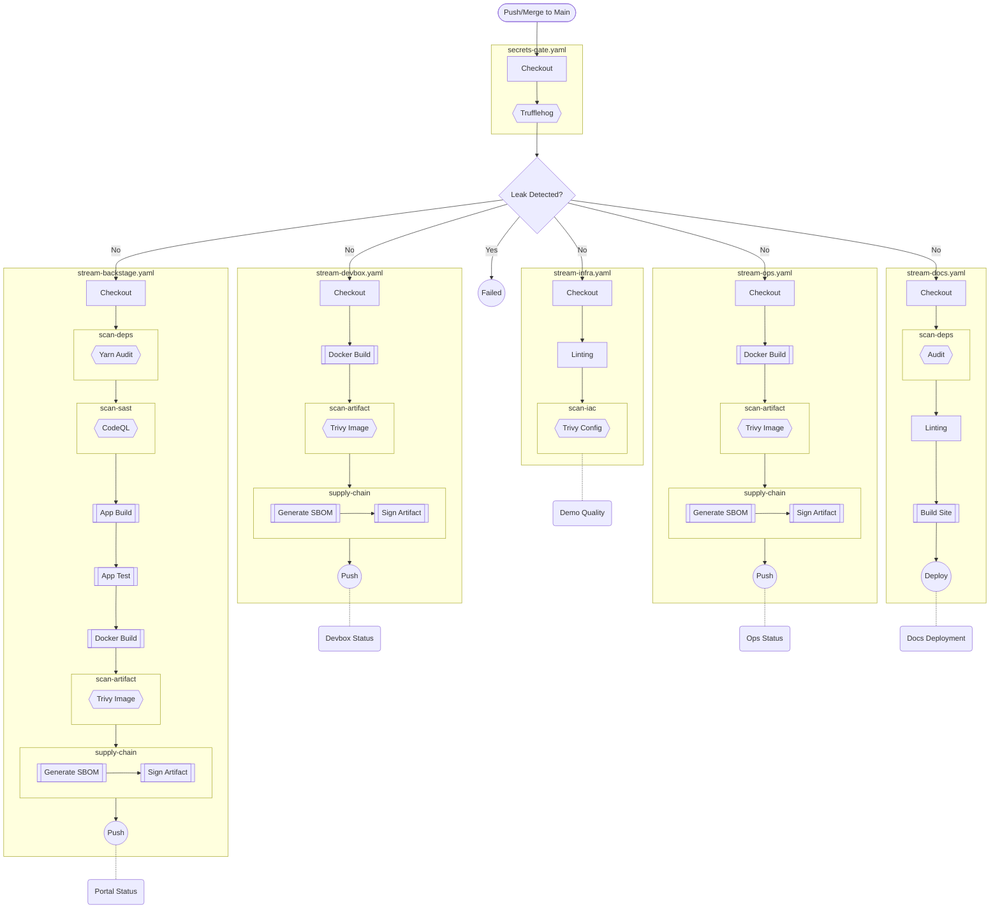

# GitHub Actions CI/CD Strategy

## The "Grand Pipeline" (Atomic File & Execution)

**Shapes:**
- `{{Hexagon}}`: Policy / Security
- `[[Double Rectangle]]`: Build / Process
- `[Rectangle]`: Setup / Atomic Action
- `((Circle))`: Delivery
- `(Stadium)`: Status / Badge / Trigger
- `Box`: Physical File Context

