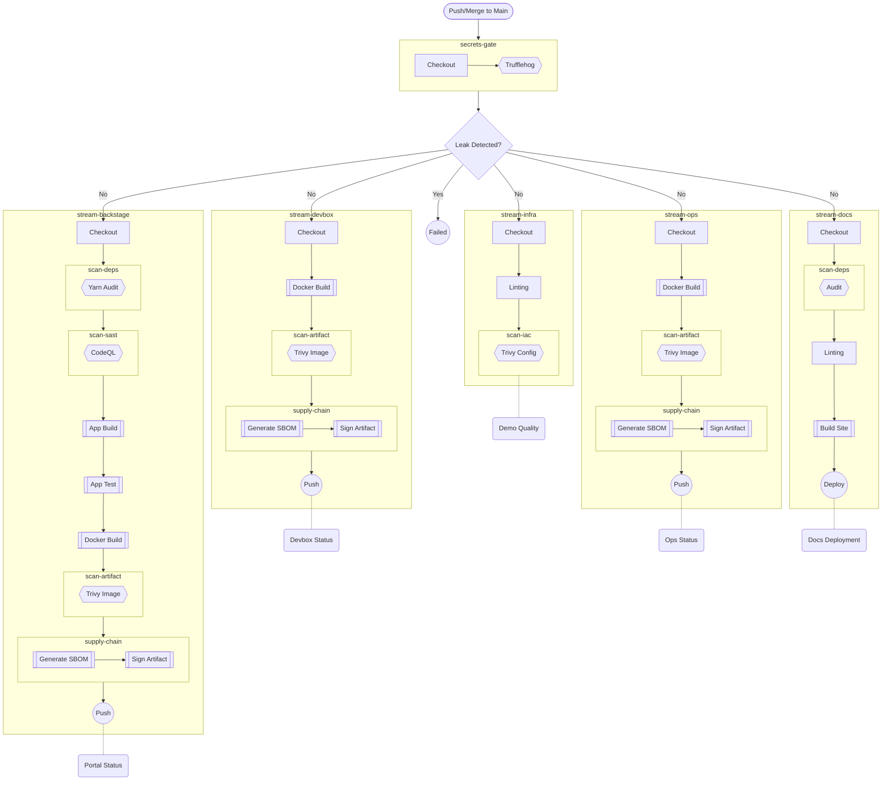
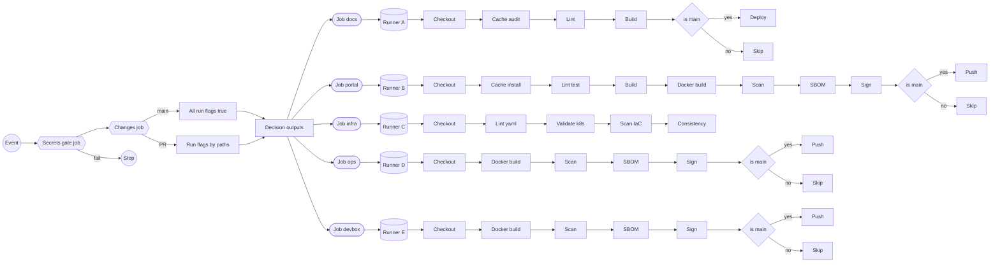

# GitHub Actions CI/CD Strategy

- The logic have to reuse the Task avaliable when possible
- Its better use an Action available in Github than implement custom logic
- Should me as modular as posible to reuse logic from steps but efficient in the use of runners
- The main branch its the complete pipeline process for CICD in the proyect, all extra scenarios should be a subpipeline from this one.
- Pull Request should trigger GA just if make sense because the changes in the PR to avoid waste Runner's time.

## "The Grand Pipeline"

## Blueprint de Arquitectura a detalle para implementacion en GA

