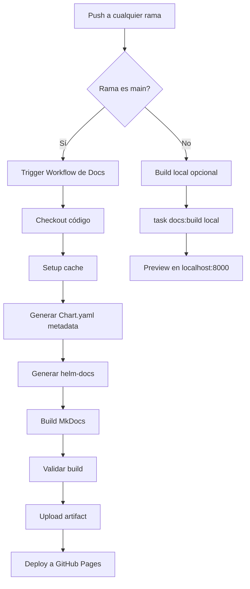

# Plan de Reconstrucción de Documentación - IDP Blueprint

**Fecha:** 2025-11-11
**Rama de trabajo:** `claude/deep-analysis-011CV2prFqEwm7PDVDjSSkQ4`
**Estado actual:** IMPLEMENTACIÓN ROTA - Requiere reconstrucción completa

---

## TABLA DE CONTENIDOS

1. [Diagnóstico de Problemas Críticos](#1-diagnóstico-de-problemas-críticos)
2. [Arquitectura Nueva Propuesta](#2-arquitectura-nueva-propuesta)
3. [Estructura del Directorio docs/](#3-estructura-del-directorio-docs)
4. [Configuración de MkDocs](#4-configuración-de-mkdocs)
5. [GitHub Actions Workflow](#5-github-actions-workflow)
6. [Configuración de GitHub Pages](#6-configuración-de-github-pages)
7. [Plan de Migración y Purga](#7-plan-de-migración-y-purga)
8. [Archivos a Rescatar](#8-archivos-a-rescatar)
9. [Archivos a Eliminar](#9-archivos-a-eliminar)
10. [Pasos de Implementación](#10-pasos-de-implementación)
11. [Validación y Testing](#11-validación-y-testing)
12. [Rollback Plan](#12-rollback-plan)

---

## 1. DIAGNÓSTICO DE PROBLEMAS CRÍTICOS

### Problemas Identificados

#### ❌ P1: Directorio Duplicado
- **Problema:** Existen `docs_src/` (fuente) y `docs/` (compilado HTML)
- **Impacto:** Duplicación de contenido en git, confusión de fuente única de verdad
- **Tamaño:** `docs_src/` (308 KB) + `docs/` (4.3 MB) = 4.6 MB desperdiciados

#### ❌ P2: Workflow que contamina main
- **Problema:** `.github/workflows/docs.yaml` hace commit y push del HTML compilado a `main`
- **Impacto:** Historial de git contaminado con HTML generado, PRs con ruido
- **Evidencia:** Líneas 89-99 de `docs.yaml` - `git add -f docs/` y `git push origin main`

#### ❌ P3: GitHub Pages mal configurado
- **Problema:** Sirve desde carpeta `docs/` en rama `main` en lugar de usar GitHub Actions deployment
- **Impacto:** No se aprovecha el artifact deployment moderno, no hay preview de PRs posible

#### ❌ P4: No hay deployment condicional por rama
- **Problema:** Solo funciona después de CI en `main` o manual
- **Impacto:** No se puede hacer preview de documentación en feature branches
- **Evidencia:** Líneas 4-8 de `docs.yaml` - solo trigger en `main`

#### ❌ P5: Archivos compilados en git
- **Problema:** Todo el contenido de `docs/` (4.3 MB de HTML) está en git
- **Impacto:** Repo innecesariamente grande, pull/clone lentos, merge conflicts

#### ❌ P6: Estructura confusa de archivos
- **Problema:** `.nojekyll` en 3 lugares, `overrides/` con solo 2 archivos, Chart.yaml generados en `docs_src/`
- **Impacto:** Difícil de mantener, archivos esparcidos sin razón clara

#### ❌ P7: Dependencia de workflow_run
- **Problema:** El workflow de docs depende de que CI complete exitosamente
- **Impacto:** Si CI falla por código, docs no se actualizan aunque solo cambien .md

---

## 2. ARQUITECTURA NUEVA PROPUESTA

### Principios de Diseño

1. **Fuente Única de Verdad**: Todo en `docs/` (no `docs_src/`)
2. **Sin Archivos Compilados en Git**: `docs/` nunca se commitea (agregado a .gitignore)
3. **GitHub Actions Artifact Deployment**: Usar `actions/upload-pages-artifact` + `actions/deploy-pages`
4. **Build Condicional por Rama**:
   - `main` → Deploy automático a GitHub Pages
   - Otras ramas → Build para validación (sin deploy)
   - PRs → Build y comentario con preview link (futuro)
5. **Helm-docs Integrado**: Generación automática de Chart.yaml y READMEs en `docs/components/`
6. **Cache Agresivo**: Cache de MkDocs, Python deps, y Devbox para builds rápidos

### Flujo de Trabajo Nuevo



### Ventajas

✅ **Repo limpio**: Sin HTML en git, historial limpio
✅ **Builds rápidos**: Cache de dependencias, solo rebuild cuando cambia fuente
✅ **Deployment moderno**: Usando GitHub Pages actions oficiales
✅ **Flexible**: Fácil agregar preview de PRs en el futuro
✅ **Mantenible**: Estructura clara, archivos mínimos
✅ **Escalable**: Fácil agregar versioning con mike en el futuro

---

## 3. ESTRUCTURA DEL DIRECTORIO `docs/`

### Árbol de Directorios Propuesto

```
docs/                                    # Directorio único de documentación (fuente)
├── index.md                             # Página principal
│
├── getting-started/                     # Guías de inicio
│   ├── overview.md
│   ├── prerequisites.md
│   ├── quickstart.md
│   └── deployment.md
│
├── architecture/                        # Documentación de arquitectura
│   ├── overview.md
│   ├── visual.md                        # Con diagramas Mermaid
│   ├── infrastructure.md
│   ├── applications.md
│   ├── secrets.md
│   ├── cicd.md
│   ├── policies.md
│   ├── bootstrap.md
│   └── observability.md
│
├── components/                          # Componentes del IDP
│   ├── infrastructure/
│   │   ├── index.md
│   │   ├── cilium/
│   │   │   ├── index.md                # Redacción manual
│   │   │   ├── Chart.yaml              # Generado por script
│   │   │   └── values.md               # Generado por helm-docs (futuro)
│   │   ├── cert-manager/
│   │   │   ├── index.md
│   │   │   └── Chart.yaml
│   │   ├── vault/
│   │   │   ├── index.md
│   │   │   └── Chart.yaml
│   │   ├── external-secrets/
│   │   │   ├── index.md
│   │   │   └── Chart.yaml
│   │   └── argocd/
│   │       ├── index.md
│   │       └── Chart.yaml
│   │
│   ├── policy/
│   │   ├── index.md
│   │   ├── kyverno/
│   │   │   ├── index.md
│   │   │   └── Chart.yaml
│   │   └── policy-reporter/
│   │       ├── index.md
│   │       └── Chart.yaml
│   │
│   ├── observability/
│   │   ├── index.md
│   │   ├── prometheus/
│   │   │   ├── index.md
│   │   │   └── Chart.yaml
│   │   ├── grafana/
│   │   │   ├── index.md                # CAMBIO: Mover de grafana.md a grafana/index.md
│   │   │   └── Chart.yaml
│   │   ├── loki/
│   │   │   ├── index.md
│   │   │   └── Chart.yaml
│   │   └── fluent-bit/
│   │       ├── index.md
│   │       └── Chart.yaml
│   │
│   ├── cicd/
│   │   ├── index.md
│   │   ├── argo-workflows/
│   │   │   ├── index.md
│   │   │   └── Chart.yaml
│   │   └── sonarqube/
│   │       ├── index.md
│   │       └── Chart.yaml
│   │
│   └── security/
│       ├── index.md
│       └── trivy/
│           ├── index.md
│           └── Chart.yaml
│
├── guides/                              # Guías prácticas
│   ├── overview.md
│   ├── contributing.md
│   └── policy-tagging.md
│
├── reference/                           # Documentación de referencia
│   ├── overview.md
│   ├── resource-requirements.md
│   ├── troubleshooting.md
│   ├── labels-standard.md
│   └── finops-tags.md
│
├── includes/                            # Archivos incluidos
│   └── abbreviations.md                 # Abreviaciones para snippets
│
├── assets/                              # Assets estáticos
│   ├── images/
│   │   ├── favicon.png
│   │   ├── logo.png                     # (futuro)
│   │   └── diagrams/                    # (futuro - diagramas exportados)
│   ├── stylesheets/
│   │   └── extra.css                    # Estilos personalizados
│   └── javascripts/                     # (futuro - si se necesita)
│       └── extra.js
│
└── .pages                               # Configuración de navegación (opcional - plugin mkdocs-awesome-pages)
```

### Notas Importantes

- **NO hay directorio `docs/` compilado en git** - Se genera en CI y se sube como artifact
- **Chart.yaml generados**: Se generan en tiempo de build por `Scripts/generate-chart-metadata.sh`
- **Helm-docs**: Genera documentación de valores en el futuro en cada componente
- **Diagramas**: Usar Mermaid embebido en markdown siempre que sea posible

---

## 4. CONFIGURACIÓN DE MKDOCS

### mkdocs.yml Actualizado

```yaml
# Site metadata
site_name: IDP Blueprint
site_description: Enterprise-grade Internal Developer Platform Blueprint - Production-ready platform engineering stack with GitOps, observability, security, and policy enforcement
site_author: IDP Blueprint Project
site_url: https://rou-cru.github.io/idp-blueprint

# Build directories
site_dir: site           # CAMBIO: Output a site/ en lugar de docs/
docs_dir: docs           # CAMBIO: Fuente es docs/ en lugar de docs_src/

# Repository
repo_name: rou-cru/idp-blueprint
repo_url: https://github.com/rou-cru/idp-blueprint
edit_uri: edit/main/docs/    # CAMBIO: Actualizado a docs/

# Copyright
copyright: Copyright &copy; 2024-2025 IDP Blueprint Contributors

# Theme configuration
theme:
  name: material
  language: en
  # ELIMINAR: custom_dir (si overrides/ no es necesario)

  palette:
    # Auto dark/light mode
    - media: "(prefers-color-scheme)"
      scheme: slate
      primary: blue grey
      accent: light blue
      toggle:
        icon: material/brightness-auto
        name: Switch to light mode
    - media: "(prefers-color-scheme: light)"
      scheme: default
      primary: blue grey
      accent: light blue
      toggle:
        icon: material/brightness-7
        name: Switch to dark mode
    - media: "(prefers-color-scheme: dark)"
      scheme: slate
      primary: blue grey
      accent: light blue
      toggle:
        icon: material/brightness-4
        name: Switch to system preference

  font:
    text: Inter
    code: Fira Code

  features:
    # Content
    - content.action.edit
    - content.code.copy
    - content.code.annotate
    - content.tabs.link
    - content.tooltips
    # Navigation
    - navigation.footer
    - navigation.indexes
    - navigation.instant
    - navigation.instant.progress
    - navigation.path
    - navigation.top
    - navigation.tracking
    # Search
    - search.highlight
    - search.share
    - search.suggest
    # TOC
    - toc.follow

  icon:
    repo: fontawesome/brands/github
    edit: material/pencil

# Markdown extensions
markdown_extensions:
  - abbr
  - admonition
  - attr_list
  - def_list
  - footnotes
  - md_in_html
  - tables
  - toc:
      permalink: true
      permalink_title: Anchor link to this section
      toc_depth: 3
  # PyMdown Extensions
  - pymdownx.arithmatex:
      generic: true
  - pymdownx.betterem:
      smart_enable: all
  - pymdownx.caret
  - pymdownx.details
  - pymdownx.emoji:
      emoji_index: !!python/name:material.extensions.emoji.twemoji
      emoji_generator: !!python/name:material.extensions.emoji.to_svg
  - pymdownx.highlight:
      anchor_linenums: true
      line_spans: __span
      pygments_lang_class: true
      auto_title: true
  - pymdownx.inlinehilite
  - pymdownx.keys
  - pymdownx.mark
  - pymdownx.smartsymbols
  - pymdownx.snippets:
      auto_append:
        - includes/abbreviations.md
      check_paths: true
  - pymdownx.superfences:
      custom_fences:
        - name: mermaid
          class: mermaid
          format: !!python/name:pymdownx.superfences.fence_code_format
  - pymdownx.tabbed:
      alternate_style: true
      combine_header_slug: true
  - pymdownx.tasklist:
      custom_checkbox: true
  - pymdownx.tilde

# Plugins
plugins:
  - search:
      separator: '[\s\-,:!=\[\]()"`/]+|\.(?!\d)|&[lg]t;|(?!\b)(?=[A-Z][a-z])'
      lang: en
  - social:
      cards: true
      cards_layout_options:
        background_color: "#455a64"
        color: "#ffffff"
  - minify:
      minify_html: true
      minify_js: true
      minify_css: true
      htmlmin_opts:
        remove_comments: true
  - git-revision-date-localized:
      enable_creation_date: true
      type: timeago
      fallback_to_build_date: true
  - glightbox:
      touchNavigation: true
      loop: false
      effect: zoom
      slide_effect: slide
      width: 100%
      height: auto
      zoomable: true
      draggable: true
      auto_caption: false
      caption_position: bottom

# Extra configuration
extra:
  social:
    - icon: fontawesome/brands/github
      link: https://github.com/rou-cru/idp-blueprint
      name: GitHub Repository
    - icon: fontawesome/brands/docker
      link: https://github.com/rou-cru/idp-blueprint/pkgs/container/idp-blueprint
      name: Container Registry

  # Analytics (opcional - agregar Google Analytics si se desea)
  # analytics:
  #   provider: google
  #   property: G-XXXXXXXXXX

# Custom CSS
extra_css:
  - assets/stylesheets/extra.css

# Navigation tree
nav:
  - Home: index.md
  - Getting Started:
      - Overview: getting-started/overview.md
      - Prerequisites: getting-started/prerequisites.md
      - Quick Start: getting-started/quickstart.md
      - Deployment: getting-started/deployment.md
  - Architecture:
      - Overview: architecture/overview.md
      - Visual Architecture: architecture/visual.md
      - Infrastructure Layer: architecture/infrastructure.md
      - Application Layer: architecture/applications.md
      - Secrets Management: architecture/secrets.md
      - CI/CD Pipeline: architecture/cicd.md
      - Policy Enforcement: architecture/policies.md
      - Bootstrap Process: architecture/bootstrap.md
      - Observability: architecture/observability.md
  - Components:
      - Infrastructure:
          - Overview: components/infrastructure/index.md
          - Cilium CNI: components/infrastructure/cilium/index.md
          - Cert Manager: components/infrastructure/cert-manager/index.md
          - Vault: components/infrastructure/vault/index.md
          - External Secrets: components/infrastructure/external-secrets/index.md
          - ArgoCD: components/infrastructure/argocd/index.md
      - Policy:
          - Overview: components/policy/index.md
          - Kyverno: components/policy/kyverno/index.md
          - Policy Reporter: components/policy/policy-reporter/index.md
      - Observability:
          - Overview: components/observability/index.md
          - Prometheus: components/observability/prometheus/index.md
          - Grafana: components/observability/grafana/index.md  # CAMBIO: Actualizado
          - Loki: components/observability/loki/index.md
          - Fluent-bit: components/observability/fluent-bit/index.md
      - CI/CD:
          - Overview: components/cicd/index.md
          - Argo Workflows: components/cicd/argo-workflows/index.md
          - SonarQube: components/cicd/sonarqube/index.md
      - Security:
          - Overview: components/security/index.md
          - Trivy: components/security/trivy/index.md
  - Guides:
      - Overview: guides/overview.md
      - Contributing: guides/contributing.md
      - Policy Tagging: guides/policy-tagging.md
  - Reference:
      - Overview: reference/overview.md
      - Resource Requirements: reference/resource-requirements.md
      - Troubleshooting: reference/troubleshooting.md
      - Label Standards: reference/labels-standard.md
      - FinOps Tags: reference/finops-tags.md
```

### Cambios Clave

1. **`site_dir: site`** - Output va a `site/` (no `docs/`)
2. **`docs_dir: docs`** - Fuente es `docs/` (no `docs_src/`)
3. **`edit_uri: edit/main/docs/`** - Actualizado
4. **Removido `custom_dir`** - Si `overrides/` no es necesario
5. **Grafana path actualizado** - De `grafana.md` a `grafana/index.md`

---

## 5. GITHUB ACTIONS WORKFLOW

### .github/workflows/docs.yaml (Nuevo)

```yaml
name: Documentation

on:
  # Trigger on push to main
  push:
    branches:
      - main
    paths:
      - 'docs/**'
      - 'mkdocs.yml'
      - 'requirements.txt'
      - 'Scripts/generate-chart-metadata.sh'
      - 'Scripts/helm-docs-*.sh'
      - '.github/workflows/docs.yaml'

  # Allow manual trigger
  workflow_dispatch:

  # Trigger on PR for validation (no deploy)
  pull_request:
    branches:
      - main
    paths:
      - 'docs/**'
      - 'mkdocs.yml'
      - 'requirements.txt'

# Prevent concurrent deployments
concurrency:
  group: docs-${{ github.ref }}
  cancel-in-progress: true

# Required permissions for GitHub Pages
permissions:
  contents: read
  pages: write
  id-token: write

jobs:
  build:
    name: Build Documentation
    runs-on: ubuntu-latest
    steps:
      - name: Checkout repository
        uses: actions/checkout@v4
        with:
          fetch-depth: 0  # Full history for git-revision-date plugin

      - name: Setup Pages
        id: pages
        uses: actions/configure-pages@v4

      - name: Restore MkDocs cache
        uses: actions/cache@v4
        with:
          path: .cache
          key: mkdocs-${{ hashFiles('mkdocs.yml', 'requirements.txt') }}-${{ hashFiles('docs/**') }}
          restore-keys: |
            mkdocs-${{ hashFiles('mkdocs.yml', 'requirements.txt') }}-
            mkdocs-

      - name: Prepare Devbox configuration
        run: ln -sf devbox-minimal.json devbox.json
        working-directory: .devcontainer

      - name: Install Devbox
        uses: jetpack-io/devbox-install-action@v0.11.0
        with:
          project-path: .devcontainer
          enable-cache: true

      - name: Setup Python
        uses: actions/setup-python@v5
        with:
          python-version: '3.11'
          cache: 'pip'

      - name: Install MkDocs and dependencies
        run: pip install -r requirements.txt

      - name: Generate Chart.yaml metadata
        run: devbox run -- task docs:metadata
        working-directory: .devcontainer

      - name: Generate Helm documentation
        run: devbox run -- task docs:helm
        working-directory: .devcontainer

      - name: Build MkDocs site
        run: devbox run -- task docs:build
        working-directory: .devcontainer

      - name: Validate build output
        run: |
          test -d site/ || { echo "❌ Error: site/ directory not found"; exit 1; }
          test -f site/index.html || { echo "❌ Error: site/index.html not found"; exit 1; }
          test -f site/sitemap.xml || { echo "❌ Error: site/sitemap.xml not found"; exit 1; }
          echo "✅ Build output validated successfully"

      - name: Check for broken links
        run: devbox run -- task docs:linkcheck
        working-directory: .devcontainer
        continue-on-error: true

      - name: Upload Pages artifact
        if: github.event_name != 'pull_request'
        uses: actions/upload-pages-artifact@v3
        with:
          path: site/

      - name: Upload build artifact (PR preview)
        if: github.event_name == 'pull_request'
        uses: actions/upload-artifact@v4
        with:
          name: docs-preview-${{ github.event.pull_request.number }}
          path: site/
          retention-days: 7

  deploy:
    name: Deploy to GitHub Pages
    needs: build
    if: github.event_name != 'pull_request' && github.ref == 'refs/heads/main'
    runs-on: ubuntu-latest
    environment:
      name: github-pages
      url: ${{ steps.deployment.outputs.page_url }}
    steps:
      - name: Deploy to GitHub Pages
        id: deployment
        uses: actions/deploy-pages@v4
```

### Cambios Clave

1. **Sin commits a git**: No hay `git add`, `git commit`, `git push`
2. **Artifact deployment**: Usa `actions/upload-pages-artifact` y `actions/deploy-pages`
3. **Build en PRs**: Valida documentación en PRs sin hacer deploy
4. **Paths filter**: Solo se ejecuta cuando cambian archivos relevantes
5. **Cache mejorado**: Cache de MkDocs incluye hash de docs/**
6. **Permissions**: Solo `contents: read`, `pages: write`, `id-token: write`

---

## 6. CONFIGURACIÓN DE GITHUB PAGES

### Settings de GitHub (Manual)

**⚠️ IMPORTANTE: Estos cambios deben hacerse manualmente en GitHub UI**

1. **Ir a:** `https://github.com/rou-cru/idp-blueprint/settings/pages`

2. **Build and deployment:**
   - Source: **GitHub Actions** (NO "Deploy from a branch")

3. **Custom domain:** (opcional)
   - Dejar vacío o configurar dominio personalizado

### Archivo .github/workflows/pages.yaml

No es necesario. El workflow `docs.yaml` ya maneja todo.

### .gitignore Actualizado

```gitignore
# AGREGAR al .gitignore existente:

# MkDocs build output
/site/
/.cache/

# Legacy docs directory (será eliminado en la migración)
# /docs/  # Comentado porque ya existe contenido legacy aquí
```

**Nota:** Después de la migración, `docs/` (compilado) se eliminará y se agregará a .gitignore.

---

## 7. PLAN DE MIGRACIÓN Y PURGA

### Fases de Migración

```
FASE 1: PREPARACIÓN (Sin cambios destructivos)
└── Crear nueva estructura en paralelo
    ├── Copiar docs_src/ → docs/
    ├── Crear nuevos workflows
    └── Actualizar configuraciones

FASE 2: MIGRACIÓN (Cambios estructurales)
└── Mover archivos y actualizar paths
    ├── Mover contenido de docs_src/ a docs/
    ├── Actualizar mkdocs.yml
    ├── Actualizar Scripts/generate-chart-metadata.sh
    └── Actualizar Task/utils.yaml

FASE 3: PURGA (Eliminación de obsoletos)
└── Eliminar archivos y directorios obsoletos
    ├── Eliminar docs_src/
    ├── Eliminar docs/ compilado
    ├── Eliminar .nojekyll
    ├── Eliminar overrides/ (si no es necesario)
    └── Actualizar .gitignore

FASE 4: DEPLOYMENT (Activación)
└── Desplegar nueva configuración
    ├── Configurar GitHub Pages en UI
    ├── Hacer push de cambios
    ├── Validar deployment
    └── Verificar links
```

### Checklist de Migración

- [ ] **FASE 1: Preparación**
  - [ ] Backup de rama actual
  - [ ] Crear nueva estructura `docs/`
  - [ ] Copiar archivos markdown de `docs_src/` a `docs/`
  - [ ] Crear nuevo workflow `.github/workflows/docs.yaml`
  - [ ] Actualizar `mkdocs.yml` con nuevos paths
  - [ ] Actualizar `Scripts/generate-chart-metadata.sh` (docs_src → docs)
  - [ ] Actualizar `Task/utils.yaml` (docs_src → docs)
  - [ ] Crear `docs/assets/stylesheets/extra.css` (mover de overrides)

- [ ] **FASE 2: Migración**
  - [ ] Mover `docs_src/components/observability/grafana.md` → `docs/components/observability/grafana/index.md`
  - [ ] Verificar que todos los archivos .md estén en `docs/`
  - [ ] Actualizar paths en scripts de generación
  - [ ] Test build local: `task docs:build`
  - [ ] Verificar `site/` se genera correctamente

- [ ] **FASE 3: Purga**
  - [ ] Eliminar `docs_src/` completo
  - [ ] Eliminar `docs/` compilado (todo el HTML)
  - [ ] Eliminar `.nojekyll` (raíz, docs_src, docs)
  - [ ] Evaluar y eliminar `overrides/` si no es necesario
  - [ ] Actualizar `.gitignore` para ignorar `/site/` y `/.cache/`
  - [ ] Eliminar workflow antiguo `.github/workflows/docs.yaml` (si tiene nombre diferente)

- [ ] **FASE 4: Deployment**
  - [ ] Configurar GitHub Pages en Settings (GitHub Actions)
  - [ ] Commit y push de todos los cambios
  - [ ] Verificar que workflow se ejecute correctamente
  - [ ] Validar deployment en https://rou-cru.github.io/idp-blueprint
  - [ ] Verificar links con `task docs:linkcheck`
  - [ ] Validar navegación completa del sitio

---

## 8. ARCHIVOS A RESCATAR

### Contenido Manual (42 archivos markdown)

#### Raíz del Repositorio
```
✅ README.md              # Documentación principal del proyecto
✅ CONTRIBUTING.md        # Guía de contribuciones
✅ AGENTS.md              # Documentación de agentes
```

#### docs_src/ → docs/ (39 archivos)

**Getting Started (4 archivos):**
```
✅ getting-started/overview.md
✅ getting-started/prerequisites.md
✅ getting-started/quickstart.md
✅ getting-started/deployment.md
```

**Architecture (9 archivos):**
```
✅ architecture/overview.md
✅ architecture/visual.md
✅ architecture/infrastructure.md
✅ architecture/applications.md
✅ architecture/secrets.md
✅ architecture/cicd.md
✅ architecture/policies.md
✅ architecture/bootstrap.md
✅ architecture/observability.md
```

**Components (18 archivos):**
```
✅ components/infrastructure/index.md
✅ components/infrastructure/cilium/index.md
✅ components/infrastructure/cert-manager/index.md
✅ components/infrastructure/vault/index.md
✅ components/infrastructure/external-secrets/index.md
✅ components/infrastructure/argocd/index.md

✅ components/policy/index.md
✅ components/policy/kyverno/index.md
✅ components/policy/policy-reporter/index.md

✅ components/observability/index.md
✅ components/observability/prometheus/index.md
✅ components/observability/grafana.md           # ⚠️ MOVER a grafana/index.md
✅ components/observability/loki/index.md
✅ components/observability/fluent-bit/index.md

✅ components/cicd/index.md
✅ components/cicd/argo-workflows/index.md
✅ components/cicd/sonarqube/index.md

✅ components/security/index.md
✅ components/security/trivy/index.md
```

**Guides (3 archivos):**
```
✅ guides/overview.md
✅ guides/contributing.md
✅ guides/policy-tagging.md
```

**Reference (5 archivos):**
```
✅ reference/overview.md
✅ reference/resource-requirements.md
✅ reference/troubleshooting.md
✅ reference/labels-standard.md
✅ reference/finops-tags.md
```

**Includes (1 archivo):**
```
✅ includes/abbreviations.md
```

### Assets Estáticos

```
✅ docs/assets/images/favicon.png        # Favicon del sitio
⚠️ overrides/main.html                   # Evaluar si es necesario
⚠️ overrides/404.html                    # Evaluar si es necesario
```

### Archivos de Configuración a Mantener

```
✅ mkdocs.yml                            # Actualizar paths
✅ requirements.txt                       # Mantener sin cambios
✅ .helm-docs-template.gotmpl            # Mantener sin cambios
✅ Scripts/generate-chart-metadata.sh    # Actualizar output path a docs/
✅ Scripts/helm-docs-generate.sh         # Revisar si necesita cambios
✅ Scripts/helm-docs-common.sh           # Mantener sin cambios
✅ Scripts/docs-linkcheck.sh             # Actualizar path a site/
✅ Scripts/helm-docs-lint.sh             # Mantener sin cambios
✅ Task/utils.yaml                       # Actualizar docs_src → docs
```

---

## 9. ARCHIVOS A ELIMINAR

### Directorios Completos

```
❌ docs/                                 # TODO el contenido compilado (4.3 MB)
   └── **/*                              # HTML, CSS, JS, fonts, search index, etc.

❌ docs_src/                             # Después de migrar a docs/
   └── **/*                              # Todos los archivos ya migrados

❌ overrides/                            # SI no es estrictamente necesario
   ├── main.html                         # Evaluar contenido primero
   └── 404.html                          # Evaluar contenido primero
```

### Archivos Individuales

```
❌ .nojekyll                             # En raíz del repo (no es necesario con GitHub Actions)
❌ docs_src/.nojekyll                    # No es necesario
❌ docs/.nojekyll                        # Se eliminará con docs/
```

### Archivos Generados a NO Commitear

```
❌ docs/components/**/Chart.yaml         # Generados, no deben estar en git
   (Se generarán en tiempo de build)
```

### Workflow Antiguo

```
⚠️ .github/workflows/docs.yaml           # Reemplazar completamente (no eliminar si es el mismo archivo)
```

---

## 10. PASOS DE IMPLEMENTACIÓN

### Orden de Ejecución (Paso a Paso)

#### PASO 1: Backup y Preparación
```bash
# 1.1 - Crear backup de rama actual
git branch backup/docs-before-migration

# 1.2 - Asegurar que estamos en la rama correcta
git checkout claude/deep-analysis-011CV2prFqEwm7PDVDjSSkQ4

# 1.3 - Verificar estado limpio
git status
```

#### PASO 2: Migrar Contenido docs_src → docs

```bash
# 2.1 - Remover docs/ compilado existente (4.3 MB de HTML)
git rm -r docs/
git commit -m "chore: remove compiled docs from git"

# 2.2 - Mover docs_src/ a docs/
git mv docs_src docs

# 2.3 - Verificar estructura
ls -la docs/

# 2.4 - Commit del movimiento
git commit -m "refactor: rename docs_src to docs as single source of truth"
```

#### PASO 3: Actualizar Configuraciones

```bash
# 3.1 - Actualizar mkdocs.yml
# (Usar el contenido de la sección 4 de este plan)
# Cambios clave:
#   - site_dir: site
#   - docs_dir: docs
#   - edit_uri: edit/main/docs/

# 3.2 - Actualizar Scripts/generate-chart-metadata.sh
# Cambiar línea 150:
#   OLD: local output_dir="docs_src/components/${category}/${component}"
#   NEW: local output_dir="docs/components/${category}/${component}"

# 3.3 - Actualizar Task/utils.yaml
# Cambiar en docs:build task:
#   sources:
#     - docs/**/*.md    # Antes docs_src/**/*.md

# 3.4 - Actualizar Scripts/docs-linkcheck.sh (si usa path docs/)
# Cambiar referencias de docs/ a site/
```

#### PASO 4: Mover Grafana a Estructura Correcta

```bash
# 4.1 - Crear directorio grafana
mkdir -p docs/components/observability/grafana/

# 4.2 - Mover grafana.md a grafana/index.md
git mv docs/components/observability/grafana.md \
       docs/components/observability/grafana/index.md

# 4.3 - Commit
git commit -m "refactor: move grafana.md to grafana/index.md for consistency"
```

#### PASO 5: Crear Assets y Mover Estilos

```bash
# 5.1 - Crear estructura de assets
mkdir -p docs/assets/stylesheets
mkdir -p docs/assets/images

# 5.2 - Si overrides/ tiene estilos personalizados, moverlos
# (Evaluar contenido de overrides/ primero)

# 5.3 - Crear docs/assets/stylesheets/extra.css
# (Contenido de estilos personalizados)
```

#### PASO 6: Limpiar Archivos Obsoletos

```bash
# 6.1 - Eliminar .nojekyll
git rm .nojekyll
git rm docs/.nojekyll  # Si existe después del rename

# 6.2 - Eliminar overrides/ (SI no es necesario - evaluar primero)
# git rm -r overrides/

# 6.3 - Commit
git commit -m "chore: remove obsolete .nojekyll files"
```

#### PASO 7: Actualizar .gitignore

```bash
# 7.1 - Agregar a .gitignore:
cat >> .gitignore <<'EOF'

# MkDocs build output
/site/
/.cache/

# Helm-docs generated files
/docs/components/**/Chart.yaml
EOF

# 7.2 - Commit
git commit -m "chore: ignore MkDocs build output and generated files"
```

#### PASO 8: Crear Nuevo Workflow

```bash
# 8.1 - Backup del workflow actual
cp .github/workflows/docs.yaml .github/workflows/docs.yaml.backup

# 8.2 - Reemplazar .github/workflows/docs.yaml
# (Usar el contenido de la sección 5 de este plan)

# 8.3 - Commit
git commit -m "feat: modernize docs workflow with GitHub Pages Actions"
```

#### PASO 9: Build y Validación Local

```bash
# 9.1 - Limpiar cache anterior
rm -rf .cache/ site/

# 9.2 - Generar Chart.yaml
task docs:metadata

# 9.3 - Generar helm-docs
task docs:helm

# 9.4 - Build MkDocs
task docs:build

# 9.5 - Verificar output
ls -lah site/
test -f site/index.html && echo "✅ Build exitoso" || echo "❌ Build falló"

# 9.6 - Servir localmente para prueba
task docs:serve
# Abrir http://localhost:8000 y verificar navegación
```

#### PASO 10: Push y Deploy

```bash
# 10.1 - Push a rama
git push -u origin claude/deep-analysis-011CV2prFqEwm7PDVDjSSkQ4

# 10.2 - Configurar GitHub Pages en UI
# Ir a: https://github.com/rou-cru/idp-blueprint/settings/pages
# Source: GitHub Actions

# 10.3 - Merge a main (o crear PR)
# Opción A: Merge directo si tienes permisos
git checkout main
git merge claude/deep-analysis-011CV2prFqEwm7PDVDjSSkQ4
git push origin main

# Opción B: Crear PR
gh pr create --title "Reconstrucción completa de documentación" \
             --body "Ver DOCS_RECONSTRUCTION_PLAN.md para detalles"

# 10.4 - Verificar workflow
# Ir a: https://github.com/rou-cru/idp-blueprint/actions

# 10.5 - Validar sitio deployado
# Ir a: https://rou-cru.github.io/idp-blueprint
```

---

## 11. VALIDACIÓN Y TESTING

### Checklist de Validación Post-Deployment

#### Build Local
- [ ] `task docs:metadata` ejecuta sin errores
- [ ] `task docs:helm` ejecuta sin errores
- [ ] `task docs:build` ejecuta sin errores
- [ ] `site/` directory se crea correctamente
- [ ] `site/index.html` existe
- [ ] `site/sitemap.xml` existe
- [ ] `task docs:serve` funciona y sitio es navegable en localhost:8000

#### Estructura de Archivos
- [ ] `docs/` contiene todo el contenido markdown (fuente)
- [ ] `site/` contiene HTML compilado (no en git)
- [ ] `docs_src/` no existe (eliminado)
- [ ] `docs/` compilado no existe en git (eliminado)
- [ ] `.gitignore` incluye `/site/` y `/.cache/`

#### Configuración
- [ ] `mkdocs.yml` tiene `docs_dir: docs` y `site_dir: site`
- [ ] `Scripts/generate-chart-metadata.sh` genera en `docs/components/`
- [ ] `Task/utils.yaml` usa paths correctos
- [ ] `.github/workflows/docs.yaml` usa nuevo flujo de artifact

#### GitHub Pages
- [ ] Settings → Pages → Source es "GitHub Actions"
- [ ] Workflow se ejecuta en push a `main`
- [ ] Workflow completa exitosamente
- [ ] Sitio es accesible en https://rou-cru.github.io/idp-blueprint
- [ ] No hay errores 404 en navegación
- [ ] Botón "Edit on GitHub" funciona
- [ ] Links internos funcionan correctamente

#### Contenido
- [ ] Home page carga correctamente
- [ ] Todas las secciones de Getting Started son accesibles
- [ ] Todas las secciones de Architecture son accesibles
- [ ] Todos los componentes son accesibles
- [ ] Guides son accesibles
- [ ] Reference es accesible
- [ ] Búsqueda funciona
- [ ] Navegación instantánea funciona
- [ ] Dark/Light mode toggle funciona
- [ ] Imágenes cargan correctamente (favicon)
- [ ] Estilos personalizados se aplican
- [ ] Diagramas Mermaid renderizan correctamente

#### Links
- [ ] `task docs:linkcheck` pasa (o errores son esperados)
- [ ] Links internos funcionan
- [ ] Links a GitHub funcionan
- [ ] Links a upstream projects funcionan

---

## 12. ROLLBACK PLAN

### Si algo sale mal durante la migración

#### Opción A: Rollback Local (antes de push)

```bash
# Si estás en medio de cambios y algo falla
git reset --hard HEAD

# Volver al estado antes de la migración
git checkout backup/docs-before-migration
```

#### Opción B: Rollback después de Push (rama feature)

```bash
# Revertir cambios en rama feature
git revert <commit-hash>

# O resetear completamente la rama
git reset --hard <commit-antes-de-migracion>
git push --force origin claude/deep-analysis-011CV2prFqEwm7PDVDjSSkQ4
```

#### Opción C: Rollback en Main (si ya se hizo merge)

```bash
# Revertir el merge commit
git revert -m 1 <merge-commit-hash>
git push origin main

# Restaurar workflow anterior si es necesario
git checkout <commit-anterior> -- .github/workflows/docs.yaml
git commit -m "chore: restore previous docs workflow"
git push origin main
```

#### Opción D: Restaurar GitHub Pages Settings

1. Ir a: https://github.com/rou-cru/idp-blueprint/settings/pages
2. Source: **Deploy from a branch**
3. Branch: **main** / **docs**

### Señales de que algo salió mal

- ❌ Workflow de docs falla consistentemente
- ❌ Sitio no es accesible después de 5 minutos del deployment
- ❌ Links rotos en todas las páginas
- ❌ Imágenes no cargan
- ❌ Estilos no se aplican
- ❌ 404 en todas las páginas excepto home

### Contactos de Emergencia

- **GitHub Actions Logs**: https://github.com/rou-cru/idp-blueprint/actions
- **GitHub Pages Status**: https://github.com/rou-cru/idp-blueprint/deployments
- **MkDocs Docs**: https://www.mkdocs.org/
- **Material Theme Docs**: https://squidfunk.github.io/mkdocs-material/

---

## RESUMEN EJECUTIVO

### Antes → Después

| Aspecto | Antes | Después |
|---------|-------|---------|
| **Directorio fuente** | `docs_src/` | `docs/` |
| **Directorio compilado** | `docs/` (en git, 4.3 MB) | `site/` (gitignored) |
| **Workflow** | Push HTML a `main` | Upload artifact a GitHub Pages |
| **GitHub Pages** | Desde carpeta `docs/` en `main` | GitHub Actions deployment |
| **Build en PRs** | No | Sí (validación) |
| **Tamaño de repo** | +4.3 MB de HTML | -4.3 MB (limpio) |
| **Commits de docs** | HTML compilado en historial | Solo markdown en historial |

### Beneficios

✅ **Repo limpio**: Sin HTML en git
✅ **Historial limpio**: Solo cambios de contenido real
✅ **Deployment moderno**: GitHub Actions artifact
✅ **Validación en PRs**: Build sin deploy
✅ **Mantenible**: Estructura clara y simple
✅ **Escalable**: Fácil agregar versioning futuro
✅ **Performance**: Cache agresivo, builds rápidos

### Riesgos

⚠️ **Downtime temporal**: Durante configuración de GitHub Pages
⚠️ **Cambio de URLs**: Si hay bookmarks a páginas específicas
⚠️ **Learning curve**: Equipo debe entender nueva estructura

### Tiempo Estimado

- **Preparación**: 30 minutos
- **Migración**: 1 hora
- **Testing**: 30 minutos
- **Deployment**: 15 minutos
- **Total**: ~2.5 horas

---

**Documento creado por:** Claude (Análisis de Deep Dive)
**Última actualización:** 2025-11-11
**Estado:** PROPUESTA LISTA PARA IMPLEMENTACIÓN
