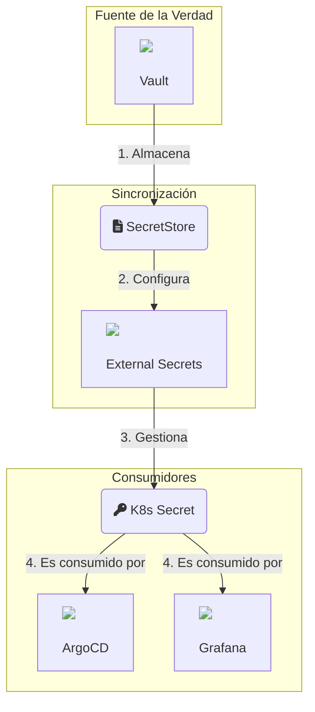
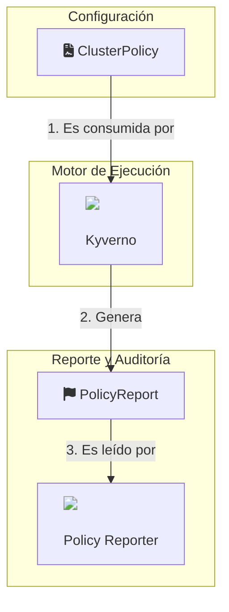

# Iteración 1: Análisis Completo de Relaciones Explícitas

Esta primera iteración mapea las dependencias explícitas y directas entre los componentes del IDP. El análisis revela una arquitectura declarativa y desacoplada, donde las herramientas se integran a través de CRDs y APIs de Kubernetes en lugar de conexiones punto a punto. Se identificaron cuatro subgrafos de dependencia principales.

## 1. Subgrafo: Gestión de Secretos

Este subgrafo muestra un patrón de "secreto como servicio" donde las aplicaciones no gestionan credenciales, sino que las consumen desde un secreto de Kubernetes que es poblado dinámicamente.

- **Flujo:** `Vault` (almacena) → `External Secrets` (sincroniza) → `K8s Secret` (abstrae) → `ArgoCD/Grafana` (consume).
- **Conclusión:** Centraliza la gestión de secretos en Vault y desacopla las aplicaciones de la fuente de la verdad. La `creationPolicy: Merge` es clave para permitir que el chart de Helm y ESO gestionen el mismo secreto.



## 2. Subgrafo: Infraestructura de Clave Pública (PKI)

Este subgrafo ilustra un proceso de arranque de PKI totalmente declarativo y auto-contenido para la emisión de certificados TLS.

- **Flujo:** Se usa un `self-signed-issuer` para crear una CA raíz (`idp-demo-ca-secret`). Esta CA respalda a un `ca-issuer`, que a su vez emite los certificados para las aplicaciones, como el `idp-wildcard-cert` para el Gateway.
- **Conclusión:** Automatiza completamente el ciclo de vida de los certificados TLS internos, garantizando que los servicios se expongan de forma segura por defecto.

```mermaid
graph TD;
    subgraph "Arranque (Bootstrap)"
        SelfSigned[ClusterIssuer<br>(self-signed)]
    end
    subgraph "Autoridad de Certificación (CA)"
        CARootCert(fa:fa-id-card Certificate: idp-demo-ca)
        CARootSecret(fa:fa-key K8s Secret: idp-demo-ca-secret)
        CAIssuer[ClusterIssuer<br>(ca-issuer)]
    end
    subgraph "Emisión para Aplicaciones"
        WildcardCert(fa:fa-id-card Certificate: idp-wildcard)
        WildcardSecret(fa:fa-key K8s Secret: idp-wildcard)
        Gateway[<br>Gateway]
    end

    SelfSigned -- "1. Emite" --> CARootCert
    CARootCert -- "2. Crea" --> CARootSecret
    CARootSecret -- "3. Respalda a" --> CAIssuer
    CAIssuer -- "4. Emite" --> WildcardCert
    WildcardCert -- "5. Crea" --> WildcardSecret
    WildcardSecret -- "6. Usado por" --> Gateway
```

## 3. Subgrafo: Observabilidad

Este subgrafo combina patrones "push" (logs) y "pull" (métricas) para construir una visión completa del estado del sistema.

- **Flujo de Logs (Push):** `Fluent-bit` se ejecuta en cada nodo, captura todos los logs de contenedores y los empuja a `Loki`.
- **Flujo de Métricas (Pull):** `Prometheus` descubre y extrae métricas de cualquier aplicación que exponga un `ServiceMonitor`.
- **Visualización:** `Grafana` se conecta a `Loki` y `Prometheus` como fuentes de datos para presentar una vista unificada.

```mermaid
graph LR;
    subgraph "Recolección (Nodos)"
        FluentBit[<br>Fluent-bit]
    end
    subgraph "Agregación y Almacenamiento"
        Loki[<br>Loki]
        Prometheus[<br>Prometheus]
    end
    subgraph "Visualización"
        Grafana[<br>Grafana]
    end
    subgraph "Aplicaciones Monitoreadas"
        App1(App con<br>ServiceMonitor)
        App2(App con<br>ServiceMonitor)
    end

    FluentBit -- "1. Envía logs (Push)" --> Loki
    Grafana -- "3. Consulta logs" --> Loki
    Grafana -- "3. Consulta métricas" --> Prometheus
    Prometheus -- "2. Scrapea métricas (Pull)" --> App1
    Prometheus -- "2. Scrapea métricas (Pull)" --> App2
```

## 4. Subgrafo: Políticas y Seguridad

Este subgrafo muestra un ciclo de "configuración -> ejecución -> reporte".

- **Flujo:** Las `ClusterPolicy` son recursos que actúan como configuración para el motor de `Kyverno`. Kyverno evalúa los recursos del clúster y genera `PolicyReport`s. `Policy Reporter` consume estos informes para ofrecer una vista del estado de cumplimiento.
- **Conclusión:** Permite gobernar el clúster de forma declarativa y auditable.



## Visualización Global en Plano Cartesiano

Este gráfico posiciona los componentes analizados para dar una visión holística de la arquitectura.

- **Eje X (Infraestructura vs. Aplicación):** Componentes más a la izquierda son de bajo nivel y fundamentales para el clúster. Más a la derecha son de alto nivel y orientados al usuario/aplicación.
- **Eje Y (Tipo de Interacción):** Clasifica los componentes por su modo principal de interacción: `Push` (envían datos activamente), `Pull` (consultan datos activamente) o `Pasivo/Reactivo` (actúan como fuente de verdad o reaccionan a cambios).

```json
{
  "title": "Mapa Arquitectónico de Dependencias Explícitas",
  "description": "Posicionamiento de componentes según su nivel en el stack y su tipo de interacción.",
  "data": {
    "type": "scatter",
    "data": {
      "datasets": [
        {
          "label": "Componentes",
          "data": [
            { "x": 1, "y": 3, "label": "Vault" },
            { "x": 2, "y": 3, "label": "Cert-Manager" },
            { "x": 2, "y": 3, "label": "Kyverno" },
            { "x": 3, "y": 2, "label": "External Secrets" },
            { "x": 3, "y": 1, "label": "Fluent-bit" },
            { "x": 4, "y": 3, "label": "Loki" },
            { "x": 5, "y": 2, "label": "Prometheus" },
            { "x": 6, "y": 2, "label": "Policy Reporter" },
            { "x": 7, "y": 2, "label": "ArgoCD" },
            { "x": 8, "y": 2, "label": "Grafana" }
          ],
          "backgroundColor": "rgba(255, 99, 132, 0.6)",
          "pointRadius": 10,
          "pointHoverRadius": 15
        }
      ]
    },
    "options": {
      "scales": {
        "x": {
          "title": { "display": true, "text": "<- Infraestructura Core ... Aplicación de Usuario ->" },
          "min": 0, "max": 9
        },
        "y": {
          "title": { "display": true, "text": "Tipo de Interacción" },
          "min": 0, "max": 4,
          "ticks": {
            "stepSize": 1,
            "callback": "function(value, index, values) { return ['','Push', 'Pull', 'Pasivo/Reactivo'][value] || ''; }"
          }
        }
      },
      "plugins": {
        "tooltip": {
          "callbacks": { "label": "function(context) { return context.raw.label; }" }
        }
      }
    }
  }
}
```
