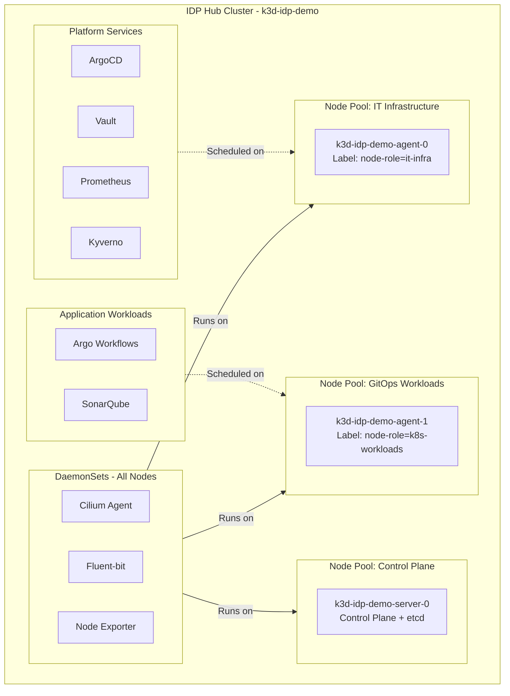

# Scheduling & Node Pools

Workloads are organized using node labels to steer scheduling and isolation.

## Node pools

- Control plane: Kubernetes API and controllers
- Infrastructure: bootstrap and platform services (Vault, ArgoCD, cert-manager…)
- Workloads: GitOps-managed stacks (observability, security, CI/CD)

Kubernetes labels and taints/tolerations can be used to enforce separation.
See the [Node Pools diagram](../architecture/visual.md#_3-node-pools-and-workload-deployment).

## Diagram

=== "D2"

```d2
direction: right

Cluster: {
  label: "k3d-idp-demo"
  CP: "Control Plane\nserver-0"
  INFRA: "Node Pool: IT Infrastructure\nagent-0\nlabel: node-role=it-infra"
  WORK: "Node Pool: GitOps Workloads\nagent-1\nlabel: node-role=k8s-workloads"
}

Platform: {
  Argo: ArgoCD
  Vault: Vault
  Kyverno: Kyverno
  Prom: Prometheus
}

Apps: {
  Workflows: "Argo Workflows"
  Sonar: SonarQube
}

DaemonSets: {
  Cilium: "Cilium Agent"
  Fluent: "Fluent-bit"
  NodeExp: "Node Exporter"
}

Platform.Argo -> Cluster.INFRA: "scheduled on"
Platform.Vault -> Cluster.INFRA
Platform.Kyverno -> Cluster.INFRA
Platform.Prom -> Cluster.INFRA
Apps.Workflows -> Cluster.WORK: "scheduled on"
Apps.Sonar -> Cluster.WORK
DaemonSets.Cilium -> Cluster.CP
DaemonSets.Cilium -> Cluster.INFRA
DaemonSets.Cilium -> Cluster.WORK
DaemonSets.Fluent -> Cluster.CP
DaemonSets.Fluent -> Cluster.INFRA
DaemonSets.Fluent -> Cluster.WORK
DaemonSets.NodeExp -> Cluster.CP
DaemonSets.NodeExp -> Cluster.INFRA
DaemonSets.NodeExp -> Cluster.WORK
```

=== "Mermaid"


