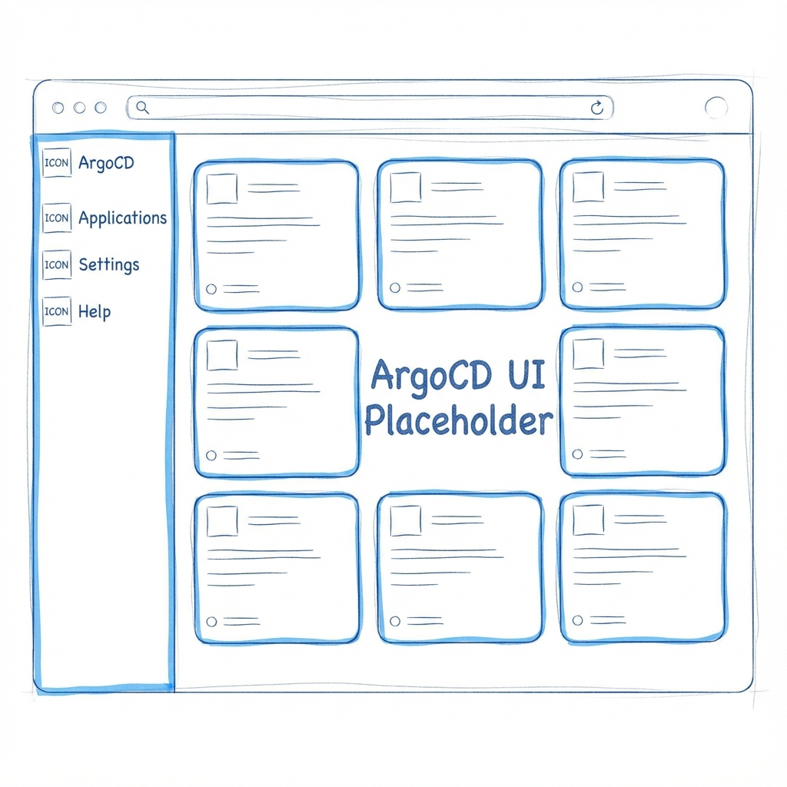

The `K8s/cicd/` directory hosts everything developers need to run workflows, quality scans,
and build-time policies inside the IDP.

This page shows the component view of the CI/CD part of the developer‑facing stacks.

## Components

| Component | Path | Highlights |
| --- | --- | --- |
| Argo Workflows | `K8s/cicd/argo-workflows/` | Controller + UI; metrics; RBAC to `cicd`. |
| Governance manifests | `K8s/cicd/governance/` | RQ + LimitRange keep demos light. |
| SonarQube | `K8s/cicd/sonarqube/` | Community edition; admin/monitor creds from Vault. |

### Repo wiring & tasks

The ApplicationSet in `K8s/cicd/applicationset-cicd.yaml` watches `K8s/cicd/*` and
generates Applications per subfolder. Deploy only the CI/CD stack with
`task stacks:cicd` (after bootstrap). Secrets are seeded from Vault via External
Secrets using defaults from `config.toml` (`passwords.sonarqube_*`) or generated by
`vault:generate-secrets`.


## Workflow Execution Flow

```d2
direction: right

classes: { actor: { style.fill: "#0f172a";
                   style.stroke: "#38bdf8";
                   style.font-color: white }
           control: { style.fill: "#111827";
                      style.stroke: "#6366f1";
                      style.font-color: white }
           data: { style.fill: "#0f766e"; style.stroke: "#34d399"; style.font-color: white }
           ux: { style.fill: "#7c3aed"; style.stroke: "#a855f7"; style.font-color: white } }

Dev: { class: actor; label: "Developer" }
Git: { class: actor; label: "Git repo\nWorkflow specs" }

Argo: {
  class: control
  Server: "Argo Workflows server\n(UI/API)"
  Controller: "Workflow controller"
}

Exec: {
  class: data
  Pods: "Workflow pods\n(priority: cicd-execution)"
  Secrets: "Secrets from Vault via ESO"
}

Sonar: { class: ux; label: "SonarQube\nquality gate" }



Dev -> Git: "author templates"
Git -> Argo.Server: "submit / reference artifact"
Argo.Server -> Argo.Controller: "create Workflow CR"
Argo.Controller -> Exec.Pods: "launch steps"
Exec.Pods -> Sonar: "scan & gate"
Exec.Pods -> Argo.Server: "status / metrics"
```

## Secrets & Credentials

Argo Workflows reads Vault-backed secrets via External Secrets (see
`K8s/cicd/argo-workflows/values.yaml` and `IT/external-secrets/`). SonarQube admin and
monitoring tokens come from Vault and are injected by Helm after ESO syncs the secret.
Other CI secrets follow the same pattern: define in Vault, sync via `ExternalSecret`,
mount as env vars in workflow pods.

## Observability Hooks

Workflow controller metrics are scraped by Prometheus via `ServiceMonitor` and shown in
Grafana. Argo emits Kubernetes events that Fluent Bit ships to Loki for centralized log
tailing. SonarQube exposes probes plus JVM metrics for dashboards tracking quality gates
and scan times.

### Verify

- Workflows UI: `https://workflows.<ip-dashed>.nip.io` via Gateway
- SonarQube UI: `https://sonarqube.<ip-dashed>.nip.io`
- Controller healthy: `kubectl -n cicd get deploy argo-workflows-controller`

## Extending the Stack

1. **Add Workflows** – store reusable templates under `K8s/cicd/argo-workflows/templates/`
   (or similar), include them via ConfigMaps, and reference them in Workflow manifests.
2. **Add Build Tools** – create subdirectories (e.g., `kaniko/`, `tekton/`) and update
   `applicationset-cicd.yaml` so ArgoCD auto-syncs them.
3. **Expose CI Services** – enable Ingress/Gateway entries in values files to expose
   SonarQube or Argo Workflows UI via the platform Gateway.
4. **Integrate pipelines** – Wire Argo Events sensors (see `K8s/events/*`) or GitHub
   webhooks to trigger workflows automatically via the event mesh.

## Example: Quality Gate Workflow

Keep this as a concise stage map (not a sequence diagram) to explain gate placement:

- **Code** → **Build & Test** → **SonarQube Scan** → **Quality Gate**
- Pass → proceed to **GitOps Merge**; Fail → return to **Code**.

In Argo Workflows, this becomes a DAG (`build` → `sonarqube-scan` → `quality-gate`)
  using the Vault-provisioned monitoring token.
