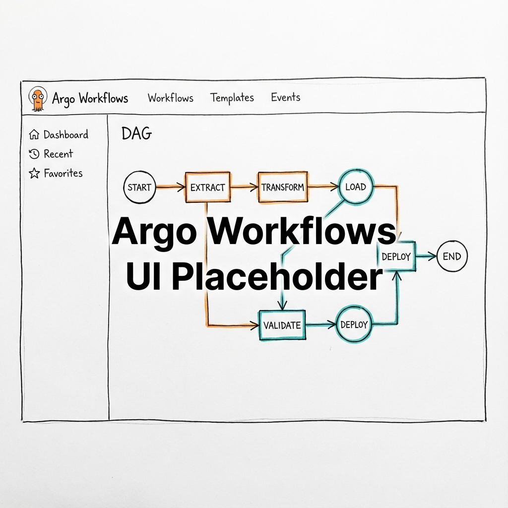

The `K8s/cicd/` directory hosts everything developers need to run workflows, quality scans,
and build-time policies inside the IDP.

This page shows the component view of the CI/CD part of the developer‑facing stacks.

## Components

| Component | Path | Highlights |
| --- | --- | --- |
| Argo Workflows | `K8s/cicd/argo-workflows/` | Workflow controller + server with metrics + RBAC locked to `cicd` namespace. |
| Governance manifests | `K8s/cicd/governance/` | ResourceQuota + LimitRange to keep demo workloads lightweight. |
| SonarQube | `K8s/cicd/sonarqube/` | Community edition with Vault-managed admin password + monitoring passcode. |

### Repo wiring & tasks

The ApplicationSet in `K8s/cicd/applicationset-cicd.yaml` watches `K8s/cicd/*` and generates Applications per subfolder. Deploy only the CI/CD stack with `task stacks:cicd` (after bootstrap). Secrets are seeded from Vault using External Secrets with defaults from `config.toml` (`passwords.sonarqube_*`) or generated by `vault:generate-secrets`.

## Workflow Execution Flow

> **Source:** [cicd-workflow-execution.d2](../assets/diagrams/architecture/cicd-workflow-execution.d2)

## Secrets & Credentials

Argo Workflows authenticates to Vault-backed secrets via External Secrets (see `K8s/cicd/argo-workflows/values.yaml` and `IT/external-secrets/`). SonarQube admin and monitoring tokens come from Vault and are injected by Helm after ESO syncs the secret. Additional CI secrets follow the same pattern: define them in Vault, sync via `ExternalSecret`, and mount as environment variables in workflow pods.

## Observability Hooks

Workflow controller metrics are scraped by Prometheus via `ServiceMonitor` and surfaced in Grafana. Argo emits Kubernetes events that Fluent-bit ships to Loki for centralized log tailing. SonarQube exposes readiness/liveness probes along with JVM metrics for dashboards tracking quality gates and scan times.

### Verify

- Workflows UI: `https://workflows.<ip-dashed>.nip.io` via Gateway
- SonarQube UI: `https://sonarqube.<ip-dashed>.nip.io`
- Controller healthy: `kubectl -n cicd get deploy argo-workflows-controller`

## Extending the Stack

1. **Add Workflows** – store reusable templates under `K8s/cicd/argo-workflows/templates/`
   (or similar), include them via ConfigMaps, and reference them in Workflow manifests.
2. **Add Build Tools** – create subdirectories (e.g., `kaniko/`, `tekton/`) and update
   `applicationset-cicd.yaml` so ArgoCD auto-syncs them.
3. **Expose CI Services** – enable Ingress/Gateway entries in values files to expose SonarQube
   or Argo Workflows UI via the platform Gateway.
4. **Integrate pipelines** – Wire Argo Events sensors (see `K8s/events/*`) or GitHub
   webhooks to trigger workflows automatically via the event mesh.

## Example: Quality Gate Workflow

Keep this as a concise stage map (not a sequence diagram) to explain gate placement:

- **Code** → **Build & Test** → **SonarQube Scan** → **Quality Gate**
- Pass → proceed to **GitOps Merge**; Fail → return to **Code**.

In Argo Workflows, this becomes a DAG (`build` → `sonarqube-scan` → `quality-gate`)
  using the Vault-provisioned monitoring token.
