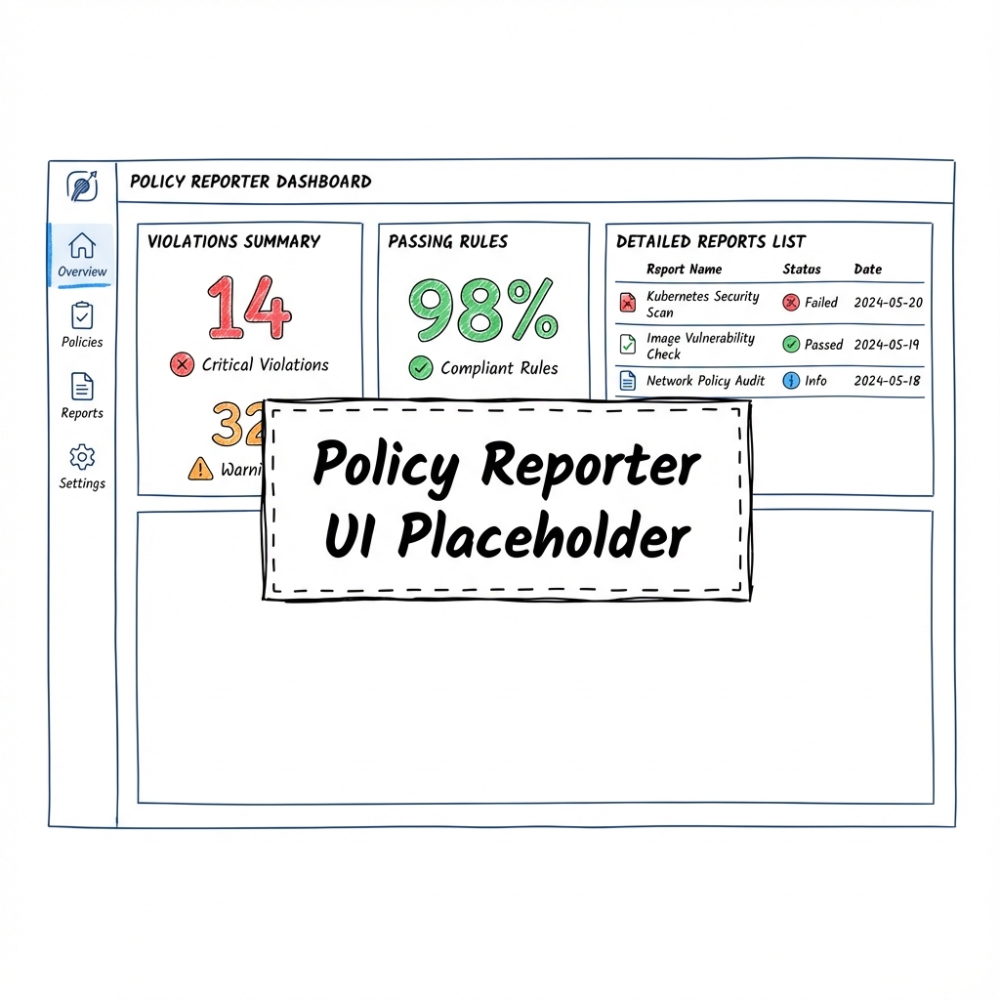

Governance lives under `Policies/` and is deployed before any workload stacks sync.
Kyverno enforces the rules, while Policy Reporter surfaces compliance status.

This page shows the component view for the automation & governance layer (Kyverno +
Policy Reporter).

## Policy Layers

| Layer | Location | Purpose |
| --- | --- | --- |
| Baseline | `Policies/rules/baseline/` | Adds canonical labels and quotas. |
| Security | `Policies/rules/security/` | Priv pods blocked; RO rootfs; vet registries. |
| Hygiene | `Policies/rules/platform/` | Check SAs; req/limits; validate priorities. |

## Deployment Path

- `Policies/app-kyverno.yaml` – ArgoCD Application applied during bootstrap.
- `Policies/kustomization.yaml` – Installs Kyverno Helm and all policy manifests.
- `Policies/policy-reporter/` – Deploys Policy Reporter + UI for at-a-glance status.

### Repo wiring & tasks

Bootstrap runs `task stacks:policies` after ArgoCD, applying
`Policies/app-kyverno.yaml` with `REPO_URL`/`TARGET_REVISION` envsubst. Redeploy
policies only with `task stacks:policies`. Lint and check before pushing using `task
quality:lint` and `task quality:check`.

## Sync Waves & Priority

Kyverno policies plug into the same sync‑wave model described in
[`GitOps, Policy, and Eventing`](../concepts/gitops-model.md).

| Resource | Sync Wave | Notes |
| --- | --- | --- |
| Kyverno Namespace/RBAC | `-2` | Must exist before CRDs/webhooks. |
| Kyverno Helm Release | `-1` | Installs CRDs + controllers. |
| ClusterPolicies | `0` | Apply after controllers are ready. |
| Policy Reporter | `1` | Consumes policy reports after Kyverno starts emitting them. |

## Policy lifecycle

### Verify

- Kyverno ready: `kubectl -n kyverno-system get deploy kyverno-admission-controller`
- Reporter UI: check Service/Ingress in `kyverno-system` and the dashboards
- Policy reports: `kubectl get policyreport,clusterpolicyreport -A`

## Writing Good Policies

1. **Stay declarative** – target labels and annotations (from the label standard) instead
   of naming individual workloads.
2. **Test locally** – use `kyverno apply` or `kyverno test` against manifests before
   pushing.
3. **Annotate severity** – add `policies.kyverno.io/severity` so Policy Reporter can filter.
4. **Document remediation** – set `policies.kyverno.io/description` and
   `documentation` annotations so the UI links back to internal runbooks.

### Local tests

- `kyverno apply` on a manifest to see allow/deny
- `kyverno test` on a curated set of cases under a `tests/` folder (optional pattern)

## Policy Reporter Dashboards

Policy Reporter exposes a UI (and Prometheus metrics) with:

- **Policy compliance score** by namespace or application.
- **Top failing policies** to highlight drift or missing labels.
- **Audit history** for previously non-compliant resources.

Hook Grafana into the Policy Reporter metrics endpoint to correlate policy drift with
deployments or cost spikes.
