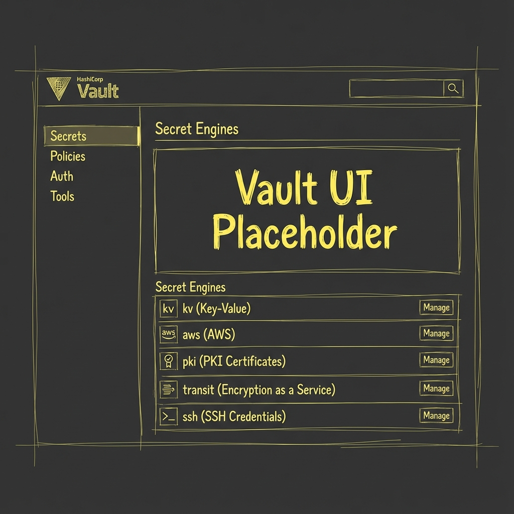

## Overview

This IDP implements a **centralized, cloud-agnostic secrets management strategy** where
HashiCorp Vault serves as the **single source of truth** for all sensitive data.
The architecture uses **External Secrets Operator (ESO)** as the unified tool
to synchronize secrets both within the Kubernetes cluster and to external cloud providers.

This page gives a cross-cutting component view of Vault + ESO and how they interact with both in-cluster and external workloads.



## Architecture Diagram


> **Source:** [secrets-architecture.d2](../assets/diagrams/architecture/secrets-architecture.d2)

## Flow Explanation

### Inside Cluster

**Vault → ESO → Kubernetes Secrets → Pods**

Vault stores secrets in its KV v2 engine at paths like `secret/data/*`. ESO watches for `ExternalSecret` custom resources in application namespaces and authenticates to Vault using a configured `ClusterSecretStore` that leverages Kubernetes service account authentication. ESO fetches the specified secrets from Vault and creates or updates native Kubernetes Secrets. Application Pods mount these Kubernetes Secrets as volumes or environment variables, completely unaware of Vault.

**Example:**

```yaml
apiVersion: external-secrets.io/v1
kind: ExternalSecret
metadata:
  name: db-credentials
spec:
  secretStoreRef:
    name: vault-backend
    kind: ClusterSecretStore
  target:
    name: db-secret # ← Creates or updates this K8s Secret
  dataFrom:
  - extract:
      key: secret/data/prod/database
```

### Outside Cluster

**Vault → ESO → Cloud Secret Managers → External Workloads**

Vault stores secrets as the same source of truth. ESO uses a `PushSecret` custom resource to read secrets from Vault and propagates these secrets to external providers like AWS Secrets Manager, GCP Secret Manager, or Azure Key Vault. External workloads (e.g., AWS Lambda, GCP Cloud Run) consume secrets from their native cloud secret manager.

**Example - Push to AWS:**

```yaml
apiVersion: external-secrets.io/v1alpha1
kind: PushSecret
metadata:
  name: push-to-aws
spec:
  secretStoreRefs:
    - name: vault-secretstore
      kind: ClusterSecretStore
    - name: aws-secrets-manager
      kind: SecretStore
  selector:
    secret:
      name: lambda-db-password
  data:
    - match:
        secretKey: password
        remoteRef:
          remoteKey: /prod/lambda/db-password
```

## Key Principles

### 1. Single Source of Truth

Vault is authoritative for all secrets. No secrets are created directly in Kubernetes Secrets (ESO creates them from Vault) or AWS/GCP/Azure Secret Managers (ESO pushes them from Vault). This centralization provides a centralized audit trail where all secret access is logged in Vault, consistent rotation where secrets updated in Vault propagate everywhere via ESO, and no vendor lock-in since the core secret store remains vendor-neutral.

### 2. Unified Operator

| Component | Responsibility | Scope |
|-----------|----------------|-------|
| **Vault** | Store, rotate, and audit secrets | Everything |
| **ESO**   | Sync Vault to K8s & push to Cloud | In-cluster & External |

**External Secrets Operator (ESO)** is used for all secret synchronization tasks.
It provides a robust and consistent mechanism for both pulling secrets into the cluster
and pushing them to external systems.

### 3. Zero-Touch Secret Consumption

Developers never handle raw secrets. The process is declarative: a developer defines an `ExternalSecret` or `PushSecret` manifest in their application's Git repository, the GitOps controller (ArgoCD) applies the manifest, and ESO automatically fetches the secret from Vault making it available to the application. Rotation is transparent—when the secret is updated in Vault, ESO updates the corresponding Kubernetes Secret or pushes the change to the cloud provider.

## Use Cases

### In-Cluster Workloads

✅ **Use `ExternalSecret` when:**

- Your workload runs inside the Kubernetes cluster.
- You need secrets available as standard Kubernetes `Secret` objects (for volume mounts
  or environment variables).

**Examples:**

- Microservices needing database passwords.
- CI/CD pipelines running in CI namespaces (for example Argo Workflows pods).
- Web applications requiring API keys.

### External Workloads

✅ **Use `PushSecret` when:**

- Your workload runs **outside** Kubernetes (e.g., serverless, VMs).
- The workload cannot call the Vault API directly (common in legacy applications).
- A cloud provider's service (like AWS RDS) requires credentials to be present
  in its native secret manager.

**Examples:**

- **AWS Lambda** functions reading from AWS Secrets Manager.
- **Crossplane** provisioning an RDS instance, which requires credentials in AWS.
- **GCP Cloud Run** services reading from GCP Secret Manager.

## Security Considerations

### Demo Environment

⚠️ **NOT for production:**

The demo environment uses self-signed TLS certificates with Vault clients setting `skipTLSVerify: true` during development. Vault is initialized with a single unseal key, the root token is logged during the init script, and both unseal keys and root token are stored in a Kubernetes Secret.

### Production Hardening

Production deployments must enforce encrypted traffic between all components via TLS everywhere, use cloud provider KMS to automatically unseal Vault, require a quorum of operators to manually unseal Vault if auto-unseal fails through multi-share unseal keys, implement least-privilege access control within Vault via RBAC policies, and restrict network access to the Vault service ideally allowing only ESO to connect through Network Policies.

## Deployment Workflow

### Initial Setup

```bash
# 1. Deploy Vault (sealed, uninitialized)
task vault:deploy

# 2. Initialize Vault manually
task vault:init
# → Generates unseal keys, root token
# → Configures Kubernetes auth for ESO

# 3. Deploy ESO
task external-secrets:deploy
task it:external-secrets:apply-resources
```

### Day-2 Operations

**Add a new secret to Vault:**

```bash
kubectl exec -n vault-system vault-0 -- \
  vault kv put secret/prod/app-credentials \
  username=app_user \
  password=secure_password
```

**Consume in-cluster (ESO `ExternalSecret`):**

This is the standard way to make secrets available to pods.

```yaml
apiVersion: external-secrets.io/v1
kind: ExternalSecret
metadata:
  name: app-credentials
  namespace: production
spec:
  secretStoreRef:
    name: vault-backend
    kind: ClusterSecretStore
  target:
    name: app-secret # ESO creates this K8s Secret
    creationPolicy: Owner
  dataFrom:
  - extract:
      key: secret/data/prod/app-credentials
```

**Real-world example: ArgoCD admin password management** (see `IT/external-secrets/argocd-admin-externalsecret.yaml`):

This `ExternalSecret` targets an existing secret managed by Helm (`argocd-secret`) and
merges the password into it.

```yaml
apiVersion: external-secrets.io/v1
kind: ExternalSecret
metadata:
  name: argocd-admin-password
  namespace: argocd
spec:
  refreshInterval: 5m
  secretStoreRef:
    kind: SecretStore
    name: vault-backend
  target:
    name: argocd-secret
    creationPolicy: Merge
    deletionPolicy: Retain
  data:
    - secretKey: admin.password
      remoteRef:
        key: secret/data/argocd/admin
        property: admin.password
```

**Push to AWS (ESO `PushSecret`):**

```yaml
apiVersion: external-secrets.io/v1alpha1
kind: PushSecret
metadata:
  name: push-app-creds-to-aws
spec:
  secretStoreRefs:
    - name: vault-secretstore
    - name: aws-secrets-manager
  selector:
    secret:
      name: app-credentials # References a K8s secret synced by another ExternalSecret
  data:
    - match:
        secretKey: password
        remoteRef:
          remoteKey: /prod/lambda/app-password
```

## Monitoring & Observability

### Metrics

**Vault:**

- `vault_core_unsealed` - Seal status (0=sealed, 1=unsealed).
- `vault_token_count_by_policy` - Active tokens per policy.
- Prometheus ServiceMonitor is enabled in `IT/vault/values.yaml`.

**ESO:**

- `externalsecret_sync_calls_total` - Total sync operations.
- `externalsecret_sync_calls_error` - Total sync failures.
- Available via a ServiceMonitor.

### Alerts

**Critical:**

- Vault is sealed unexpectedly.
- ESO sync failures > 5 in the last 10 minutes.
- A Vault token used by ESO is approaching its expiration.

**Warning:**

- Secret rotation delay > 1 hour.
- High Vault API latency (>500ms).

## Migration Path from Current State

### From: Custom Init Sidecar

A previous version of this blueprint used a custom sidecar container with a bash script
to initialize Vault and inject secrets. This is now deprecated.

### To: ESO + Manual Init

The current, stable architecture uses a one-time manual initialization script for
Vault (`task vault:init`) and relies on **External Secrets Operator** for
all subsequent secret synchronization.

### Future: Vault Operator

For environments requiring fully automated, declarative management
of Vault itself (including auto-unseal, HA configuration, etc.),
migrating to an operator like Bank-Vaults is the recommended next step.

**When to migrate:**

Migration to a Vault operator becomes necessary when deploying a High-Availability Vault cluster (e.g., 3+ replicas with Raft), requiring fully automatic unsealing using a cloud KMS, or when zero manual intervention in Vault's lifecycle is a hard requirement.

## References

- [External Secrets Operator Docs](https://external-secrets.io/latest/)
- [ESO `PushSecret`](https://external-secrets.io/latest/api/pushsecret/)
- [Vault Production Hardening](https://developer.hashicorp.com/vault/tutorials/operations/production-hardening)
- [Bank-Vaults Operator](https://bank-vaults.dev/docs/operator/)
