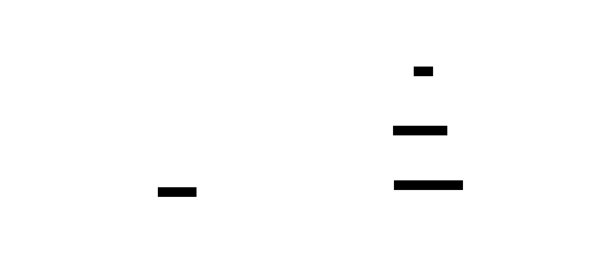
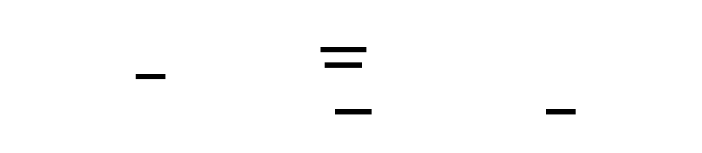
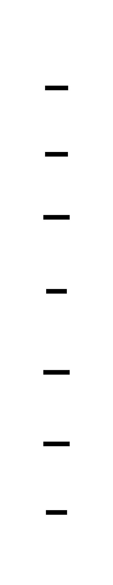

This page collects a small set of diagrams that show how the main control loops and
data paths work inside the platform. Use it as a visual reference after you have read:

- [Architecture overview](overview.md)
- [GitOps model](../concepts/gitops-model.md)
- [Security & policy model](../concepts/security-policy-model.md)

Each diagram focuses on a single question and links back to the relevant documentation.
We keep just two cross-cutting visuals here; the rest live with their detailed pages
(observability, secrets, GitOps, etc.).

## D2 Diagram Standards

We use [D2](https://d2lang.com/) for all diagrams. To maintain consistency, please use
the following standard classes:

| Class | Description | Style |
| :--- | :--- | :--- |
| `actor` | Users, Engineers | Blue fill, Person shape |
| `control` | Control Logic (ArgoCD, Controllers) | Dark fill, Indigo stroke |
| `infra` | Infrastructure (K8s, Clusters) | Dark Blue fill, Sky Blue stroke |
| `data` | Data/State (Vault, Git, DBs) | Teal fill, Emerald stroke |
| `workload` | Applications/Pods | Purple fill, Violet stroke |

Example usage:

```d2
classes: {
  control: { style: { fill: "#111827"; stroke: "#6366f1"; font-color: white } }
}
Argo: { class: control }
```

## 1. Control backbone: GitOps, policy, secrets



See: [GitOps model](../concepts/gitops-model.md), [Secrets](secrets.md),
[Policies](policies.md).

## 2. Gateway API service exposure


See: [Networking & gateway](../concepts/networking-gateway.md).

## 3. Process Flows

These diagrams show critical platform workflows step-by-step.

### Bootstrap Complete Flow

Shows the complete platform initialization sequence from cluster creation to fully
operational state.


See: [Getting Started](../getting-started/quickstart.md) for bootstrap details.

### Secret Synchronization Flow

Shows how secrets flow from Vault to Kubernetes pods via External Secrets Operator.



See: [Secrets architecture](secrets.md) for detailed secret management.

### GitOps Synchronization Flow

Shows the complete flow from Git commit to running workload with policy enforcement.



See: [GitOps model](../concepts/gitops-model.md) and
[Policy model](../concepts/security-policy-model.md).
