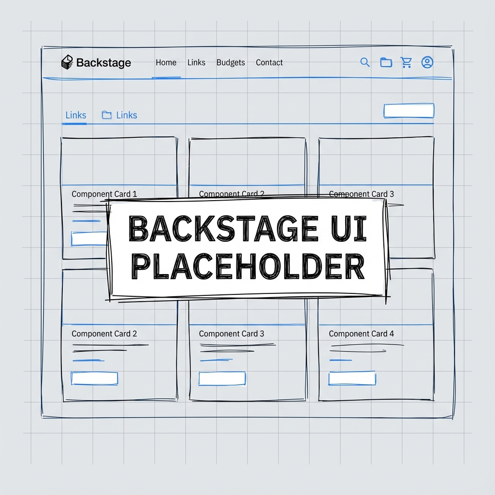

- **Chart**: `backstage` (pinned 2.6.3), deployed via Kustomize `helmCharts`.
- **Namespace**: `backstage`, with `LimitRange` and `ResourceQuota` sized for a web app + Postgres.
- **Secrets**: ExternalSecrets from Vault (`secret/backstage/app`, `secret/backstage/postgres`),
  using a dedicated `SecretStore` and SA `external-secrets`.
- **Exposure**: `HTTPRoute` `backstage.nip.io` on the platform gateway
  (TLS terminates at the Gateway).
- **Monitoring**: `ServiceMonitor` labeled `prometheus: kube-prometheus` scraping service
  `backstage` port `http`.
- **Operations**:
  - Deploy isolated: `task stacks:backstage` (requires `REPO_URL`/`TARGET_REVISION`).
  - Included in full deploy (`task stacks:deploy`) via `fuses.backstage` (`config.toml`).
  - Tweak `backstage/backstage/values.yaml` for custom images or extra integrations.

