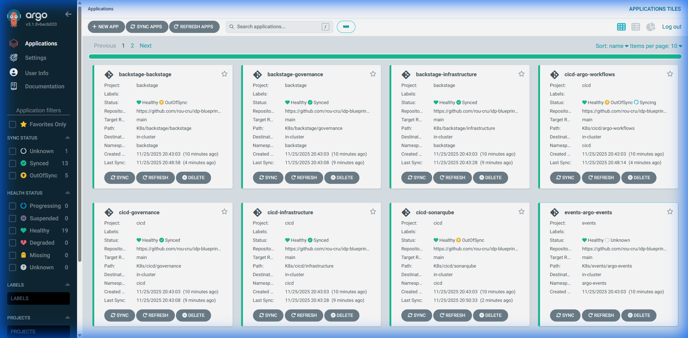

> **Prerequisites:** This builds on the [GitOps philosophy](design-philosophy.md#3-gitops).
> For implementation details, see [Application
> Architecture](../architecture/applications.md).

This IDP is GitOps‑first, policy‑driven, and event‑oriented. The goal is one predictable
path from intent to action, plus a programmable way to react to signals. We borrow C4 naming
to structure views but keep diagrams jargon‑free.

## Two layers of change: Bootstrap vs GitOps

The platform separates initial provisioning from continuous operation. Bootstrap (`IT/`)
handles one-time installation of control planes and base services including Cilium, cert-
manager, Vault/ESO, ArgoCD, and Gateway. This layer is code but not continuously reconciled.
GitOps (`K8s/`) manages continuously reconciled state through ApplicationSets that watch
directories and generate Applications.

## AppProjects and ApplicationSets — guardrails and generation

AppProjects define blast radius by constraining source repositories and deployment
destinations (see `IT/argocd/appproject-*.yaml`). ApplicationSets map directories to
Applications, triggering one rollout per commit.

## Sync Waves — ordering without scripts

ArgoCD applies resources in ascending `argocd.argoproj.io/sync-wave` order. Waves express
dependency intent rather than encoding fragile numeric sequences. Most resources use the
default wave (0), indicating standard order. Foundation or prerequisite objects like
namespaces and SecretStores receive negative waves to deploy before dependents. Routes,
dashboards, and components that depend on backends use positive waves.

The codebase demonstrates this pattern consistently. Namespaces for each stack carry
negative waves in `K8s/*/governance/namespace.yaml`. HTTPRoutes and edge objects use
positive waves in `IT/gateway/httproutes/*.yaml`. SLO and UI components
(`K8s/observability/slo/*`) use higher positive waves to wait for data sources.

When adding a resource, pick the smallest annotation that expresses the dependency, and keep
the manifests as the source of truth. The specific integers may change; the intent
(foundation → core → edge) should not.

## Policy — turning conventions into guarantees

Kyverno validates at admission and can mutate or generate resources. The platform uses it to
encode rules ensuring every namespace and workload includes appropriate labels, limits, and
safety constraints. Common enforcement targets include namespace labels (owner, business-
unit, environment), component labels on Deployments/StatefulSets/DaemonSets, and default
NetworkPolicies for future hardening.

## Eventing — a programmable nervous system

Argo Events makes “what happens next” explicit: route events into Sensors, then trigger
Workflows, ArgoCD actions, or HTTP calls. Treat alerts, GitHub webhooks, and K8s resource
state changes the same: as events.

Typical recipes:

Typical recipes include triggering a rollback and notification when an SLO burn alert fires,
or running build and test pipelines for GitHub PRs to generate previews. For ArgoCD, an
OutOfSync event can trigger a refresh or sync operation gated by policy checks.

## Sync policy, drift, and safety

Automated prune and self‑heal settings keep the cluster aligned with Git, while server‑side
apply and out‑of‑sync only options reduce noisy diffs. Non‑deterministic fields like webhook
`caBundle` are ignored to avoid unnecessary drift.

## Secrets in the loop

ESO authenticates to Vault and writes K8s Secrets. Workloads consume only K8s Secrets. Use
`creationPolicy: Merge` when charts need to add internal keys later.
