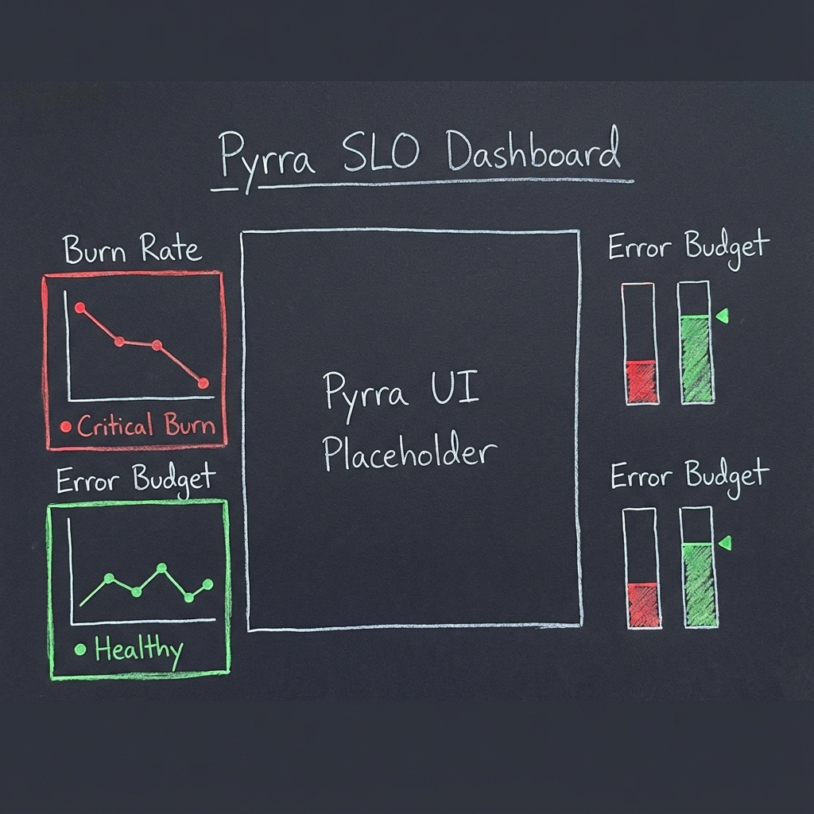
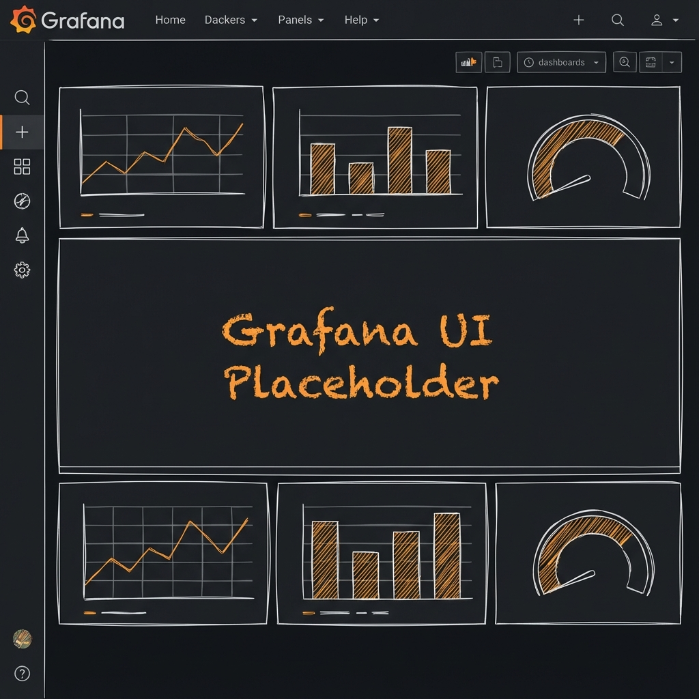
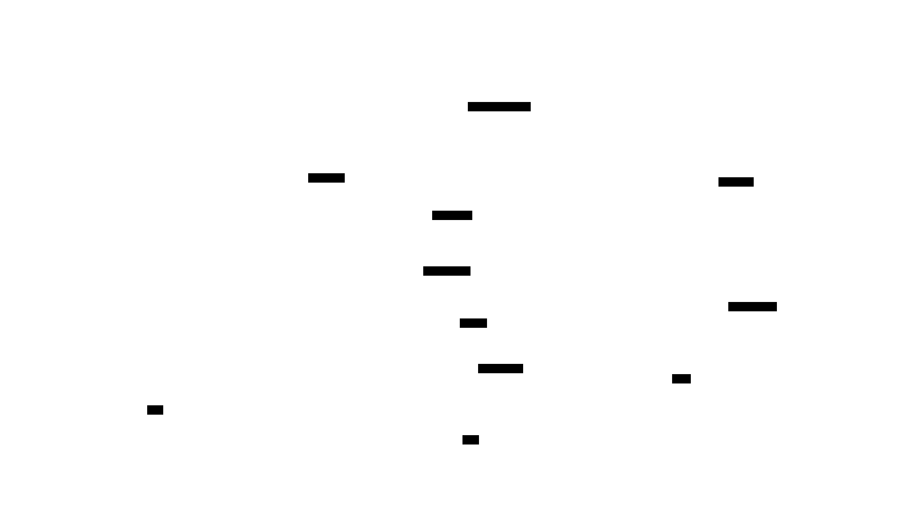

The observability stack covers metrics, logs, and dashboards with minimal footprint. It
lives under `K8s/observability/` and is powered by Prometheus, Loki, Fluent-bit, and
Grafana.

This page is the component view for the "Observability" part of the developer‑facing
stacks.

## Components at a Glance

| Component  | Deploy Path                                | Purpose                                                             |
| ---------- | ------------------------------------------ | ------------------------------------------------------------------- |
| Prometheus | `K8s/observability/kube-prometheus-stack/` | Scrapes cluster + workload metrics, exposes Alertmanager + Grafana. |
| Fluent-bit | `K8s/observability/fluent-bit/`            | Tails container logs on every node and forwards to Loki.            |
| Loki       | `K8s/observability/loki/`                  | Stores logs in boltDB shipper mode (single replica for k3d).        |
| Pyrra      | `K8s/observability/pyrra/`                 | SLO management with Prometheus integration.                         |
| Grafana    | Bundled via Prometheus stack               | Serves dashboards; integrates with Prometheus + Loki datasources.   |

### Repo wiring & tasks

The ApplicationSet in `K8s/observability/applicationset-observability.yaml` watches
`K8s/observability/*`. Deploy only the observability stack with
`task stacks:observability`. Grafana admin credentials are synced from Vault via
`ExternalSecret` (`kube-prometheus-stack/grafana-admin-externalsecret.yaml`).

## Data Flow

> **Source:**
> [observability-dataflow.d2](../assets/diagrams/architecture/observability-dataflow.d2)

## Instrumentation Strategy

Each stack component (ArgoCD, Kyverno, Trivy, etc.) exposes metrics via ServiceMonitors
annotated with the `prometheus: kube-prometheus` label so the Prometheus Operator
scrapes them automatically. Common `app.kubernetes.io/*` labels ensure dashboards can
group data by stack or owner, tying into FinOps tagging. Prometheus stores approximately
2 days of data while Loki uses boltdb-shipper with 5Gi PVC to stay laptop-friendly
(adjust in `kube-prometheus-stack-values.yaml` and `loki-values.yaml` for longer
retention). Grafana sidecars import dashboards from
`K8s/observability/kube-prometheus-stack/dashboards/`, keeping everything
GitOps-managed.

## Alerting

The Prometheus stack enables Alertmanager but does not send notifications by default. To
enable alerts, create a `Secret` named `alertmanager-kube-prometheus-stack-alertmanager`
with your receiver configuration, update `alertmanager.config` in
`kube-prometheus-stack-values.yaml` to reference the secret or inline config, and commit
to let ArgoCD roll out the change.

### Verify

- Grafana UI: `https://grafana.<ip-dashed>.nip.io` via Gateway
- Prometheus targets: check `Status → Targets` and confirm `kubernetes-apiservers`,
  `node-exporter`, etc.
- Loki logs: Explore → Loki → `{namespace="observability"}` to see stack logs

## Custom Dashboards Workflow

Platform engineers add or update JSON files under
`K8s/observability/kube-prometheus-stack/dashboards/`. After committing, the
ApplicationSet syncs and the Grafana sidecar reloads dashboards automatically. Verify
changes in the Grafana UI.

## Extending the Stack

- **Add Tempo/OTel**: Create `K8s/observability/tempo/` with a Helm chart entry and
  reference it from the ApplicationSet.
- **Per-team dashboards**: Use folder provisioning and `grafana.dashboards` values to
  organize by stack (`observability`, `cicd`, etc.).
- **Metrics federation**: Enable the Prometheus `federation` job in values if sending
  data to an external monitoring plane.
