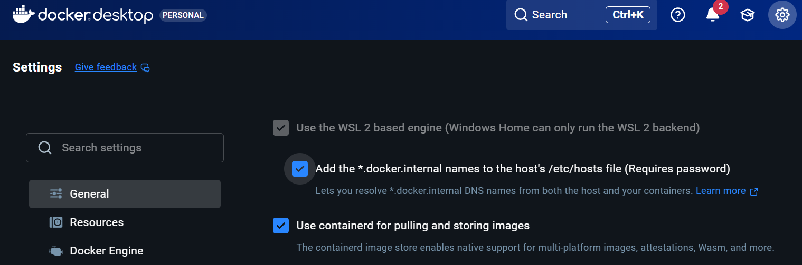

import { Button } from '../../../components/content/index.ts';

Before deploying the demo, make sure the host can run local containers with enough headroom. Devbox or the VS Code Dev Container supplies the toolchain (task, kubectl, helm, k3d, k9s, argocd CLI); the host only needs a container runtime and git.

### Host requirements

| Area | Minimum | Comfortable |
| --- | --- | --- |
| CPU | 4 cores | 6+ cores |
| Memory | 8 GB | 12+ GB |
| Storage | 30 GB free | 40+ GB free |
| Virtualization | Enabled (VT-x/AMD-V) | — |
| Network | Internet access for image pulls | — |

### Quick checks

```bash
git --version
docker info
```

### Clone the repository

```bash
git clone https://github.com/rou-cru/idp-blueprint
cd idp-blueprint
```

#### Linux
Install Docker Engine (`dockerd`), start the service, and add your user to the `docker` group (or use sudo). Verify virtualization is enabled in BIOS/UEFI and confirm with `docker info`.

#### macOS
Install Docker Desktop. The default CPU/RAM limits are fine for the demo; raise them in Settings → Resources only if you hit resource pressure. Virtualization is on by default (Intel or Apple Silicon).

#### Windows: Use WSL2
In an elevated PowerShell, enable WSL2 and install a distro:

```powershell
wsl --install
```

*For details, see [Microsoft’s official WSL documentation](https://learn.microsoft.com/en-us/windows/wsl/install).*

Then open Docker Desktop and turn on “Use the WSL 2 based engine”



Use VS Code, open the folder and “Reopen in Container” to get the toolchain preloaded.

### Ports and firewall

Default NodePorts are 30080 (HTTP) and 30443 (HTTPS); keep them free and allow inbound if you want LAN access. nip.io uses your LAN IP—make sure that IP is reachable from the browser device you will use.

### For power users

:::tip
In Windows this have to be done direct in WSL console
:::

If you prefer to stay outside VS Code (e.g., for a long-running home lab), install Devbox and run:

```bash
devbox shell
```

<div class="flex justify-center gap-3 mt-8">
  <Button href="/getting-started/overview/" variant="secondary" icon="arrow-left">
    Back: Overview
  </Button>
  <Button href="/getting-started/quickstart/" variant="primary" icon="arrow-right">
    Next: Quickstart
  </Button>
</div>