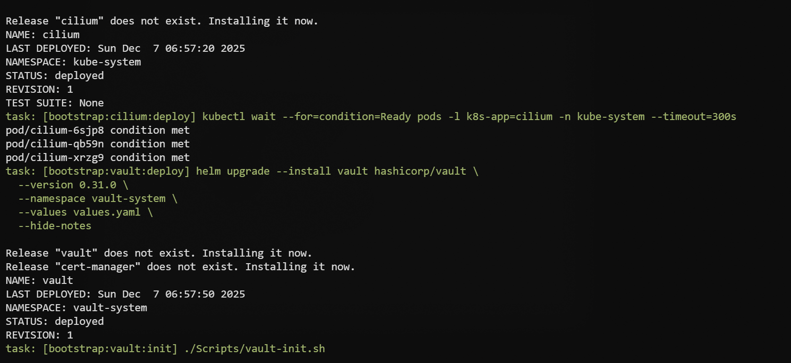
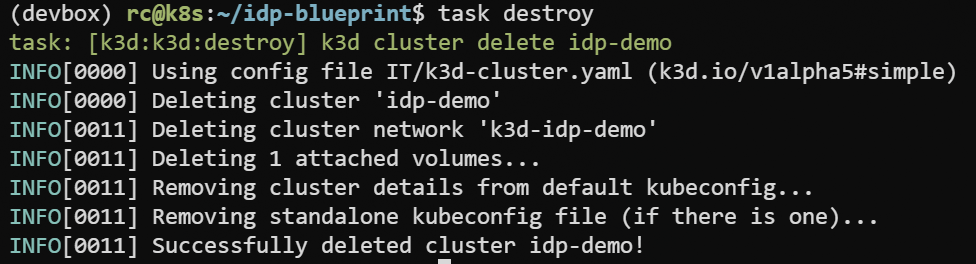

import { Button } from '../../../components/content/index.ts';

Deploy the reference implementation to observe the architecture in a live cluster. This
assumes you meet the prerequisites (container runtime + git; tooling via Devbox or Dev
Container). Initial deployment requires image downloads and ArgoCD reconciliation,
typically 5–7 minutes on most connections.

The deployment orchestration reads `config.toml` for component versions, NodePort
assignments, default credentials, and stack enablement. Before deploying, you may
customize which stacks to include.

## Optional: Configure deployment scope

Edit `config.toml` `[fuses]` to disable stacks you do not need (`observability`, `cicd`,
`security`, `events`, `backstage`). The `prod` flag hardens ArgoCD defaults. These fuses
control what the demo deploys; they do not change the underlying architecture model.
Make changes before running `task deploy`.


:::danger Never keep real passwords or secrets in plain text. The demo ships simple
values for convenience—replace them with your own secure secrets for anything beyond
local exploration. :::

## Deploy

```bash
task deploy
```

Run it from the repository root. It spins up a three-node k3d cluster, sets up
networking (Cilium, Gateway API), cert-manager, Vault + External Secrets, ArgoCD, and
then lets ApplicationSets bring up the stacks you left enabled.

Typical runs take about 5–15 minutes depending on bandwidth and available resources.

### What to expect while it runs

Early logs cover k3d creation and Cilium; later you will see ArgoCD, Gateway NodePorts,
and ApplicationSets per stack.



ArgoCD keeps reconciling after `task deploy` exits, so Healthy/Synced states appear
gradually as images finish pulling. The task prints nip.io URLs (based on your LAN IP)
when the Gateway is ready.

You can open `k9s` to watch resources settle.



Some workloads may show transient states (Pending, ContainerCreating) during initial
convergence. Multiple Helm charts reconcile in parallel under GitOps control; the
cluster reaches steady state as images finish pulling. Typical convergence time is 5–7
minutes on most setups; networks with &lt;10Mbps bandwidth or high latency may require
10–15 minutes.

## Clean up

```bash
task destroy
```

Running `task destroy` deletes the k3d cluster and all demo resources, returning your
host to the state before deployment. Use it when you finish exploring or need to reclaim
disk space.


<div class="flex justify-center gap-3 mt-8">
  <Button href="/getting-started/prerequisites/" variant="secondary" icon="arrow-left">
    Back: Prerequisites
  </Button>
  <Button href="/getting-started/verify/" variant="primary" icon="arrow-right">
    Next: Verify Installation
  </Button>
</div>
