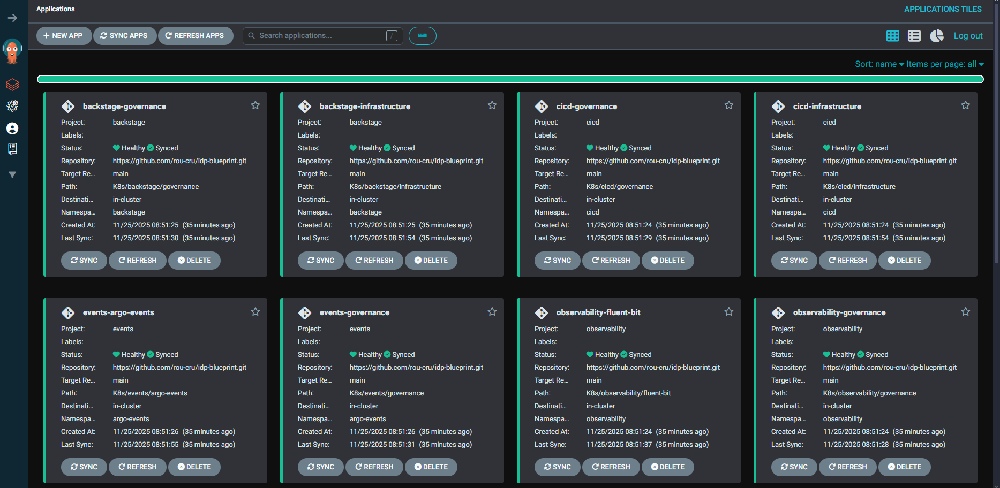
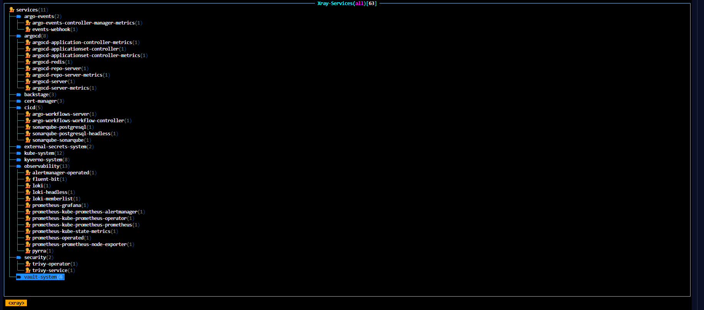
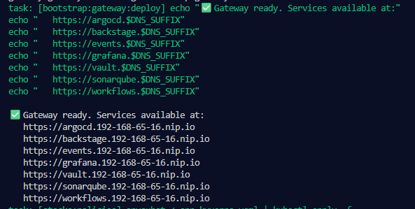
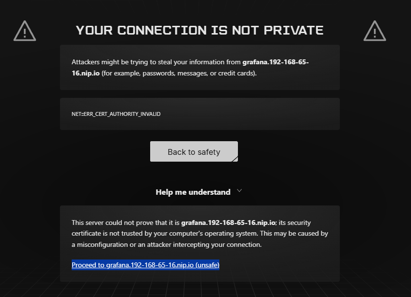

import { LinkButton } from '@astrojs/starlight/components';

Let’s confirm things came up as expected and set realistic expectations for the first minutes after deploy.

## What to expect in the first 5–10 minutes

- ArgoCD continues syncing for a bit after “task deploy” finishes
- Pods roll through Pending → Running → Ready as images download
- It’s okay if not everything is Healthy/Synced immediately

{/*Sequence diagram removed for a simpler, first-contact explanation.*/}

## Quick Checks

```bash
kubectl get nodes
kubectl get pods -A | sort
kubectl -n argocd get applications

# Optional: watch live
kubectl get pods -A -w &
kubectl -n argocd get applications -w &

# Gateway becomes ready when TLS and routes bind
kubectl -n kube-system wait --for=condition=Programmed gateway/idp-gateway --timeout=300s
```

:::tip
`k9s` ships in the Devbox/Dev Container. Try `k9s -A` and toggle between `:pods`, `:deploy`, `:events` to watch things settle.
:::

### First look at the platform

```d2
direction: right

classes: { actor: { style.fill: "#0f172a"; style.font-color: white; style.stroke: "#38bdf8" }
           gateway: { style.fill: "#0f172a"; style.stroke: "#22d3ee"; style.font-color: white }
           ui: { style.fill: "#7c3aed"; style.stroke: "#a855f7"; style.font-color: white } }

User: { class: actor; label: "You\n(Laptop)" }
Browser: { class: actor; label: "Browser" }

Gateway: { class: gateway; label: "Gateway API\nTLS *.nip.io" }

UIs: {
  class: ui
  Argo: "ArgoCD"
  Grafana
  Vault
  Backstage
}

User -> Browser: "open https://<app>.<ip>.nip.io"
Browser -> Gateway: HTTPS
Gateway -> UIs.Argo
Gateway -> UIs.Grafana
Gateway -> UIs.Vault
Gateway -> UIs.Backstage
```

### What you'll see in the ArgoCD UI

- Application cards with *Sync* (Git vs. cluster) and *Health* columns. It's normal to see some `OutOfSync` right after deploy while things converge.
- Projects in the left sidebar (e.g., `cicd`, `observability`, `backstage`) - these correspond to the [fuses](../architecture/overview.md#feature-toggles-fuses) enabled in your `config.toml`.
- Each card opens a resource graph so you can inspect Deployments, Services, and ConfigMaps.



### Example: inside an Application

Opening an Application (e.g., `observability-kube-prometheus-stack`) shows a resource graph plus metadata:

- Git source (`K8s/observability/kube-prometheus-stack`) and revision (`main`).
- Destination (`https://kubernetes.default.svc`, namespace `observability`).
- *Refresh* and *Sync* buttons to trigger reconciliation on demand.


### CLI/TUI alternative: k9s

Prefer a terminal? Use the bundled `k9s` TUI. Quick start:

```bash
k9s -A
```

From there jump with `:ns`, `:pods`, `:deploy` and watch events live while ArgoCD syncs.



## Access Endpoints

`task deploy` prints the exact service URLs using your detected LAN IP (not 127.0.0.1 in normal cases). Example output:



Patterns (replace with your IP-dashed value):

- ArgoCD: `https://argocd.<ip-dashed>.nip.io`
- Grafana: `https://grafana.<ip-dashed>.nip.io`
- Vault: `https://vault.<ip-dashed>.nip.io`
- Argo Workflows: `https://workflows.<ip-dashed>.nip.io`
- SonarQube: `https://sonarqube.<ip-dashed>.nip.io`

Reachable from other devices on your LAN using your workstation IP. Ensure the configured NodePorts are allowed by your OS firewall.

:::caution
If you can’t reach the endpoints from another device, open NodePorts `30080`/`30443` (or the values in `config.toml`) in your OS firewall.
:::

## Login Notes

- ArgoCD admin username: `admin`
- ArgoCD admin password: stored as bcrypt in the Secret; use the value in `config.toml` (`passwords.argocd_admin`, default `argo`).
- For CLI from your LAN, use `--plaintext` because ArgoCD runs in `insecure` mode (HTTP behind the Gateway):

```bash
argocd login argocd.<ip-dashed>.nip.io --username admin --password <value-from-config.toml> --plaintext
```

## Certificate Warnings

TLS uses a local, self‑signed root CA. Browsers will warn on first visit. You can proceed, or import the CA:



```bash
# Export the root CA from cert-manager
kubectl -n cert-manager get secret idp-demo-ca-secret \
  -o jsonpath='{.data.tls\.crt}' | base64 -d > idp-demo-ca.crt
```

- macOS: Keychain Access → System → Certificates → import `idp-demo-ca.crt` → “Always Trust”.
- Linux (Debian/Ubuntu): `sudo cp idp-demo-ca.crt /usr/local/share/ca-certificates/ && sudo update-ca-certificates`
- Windows: `certmgr.msc`, import into “Trusted Root Certification Authorities”.

:::tip
Certificates are issued automatically by cert-manager using a wildcard certificate for `*.127-0-0-1.nip.io`.
:::

## Quick smoke checks (eventual consistency friendly)

| Goal | Command | Success signal |
| --- | --- | --- |
| ArgoCD apps appear and converge | `kubectl -n argocd get applications` | Apps listed; `Sync` moves toward `Synced` over a few minutes |
| Grafana up with datasources | Open `https://grafana.<ip>.nip.io` | UI loads; Prometheus/Loki datasources present |
| Trivy Operator running | `kubectl -n security get pods \| rg trivy` | `trivy-operator` and `trivy-server` pods Ready |
| External Secrets working | `kubectl get externalsecrets,secretstores -A` | Objects present; ArgoCD secret exists (`kubectl -n argocd get secret argocd-secret`) |

<div style="display: flex; gap: 0.75rem; justify-content: center; margin-top: var(--sl-spacing-4);">
  <LinkButton href="/getting-started/deployment/" variant="secondary" icon="arrow-left">
    Back: Deployment
  </LinkButton>
  <LinkButton href="/operate/add-component/" variant="primary" icon="arrow-right">
    Next: Operate — Add Component
  </LinkButton>
</div>
