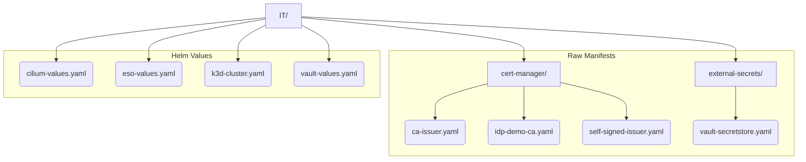

# IT Directory Architecture

This directory contains the **static** or **bootstrap layer** of the platform. These are
the core components required to bring up a functional Kubernetes cluster _before_ the
GitOps engine (e.g., ArgoCD) takes over.

## Guiding Principles

The structure follows two simple rules to ensure consistency and clarity.

### 1. Helm Chart Configurations

Configuration for a core component deployed via a Helm chart is defined in a single
`*-values.yaml` file.

- **Location**: Root of the `IT/` directory.
- **Naming**: The filename is simple and references the component (e.g.,
  `cilium-values.yaml`, `vault-values.yaml`).

### 2. Raw Kubernetes Manifests

Static Kubernetes resources that are not part of a Helm chart installation (e.g., a
`ClusterIssuer` or a `SecretStore`) are organized as raw YAML files.

- **Location**: Placed inside a subdirectory named after the parent component (e.g.,
  `cert-manager/`).
- **Naming**: The filename **must** exactly match the `metadata.name` of the resource
  defined within it (e.g., a `ClusterIssuer` with `name: ca-issuer` is saved in
  `ca-issuer.yaml`).

## Visual Structure

## Quick Reference

| File / Directory    | Purpose                                                    | Type          |
| ------------------- | ---------------------------------------------------------- | ------------- |
| `k3d-cluster.yaml`  | Defines the k3d cluster itself.                            | k3d Config    |
| `*-values.yaml`     | Configures a core component's Helm chart.                  | Helm Values   |
| `cert-manager/`     | Contains raw manifests for the cert-manager component.     | Raw Manifests |
| `external-secrets/` | Contains raw manifests for the external-secrets component. | Raw Manifests |
