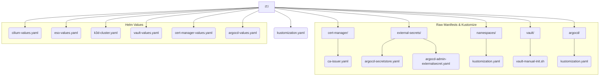

# IT Directory Architecture

This directory contains the **static** or **bootstrap layer** of the platform. These are
the core components required to bring up a functional Kubernetes cluster _before_ the
GitOps engine (e.g., ArgoCD) takes over.

## Guiding Principles

The structure follows two simple rules to ensure consistency and clarity.

### 1. Helm Chart Configurations

Configuration for a core component deployed via a Helm chart is defined in a single
`*-values.yaml` file.

- **Location**: Root of the `IT/` directory.
- **Naming**: The filename is simple and references the component (e.g.,
  `cilium-values.yaml`, `vault-values.yaml`).

### 2. Raw Kubernetes Manifests

Static Kubernetes resources that are not part of a Helm chart installation (e.g., a
`ClusterIssuer` or a `ClusterSecretStore`) are organized as raw YAML files.

- **Location**: Placed inside a subdirectory named after the parent component (e.g.,
  `cert-manager/`).
- **Naming**: The filename **must** exactly match the `metadata.name` of the resource
  defined within it (e.g., a `ClusterIssuer` with `name: ca-issuer` is saved in
  `ca-issuer.yaml`).

### 3. Bootstrap Resources via Kustomize

Some components require orchestrated deployment of multiple resources. These use
Kustomize for composition and are deployed via `kustomize build <dir>/ | kubectl apply -f -`.

- **Location**: Subdirectories with their own `kustomization.yaml`.
- **Purpose**:
  - `namespaces/`: Bootstrap namespace definitions for core components.
  - `cert-manager/`: Issuers and Certificate definitions.
  - `external-secrets/`: The `ClusterSecretStore` to connect to Vault and
    the `ExternalSecret` for ArgoCD.
  - `argocd/`: Kustomization to support the Helm chart.

## Visual Structure

## Quick Reference

| File / Directory             | Purpose                                                                  | Type                |
| ---------------------------- | ------------------------------------------------------------------------ | ------------------- |
| `k3d-cluster.yaml`           | Defines the k3d cluster itself.                                          | k3d Config          |
| `kustomization.yaml`         | Root Kustomize orchestrator (currently minimal).                         | Kustomize           |
| `*-values.yaml`              | Configures a core component's Helm chart.                                | Helm Values         |
| `namespaces/`                | Bootstrap namespace definitions for core components.                     | Kustomize Bootstrap |
| `vault/`                     | Contains the manual Vault initialization script (`vault-manual-init.sh`).| Shell Script        |
| `cert-manager/`              | Raw manifests for cert-manager (ClusterIssuers, CA certificates).        | Raw Manifests       |
| `external-secrets/`          | Raw manifests for External Secrets Operator (SecretStore, ExternalSecret).| Raw Manifests       |
| `argocd/`                    | Kustomization to support the ArgoCD Helm chart deployment.               | Kustomize           |

## Deployment Workflow

The bootstrap process follows this order (orchestrated by `Taskfile.yaml`):

1. **Create k3d cluster** (`k3d-cluster.yaml`).
2. **Apply bootstrap namespaces** via Kustomize: `kustomize build namespaces/ | kubectl apply -f -`.
3. **Deploy Cilium CNI** via Helm (`cilium-values.yaml`).
4. **Deploy Prometheus CRDs** via a dedicated Helm chart install.
  This is done using the `kube-prometheus-stack` chart with the `crdOnly=true` flag.

5. **Deploy Cert-Manager** via Helm (`cert-manager-values.yaml`).
    - Then apply Cert-Manager resources: `kustomize build cert-manager/ | kubectl apply -f -`.
6. **Deploy Vault Stack**:
    - Deploy Vault via Helm (`vault-values.yaml`).
    - Execute the manual initialization script (`vault-manual-init.sh`) to
    initialize and unseal Vault.
7. **Deploy External Secrets Operator** via Helm (`eso-values.yaml`).
    - Then apply ESO resources (`ClusterSecretStore`, `ExternalSecret` for ArgoCD)
      via Kustomize: `kustomize build external-secrets/ | kubectl apply -f -`.
2. **Deploy ArgoCD** via Helm (`argocd-values.yaml`).

**Key Insight:** The bootstrap process is a carefully orchestrated sequence of Helm deployments
 and Kustomize applications, managed entirely by `Taskfile.yaml`.
