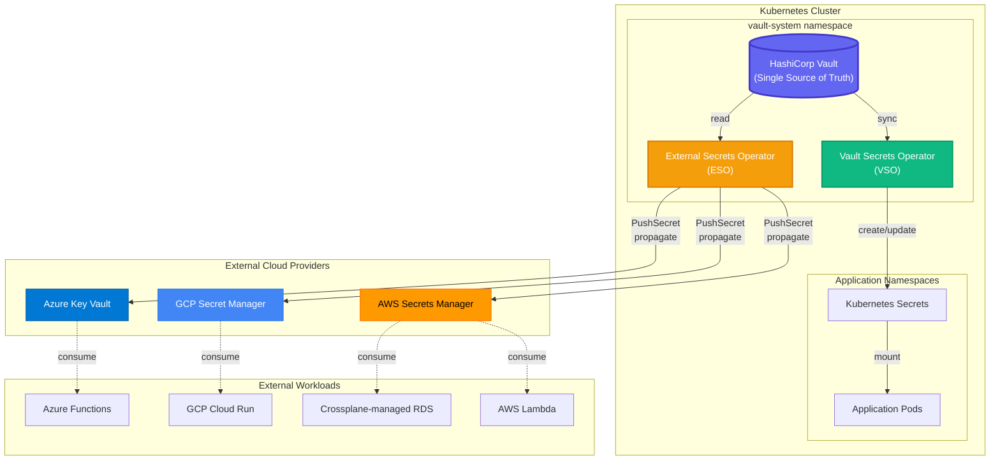

# Secrets Management Architecture

## Overview

This IDP implements a **centralized, cloud-agnostic secrets management strategy** where HashiCorp Vault serves as the **single source of truth** for all sensitive data. The architecture elegantly handles both in-cluster and external workload secrets through complementary operators.

## Architecture Diagram



## Flow Explanation

### Inside Cluster (VSO Path)

**Vault → VSO → Kubernetes Secrets → Pods**

1. **Vault** stores secrets in KV v2 engine at `secret/data/*`
2. **VSO** watches for `VaultStaticSecret` or `VaultDynamicSecret` CRDs
3. **VSO** authenticates to Vault using Kubernetes auth (ServiceAccount token)
4. **VSO** fetches secrets from Vault and creates native **Kubernetes Secrets**
5. **Application Pods** mount these secrets as volumes or environment variables

**Example:**

```yaml
apiVersion: secrets.hashicorp.com/v1beta1
kind: VaultStaticSecret
metadata:
  name: db-credentials
spec:
  vaultAuthRef: vault-auth
  mount: secret
  path: prod/database
  destination:
    create: true
    name: db-secret  # ← Creates this K8s Secret
```

### Outside Cluster (ESO PushSecret Path)

**Vault → ESO → Cloud Secret Managers → External Workloads**

1. **Vault** stores secrets (same source as in-cluster)
2. **ESO** uses `PushSecret` CRD to read from Vault
3. **ESO** propagates secrets to **AWS/GCP/Azure** secret managers
4. **External workloads** (Lambda, Cloud Run, etc.) consume from their native secret manager

**Example - Push to AWS:**

```yaml
apiVersion: external-secrets.io/v1alpha1
kind: PushSecret
metadata:
  name: push-to-aws
spec:
  secretStoreRefs:
  - name: vault-secretstore        # Source: Vault
    kind: ClusterSecretStore
  - name: aws-secrets-manager      # Destination: AWS
    kind: SecretStore
  selector:
    secret:
      name: lambda-db-password     # Secret from Vault
  data:
  - match:
      secretKey: password
      remoteRef:
        remoteKey: /prod/lambda/db-password  # AWS SM path
```

## Key Principles

### 1. Single Source of Truth

**Vault is authoritative** for all secrets. No secrets are created directly in:

- Kubernetes Secrets (VSO creates them from Vault)
- AWS/GCP/Azure Secret Managers (ESO pushes from Vault)

**Benefits:**

- Centralized audit trail (all access logged in Vault)
- Consistent rotation (rotate in Vault → propagates everywhere)
- No vendor lock-in (switch cloud providers without changing Vault)

### 2. Separation of Concerns

| Component | Responsibility | Scope |
|-----------|---------------|-------|
| **Vault** | Store, rotate, audit secrets | Everything |
| **VSO** | Sync Vault → K8s Secrets | In-cluster only |
| **ESO** | Push Vault → Cloud providers | External workloads only |

**Why not use ESO for in-cluster?**

- VSO is official HashiCorp operator (better Vault integration)
- VSO supports dynamic secrets (DB credentials rotation)
- ESO is for external/legacy systems that can't call Vault directly

### 3. Zero-Touch Secret Consumption

**Developers never see raw secrets:**

1. Request secret via YAML manifest:

   ```yaml
   apiVersion: secrets.hashicorp.com/v1beta1
   kind: VaultStaticSecret
   metadata:
     name: my-app-secret
   ```

2. VSO/ESO fetches from Vault automatically
3. Application consumes from K8s Secret or Cloud Secret Manager
4. Rotation happens transparently (VSO/ESO update secrets)

## Use Cases

### In-Cluster Workloads (VSO)

✅ **Use VSO when:**

- Workload runs inside Kubernetes
- Needs secrets as K8s Secret (volume mount, env var)
- Requires dynamic secrets (DB credentials with TTL)

**Examples:**

- Microservices needing database passwords
- CI/CD pipelines in Jenkins pods
- Applications using API keys

### External Workloads (ESO PushSecret)

✅ **Use ESO PushSecret when:**

- Workload runs **outside** Kubernetes (serverless, VMs)
- Workload **cannot** call Vault API directly (legacy apps)
- Cloud provider **requires** secrets in their native manager (compliance)

**Examples:**

- **AWS Lambda** functions (read from AWS Secrets Manager)
- **Crossplane** provisioning RDS (needs AWS credentials in Parameter Store)
- **GCP Cloud Run** services (read from GCP Secret Manager)
- **Azure Functions** (read from Azure Key Vault)

## Security Considerations

### Demo Environment (Current)

⚠️ **NOT for production:**

- TLS disabled (`skipTLSVerify: true`)
- Single unseal key (1-of-1 Shamir)
- Root token logged during init
- Keys stored in K8s Secret

### Production Hardening

**Must implement:**

1. **TLS Everywhere:**

   ```yaml
   # Vault with Cert-Manager
   tls_cert_file = "/vault/tls/tls.crt"
   tls_key_file  = "/vault/tls/tls.key"
   ```

2. **Auto-Unseal with Cloud KMS:**

   ```hcl
   seal "awskms" {
     kms_key_id = "arn:aws:kms:..."
   }
   ```

3. **Multi-Share Unseal Keys:**

   ```bash
   vault operator init -key-shares=5 -key-threshold=3
   ```

4. **RBAC Policies:**
   - Least privilege per team/namespace
   - No wildcards in production
   - Audit all policy changes

5. **Network Policies:**
   - Limit Vault access to VSO/ESO only
   - Deny direct pod-to-vault traffic
   - Use service mesh (Istio) for mTLS

## Deployment Workflow

### Initial Setup (One-Time)

```bash
# 1. Deploy Vault (sealed, uninitialized)
task vault:deploy

# 2. Initialize Vault manually
task vault:init
# → Generates unseal keys, root token
# → Configures Kubernetes auth
# → Creates VSO role and policy

# 3. Deploy VSO
task vso:deploy

# 4. Apply VSO connection resources
task it:vso:apply-resources

# 5. Deploy ESO (for external workloads)
task external-secrets:deploy
task it:external-secrets:apply-resources
```

### Day-2 Operations

**Add new secret to Vault:**

```bash
kubectl exec -n vault-system vault-0 -- \
  vault kv put secret/prod/app-credentials \
  username=app_user \
  password=secure_password
```

**Consume in-cluster (VSO):**

```yaml
apiVersion: secrets.hashicorp.com/v1beta1
kind: VaultStaticSecret
metadata:
  name: app-credentials
  namespace: production
spec:
  vaultAuthRef: vault-auth
  type: kv-v2
  mount: secret
  path: prod/app-credentials
  destination:
    create: true
    name: app-secret
```

**Advanced: Selective field mapping with transformations:**

When you need to map specific fields from Vault to different keys in the Kubernetes Secret:

```yaml
apiVersion: secrets.hashicorp.com/v1beta1
kind: VaultStaticSecret
metadata:
  name: app-credentials
  namespace: production
spec:
  vaultAuthRef: vault-auth
  type: kv-v2
  mount: secret
  path: prod/app-credentials
  destination:
    create: true
    name: app-secret
    transformation:
      templates:
        # Map Vault key to K8s Secret key
        username:
          text: '{{ get .Secrets "username" }}'
        password:
          text: '{{ get .Secrets "password" }}'
```

**Important:** For KV-v2 secrets, VSO exposes data through `.Secrets` object. The correct template syntax is:

- ✅ **Correct:** `{{ get .Secrets "key-name" }}`
- ❌ **Incorrect:** `{{ index .Data "key-name" }}`
- ❌ **Incorrect:** `{{ .Secrets.Data.data.key }}`

**Real-world example:** ArgoCD admin password management (see `IT/argocd/argocd-admin-secret.yaml`):

```yaml
apiVersion: secrets.hashicorp.com/v1beta1
kind: VaultStaticSecret
metadata:
  name: argocd-admin-password
  namespace: argocd
spec:
  vaultAuthRef: vault-system/vault-auth
  type: kv-v2
  mount: secret
  path: argocd/admin
  hmacSecretData: true  # Detect drift
  rolloutRestartTargets:  # Auto-restart on password change
  - kind: Deployment
    name: argocd-server
  destination:
    name: argocd-secret
    create: false  # Helm creates it
    overwrite: true  # VSO overwrites
    transformation:
      templates:
        admin.password:
          text: '{{ get .Secrets "admin.password" }}'
```

**Push to AWS (ESO):**

```yaml
apiVersion: external-secrets.io/v1alpha1
kind: PushSecret
metadata:
  name: push-app-creds-to-aws
spec:
  secretStoreRefs:
  - name: vault-secretstore
  - name: aws-secrets-manager
  selector:
    secret:
      name: app-secret  # From VSO
  data:
  - match:
      secretKey: password
      remoteRef:
        remoteKey: /prod/lambda/app-password
```

## Monitoring & Observability

### Metrics

**Vault:**

- `vault_core_unsealed` - Seal status (0=sealed, 1=unsealed)
- `vault_token_count_by_policy` - Active tokens per policy
- Prometheus ServiceMonitor enabled in `vault-values.yaml`

**VSO:**

- `vso_secret_sync_total` - Successful syncs
- `vso_secret_sync_errors_total` - Sync failures
- Available at `:8443/metrics`

**ESO:**

- `externalsecret_sync_calls_total` - Sync operations
- `externalsecret_sync_calls_error` - Failures
- Available via ServiceMonitor

### Alerts

**Critical:**

- Vault sealed unexpectedly
- VSO/ESO sync failures > 5 in 10min
- Vault token expiration approaching

**Warning:**

- Secret rotation delay > 1 hour
- High Vault API latency (>500ms)

## Migration Path from Current State

### From: Custom Init Sidecar (Old)

```yaml
extraContainers:
- name: vault-init-sidecar
  image: roucru/idp-blueprint:minimal
  # Custom bash script for init/unseal
```

### To: VSO + Manual Init (Current)

```bash
# One-time manual initialization
task vault:init

# VSO handles sync (no custom code)
```

### Future: Vault Operator (Bank-Vaults)

```yaml
apiVersion: vault.banzaicloud.com/v1alpha1
kind: Vault
spec:
  # Declarative auto-init, auto-unseal, auto-config
```

**When to migrate:**

- Need HA (3+ replicas with Raft)
- Auto-unseal with cloud KMS
- Zero manual intervention

## References

- [Vault Secrets Operator Docs](https://developer.hashicorp.com/vault/docs/platform/k8s/vso)
- [External Secrets PushSecret](https://external-secrets.io/latest/api/pushsecret/)
- [Vault Production Hardening](https://developer.hashicorp.com/vault/tutorials/operations/production-hardening)
- [Bank-Vaults Operator](https://bank-vaults.dev/docs/operator/)
