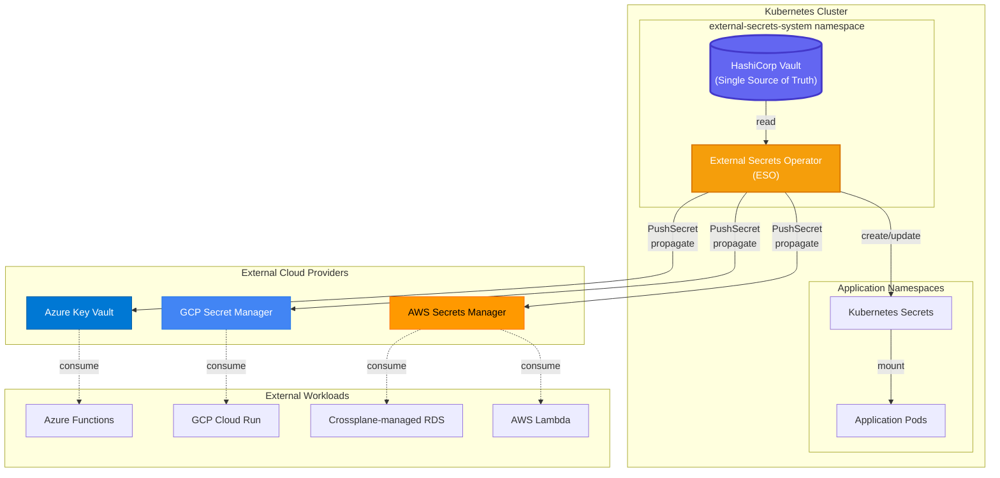

# Secrets Management Architecture

## Overview

This IDP implements a **centralized, cloud-agnostic secrets management strategy** where HashiCorp Vault serves as the **single source of truth** for all sensitive data. The architecture uses **External Secrets Operator (ESO)** as the unified tool to synchronize secrets both within the Kubernetes cluster and to external cloud providers.

## Architecture Diagram



## Flow Explanation

### Inside Cluster (ESO `ExternalSecret`)

**Vault → ESO → Kubernetes Secrets → Pods**

1.  **Vault** stores secrets in its KV v2 engine at paths like `secret/data/*`.
2.  **ESO** watches for `ExternalSecret` custom resources in application namespaces.
3.  **ESO** authenticates to Vault using a configured `ClusterSecretStore` which leverages Kubernetes service account authentication.
4.  **ESO** fetches the specified secrets from Vault and creates or updates native **Kubernetes Secrets**.
5.  **Application Pods** mount these Kubernetes Secrets as volumes or environment variables, completely unaware of Vault.

**Example:**

```yaml
apiVersion: external-secrets.io/v1beta1
kind: ExternalSecret
metadata:
  name: db-credentials
spec:
  secretStoreRef:
    name: vault-backend
    kind: ClusterSecretStore
  target:
    name: db-secret # ← Creates or updates this K8s Secret
  dataFrom:
  - extract:
      key: secret/prod/database
```

### Outside Cluster (ESO `PushSecret`)

**Vault → ESO → Cloud Secret Managers → External Workloads**

1.  **Vault** stores secrets (same source of truth).
2.  **ESO** uses a `PushSecret` custom resource to read secrets from Vault.
3.  **ESO** propagates/pushes these secrets to external providers like **AWS Secrets Manager, GCP Secret Manager, or Azure Key Vault**.
4.  **External workloads** (e.g., AWS Lambda, GCP Cloud Run) consume secrets from their native cloud secret manager.

**Example - Push to AWS:**

```yaml
apiVersion: external-secrets.io/v1alpha1
kind: PushSecret
metadata:
  name: push-to-aws
spec:
  secretStoreRefs:
    - name: vault-secretstore # Source: Vault
      kind: ClusterSecretStore
    - name: aws-secrets-manager # Destination: AWS
      kind: SecretStore
  selector:
    secret:
      name: lambda-db-password # Secret from Vault
  data:
    - match:
        secretKey: password
        remoteRef:
          remoteKey: /prod/lambda/db-password # AWS SM path
```

## Key Principles

### 1. Single Source of Truth

**Vault is authoritative** for all secrets. No secrets are created directly in:

-   Kubernetes Secrets (ESO creates them from Vault).
-   AWS/GCP/Azure Secret Managers (ESO pushes them from Vault).

**Benefits:**

-   **Centralized Audit Trail:** All secret access is logged in Vault.
-   **Consistent Rotation:** Rotate a secret in Vault, and ESO propagates the change everywhere.
-   **No Vendor Lock-in:** The core secret store remains vendor-neutral.

### 2. Unified Operator

| Component | Responsibility | Scope |
|-----------|----------------|-------|
| **Vault** | Store, rotate, and audit secrets | Everything |
| **ESO**   | Sync Vault to K8s & push to Cloud | In-cluster & External |

**External Secrets Operator (ESO)** is used for all secret synchronization tasks. It provides a robust and consistent mechanism for both pulling secrets into the cluster and pushing them to external systems.

### 3. Zero-Touch Secret Consumption

**Developers never handle raw secrets.** The process is declarative:

1.  A developer defines an `ExternalSecret` or `PushSecret` manifest in their application's Git repository.
2.  The GitOps controller (ArgoCD) applies the manifest.
3.  ESO automatically fetches the secret from Vault and makes it available to the application.
4.  Rotation is transparent: when the secret is updated in Vault, ESO updates the corresponding Kubernetes Secret or pushes the change to the cloud provider.

## Use Cases

### In-Cluster Workloads (ESO `ExternalSecret`)

✅ **Use `ExternalSecret` when:**

-   Your workload runs inside the Kubernetes cluster.
-   You need secrets available as standard Kubernetes `Secret` objects (for volume mounts or environment variables).

**Examples:**

-   Microservices needing database passwords.
-   CI/CD pipelines running in Jenkins pods.
-   Web applications requiring API keys.

### External Workloads (ESO `PushSecret`)

✅ **Use `PushSecret` when:**

-   Your workload runs **outside** Kubernetes (e.g., serverless, VMs).
-   The workload cannot call the Vault API directly (common in legacy applications).
-   A cloud provider's service (like AWS RDS) requires credentials to be present in its native secret manager.

**Examples:**

-   **AWS Lambda** functions reading from AWS Secrets Manager.
-   **Crossplane** provisioning an RDS instance, which requires credentials in AWS.
-   **GCP Cloud Run** services reading from GCP Secret Manager.

## Security Considerations

### Demo Environment (Current)

⚠️ **NOT for production:**

-   TLS is disabled (`skipTLSVerify: true`).
-   Vault is initialized with a single unseal key.
-   The root token is logged during the init script.
-   Unseal keys and the root token are stored in a Kubernetes Secret.

### Production Hardening

**Must implement:**

1.  **TLS Everywhere:** Enforce encrypted traffic between all components.
2.  **Auto-Unseal with Cloud KMS:** Use a cloud provider's KMS to automatically unseal Vault.
3.  **Multi-Share Unseal Keys:** Require a quorum of operators to unseal Vault manually if auto-unseal fails.
4.  **RBAC Policies:** Implement least-privilege access control within Vault.
5.  **Network Policies:** Restrict network access to the Vault service, ideally only allowing ESO to connect.

## Deployment Workflow

### Initial Setup (One-Time)

```bash
# 1. Deploy Vault (sealed, uninitialized)
task vault:deploy

# 2. Initialize Vault manually
task vault:init
# → Generates unseal keys, root token
# → Configures Kubernetes auth for ESO

# 3. Deploy ESO
task external-secrets:deploy
task it:external-secrets:apply-resources
```

### Day-2 Operations

**Add a new secret to Vault:**

```bash
kubectl exec -n vault-system vault-0 -- \
  vault kv put secret/prod/app-credentials \
  username=app_user \
  password=secure_password
```

**Consume in-cluster (ESO `ExternalSecret`):**

This is the standard way to make secrets available to pods.

```yaml
apiVersion: external-secrets.io/v1beta1
kind: ExternalSecret
metadata:
  name: app-credentials
  namespace: production
spec:
  secretStoreRef:
    name: vault-backend
    kind: ClusterSecretStore
  target:
    name: app-secret # ESO creates this K8s Secret
    creationPolicy: Owner
  dataFrom:
  - extract:
      key: secret/prod/app-credentials
```

**Real-world example: ArgoCD admin password management** (see `IT/external-secrets/argocd-admin-externalsecret.yaml`):

This `ExternalSecret` targets an existing secret managed by Helm (`argocd-secret`) and merges the password into it.

```yaml
apiVersion: external-secrets.io/v1beta1
kind: ExternalSecret
metadata:
  name: argocd-admin-password
  namespace: argocd
spec:
  secretStoreRef:
    name: vault-backend
    kind: ClusterSecretStore
  target:
    name: argocd-secret
    template:
      type: Opaque
      engineVersion: v2
      mergePolicy: Replace
      data:
        admin.password: '{{ .admin_password }}'
  data:
    - secretKey: admin_password
      remoteRef:
        key: secret/argocd/admin
        property: admin.password
```

**Push to AWS (ESO `PushSecret`):**

```yaml
apiVersion: external-secrets.io/v1alpha1
kind: PushSecret
metadata:
  name: push-app-creds-to-aws
spec:
  secretStoreRefs:
    - name: vault-secretstore
    - name: aws-secrets-manager
  selector:
    secret:
      name: app-credentials # References a K8s secret synced by another ExternalSecret
  data:
    - match:
        secretKey: password
        remoteRef:
          remoteKey: /prod/lambda/app-password
```

## Monitoring & Observability

### Metrics

**Vault:**

-   `vault_core_unsealed` - Seal status (0=sealed, 1=unsealed).
-   `vault_token_count_by_policy` - Active tokens per policy.
-   Prometheus ServiceMonitor is enabled in `vault-values.yaml`.

**ESO:**

-   `externalsecret_sync_calls_total` - Total sync operations.
-   `externalsecret_sync_calls_error` - Total sync failures.
-   Available via a ServiceMonitor.

### Alerts

**Critical:**

-   Vault is sealed unexpectedly.
-   ESO sync failures > 5 in the last 10 minutes.
-   A Vault token used by ESO is approaching its expiration.

**Warning:**

-   Secret rotation delay > 1 hour.
-   High Vault API latency (>500ms).

## Migration Path from Current State

### From: Custom Init Sidecar (Old)

A previous version of this blueprint used a custom sidecar container with a bash script to initialize Vault and inject secrets. This is now deprecated.

### To: ESO + Manual Init (Current)

The current, stable architecture uses a one-time manual initialization script for Vault (`task vault:init`) and relies on **External Secrets Operator** for all subsequent secret synchronization.

### Future: Vault Operator (Bank-Vaults)

For environments requiring fully automated, declarative management of Vault itself (including auto-unseal, HA configuration, etc.), migrating to an operator like Bank-Vaults is the recommended next step.

**When to migrate:**

-   When you need a High-Availability Vault cluster (e.g., 3+ replicas with Raft).
-   When you require fully automatic unsealing using a cloud KMS.
-   When zero manual intervention in Vault's lifecycle is a hard requirement.

## References

-   [External Secrets Operator Docs](https://external-secrets.io/latest/)
-   [ESO `PushSecret`](https://external-secrets.io/latest/api/pushsecret/)
-   [Vault Production Hardening](https://developer.hashicorp.com/vault/tutorials/operations/production-hardening)
-   [Bank-Vaults Operator](https://bank-vaults.dev/docs/operator/)
