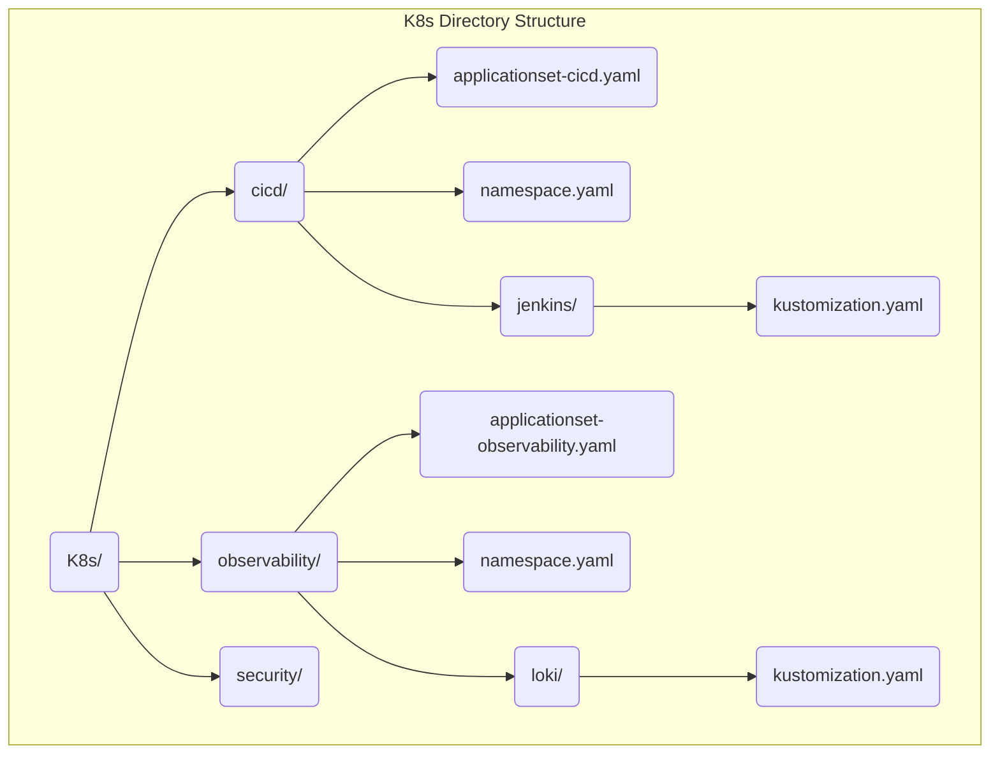
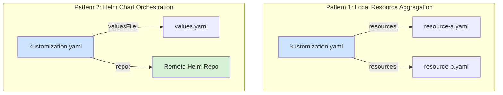

# K8s Directory Architecture: GitOps with ApplicationSets

This document outlines the GitOps strategy for managing all applications and services
(workloads) deployed on the cluster. This directory (`K8s/`) is the source of truth,
managed exclusively by ArgoCD.

## Core Pattern: App of AppSets

We employ a modular, scalable pattern where multiple `ApplicationSet` resources are used
instead of a single monolithic one. This provides flexibility, clear ownership, and
reduces the blast radius of any configuration errors.

- **One `ApplicationSet` per Stack:** Each primary directory within `K8s/` (e.g.,
  `observability/`, `cicd/`) represents a "stack" of tools. Each stack contains its own
  `applicationset-<stack>.yaml` file.
- **`ApplicationSet` Role:** This file is responsible for discovering and managing all
  applications _within its own stack directory_.
- **Root `Application`:** A root ArgoCD `Application` (managed outside this directory)
  is responsible for deploying the `ApplicationSet` resources themselves.

### GitOps Workflow Diagram

This diagram illustrates the entire flow, from the Git repository to the deployed
applications in their respective namespaces.

```mermaid
graph LR
    subgraph Git Repository (K8s/)
        A(Root App) -- deploys --> B(AppSet-CICD);
        A -- deploys --> C(AppSet-Observability);
        A -- deploys --> D(AppSet-Security);
    end

    subgraph ArgoCD
        B -- discovers --> E(jenkins/);
        C -- discovers --> F(loki/);
        C -- discovers --> G(prometheus/);
    end

    subgraph Kubernetes Cluster
        E -- deploys to --> H(Namespace: cicd);
        F -- deploys to --> I(Namespace: observability);
        G -- deploys to --> I;
    end

    style A fill:#d4a2e8
    style B fill:#f9d4a8
    style C fill:#f9d4a8
    style D fill:#f9d4a8
```

## Bootstrap and Standalone Applications

Certain foundational, cross-cutting components like the policy engine are deployed
first, before the main application stacks. This ensures the cluster's "rules of the
road" are active before other workloads are deployed.

- **Policy Stack:** The policy engine (Kyverno) and the policies themselves are managed
  by a standalone ArgoCD `Application` defined in `Policies/app-kyverno.yaml`. This
  application is deployed directly during the bootstrap phase (e.g., via
  `Taskfile.yaml`) and points to the `Policies/` directory, which uses Kustomize to
  orchestrate the deployment of the entire stack.

This approach provides a secure bootstrap process at the cost of being a slight
exception to the general "App of AppSets" pattern.

## Directory Structure

The structure is designed to be semantic, self-documenting, and to directly reflect the
namespace strategy.



- **`namespace.yaml`**: Defines the Kubernetes `Namespace` for the entire stack and
  contains the common labels and annotations that will be propagated by Kyverno, as per
  `Policies/tag-policy.md`.
- **`applicationset-<stack>.yaml`**: The `ApplicationSet` resource that manages all
  applications within the stack.
- **`<app-name>/kustomization.yaml`**: The Kustomize entrypoint for a specific
  application. ArgoCD will target this file for deployment.

## Application Manifests & Kustomize

To manage the complexity of modern applications, we use **Kustomize** as the standard
for defining and composing application manifests. Our philosophy is based on
**resource composition** over complex inheritance via `overlays`.

Two primary patterns for Kustomize are established in this project.



### Pattern 1: Local Resource Aggregation

This is the standard approach for **in-house applications** or for grouping a set of
related Kubernetes manifests.

- **When to Use It:** For internally developed microservices, governance policies
    (`ResourceQuota`, `LimitRange`), or any set of YAML manifests you manage directly.
- **Structure:**
  - A directory is created for the component (e.g., `governance/`).
  - YAML files (`limitrange.yaml`, `resourcequota.yaml`) are placed inside.
  - The `kustomization.yaml` file lists them in the `resources` section.

- **Example (`K8s/cicd/governance/kustomization.yaml`):**

    ```yaml
    apiVersion: kustomize.config.k8s.io/v1beta1
    kind: Kustomization
    resources:
      - limitrange.yaml
      - resourcequota.yaml
    ```

### Pattern 2: Helm Chart Orchestration

This is the **preferred, standard method** for deploying **third-party applications**
or any software available as a Helm chart. It allows us to version and manage the
configuration of these tools declaratively.

- **When to Use It:** For tools like Jenkins, Loki, Prometheus, Trivy, etc.
- **Structure:**
  - A directory is created for the application (e.g., `jenkins/`).
  - A `kustomization.yaml` file defines the Helm chart in the `helmCharts` section.
  - A `values.yaml` file (e.g. `jenkins-values.yaml`) contains all custom
        configuration for that chart.

- **Example (`K8s/cicd/jenkins/kustomization.yaml`):**

    ```yaml
    apiVersion: kustomize.config.k8s.io/v1beta1
    kind: Kustomization
    helmCharts:
      - name: jenkins
        repo: https://charts.jenkins.io
        version: 5.8.101
        releaseName: jenkins
        namespace: cicd
        valuesFile: jenkins-values.yaml
    ```

## Workflow for Deploying a New Application

1. **Choose the Stack:** Identify which stack the new application belongs to (e.g.,
    `observability`).
2. **Create a Directory:** Create a new subdirectory for your application (e.g.,
    `K8s/observability/my-new-app/`).
3. **Add Manifests:** Add all Kubernetes manifest files for your application to this
    new directory.
4. **Create `kustomization.yaml`:** Add a `kustomization.yaml` file that lists all the
    manifest files you just created.
5. **Commit & Push:** Commit your changes to Git. The corresponding `ApplicationSet`
    will automatically detect the new directory and deploy your application into the
    correct namespace.
