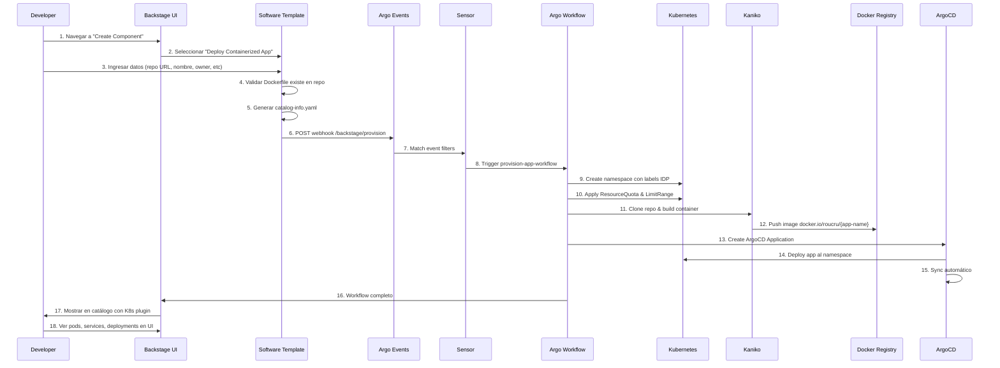

# 🛒 Golden Path Demo - Self-Service Provisioning

Documentación completa del flujo de self-service provisioning: "Catálogo de Supermercado" para desplegar cualquier aplicación contenedorizada desde repositorios públicos.

## 🎯 Concepto

**Como un supermercado**: Tomas cualquier repositorio público de GitHub con un Dockerfile del "estante", lo pasas por el template de Backstage, y automáticamente se provisiona toda la infraestructura y se despliega en Kubernetes.

## 🏗️ Arquitectura del Flujo



## 📋 Componentes Implementados

### 1. Backstage Software Template

**Ubicación**: `K8s/backstage/templates/deploy-containerized-app/template.yaml`

**Parámetros**:
- `appName`: Nombre de la aplicación (lowercase, alphanumeric, hyphens)
- `repoUrl`: URL del repositorio público de GitHub
- `owner`: Team dueño (platform-team, backend-team, etc)
- `businessUnit`: Unidad de negocio (infrastructure, engineering, product, operations)
- `environment`: dev/staging/prod
- `containerPort`: Puerto que expone el contenedor (default: 80)
- `replicas`: Número de réplicas (1-10)

**Salidas Generadas**:
- `catalog-info.yaml` con anotaciones de K8s y ArgoCD
- Manifiestos de namespace con labels IDP
- ArgoCD Application manifest

### 2. Argo Events - EventSource

**Ubicación**: `K8s/events/argo-events/backstage-eventsource.yaml`

- **Puerto**: `12001`
- **Endpoint**: `/backstage/provision`
- **Método**: `POST`

### 3. Argo Events - Sensor

**Ubicación**: `K8s/events/argo-events/app-provisioning-sensor.yaml`

**Filtros**:
- `eventType == "provision-app"`

**Trigger**: Ejecuta `provision-app-workflow` con parámetros extraídos

### 4. Argo Workflow Template

**Ubicación**: `K8s/cicd/argo-workflows/workflow-templates/provision-app-workflow.yaml`

**Pasos**:
1. **Create Namespace**: Crea namespace con labels estándar IDP
2. **Build & Push Image**: Usa Kaniko para build sin Docker daemon
3. **Create ArgoCD App**: Provisiona ArgoCD Application
4. **Wait for Deployment**: Verifica que el deployment esté ready

### 5. Kubernetes Plugin

**Configuración**: `K8s/backstage/backstage/values.yaml`

**Permisos** (ServiceAccount `backstage-kubernetes`):
- Leer pods, deployments, services, configmaps
- Leer ArgoCD Applications y Rollouts
- Leer metrics de pods/nodes
- Leer ExternalSecrets

## 🚀 Guía de Uso - Demo

### Paso 1: Aplicar Manifiestos

```bash
# Aplicar Argo Events (EventSource + Sensor)
kubectl apply -k K8s/events/argo-events/

# Aplicar Workflow Templates
kubectl apply -k K8s/cicd/argo-workflows/workflow-templates/

# Actualizar Backstage con plugin K8s
kubectl apply -k K8s/backstage/backstage/
kubectl rollout restart deployment/backstage -n backstage
```

### Paso 2: Verificar Componentes

```bash
# Verificar EventSource
kubectl get eventsource -n events backstage
kubectl logs -n events deployment/backstage-eventsource

# Verificar Sensor
kubectl get sensor -n events app-provisioning
kubectl logs -n events deployment/app-provisioning-sensor

# Verificar WorkflowTemplate
kubectl get workflowtemplate -n cicd provision-app-workflow
```

### Paso 3: Login a Backstage

```bash
# Navegar a
https://backstage.${DNS_SUFFIX}

# Login con credenciales Dex
Email: admin@example.com
Password: password
```

### Paso 4: Crear Aplicación desde Template

1. Click en **"Create"** → **"Create Component"**
2. Seleccionar **"Deploy Containerized App (From Public Repo)"**
3. Llenar formulario:

**Ejemplo 1 - Nginx Hello World**:
```
App Name: hello-nginx
Repo URL: https://github.com/nginxinc/docker-nginx
Owner: platform-team
Business Unit: engineering
Environment: dev
Container Port: 80
Replicas: 2
```

**Ejemplo 2 - Podinfo (Recommended)**:
```
App Name: demo-podinfo
Repo URL: https://github.com/stefanprodan/podinfo
Owner: backend-team
Business Unit: product
Environment: staging
Container Port: 9898
Replicas: 3
```

**Ejemplo 3 - Hello Kubernetes**:
```
App Name: hello-k8s
Repo URL: https://github.com/paulbouwer/hello-kubernetes
Owner: devops-team
Business Unit: infrastructure
Environment: dev
Container Port: 8080
Replicas: 1
```

4. Click **"Create"**
5. Esperar confirmación

### Paso 5: Ver Workflow Ejecutándose

```bash
# Lista de workflows
argo list -n cicd

# Ver logs en tiempo real
argo logs -n cicd provision-app-XXXXX --follow

# Ver workflow en UI
https://argo-workflows.${DNS_SUFFIX}/workflows/cicd
```

**Duración Estimada**: 2-4 minutos (depende del tamaño del repo/Dockerfile)

### Paso 6: Verificar Namespace Creado

```bash
# Ver namespace
kubectl get namespace demo-podinfo

# Ver labels
kubectl get namespace demo-podinfo --show-labels

# Ver recursos en el namespace
kubectl get all -n demo-podinfo

# Ver quotas y limits
kubectl get resourcequota,limitrange -n demo-podinfo
```

### Paso 7: Verificar ArgoCD Application

```bash
# Lista de apps
kubectl get application -n argocd demo-podinfo

# Ver status
kubectl describe application -n argocd demo-podinfo

# UI de ArgoCD
https://argocd.${DNS_SUFFIX}/applications/demo-podinfo
```

### Paso 8: Ver en Backstage Catalog con Plugin K8s

1. Navegar a **Catalog** en Backstage
2. Buscar `demo-podinfo`
3. Click en el componente

**Tabs Disponibles**:
- **Overview**: Metadata, links, descripción
- **Kubernetes**: 
  - Pods corriendo (con status, CPU, memory)
  - Deployments
  - Services
  - ReplicaSets
  - HPA (si existe)
  - Logs en vivo de pods
- **CI/CD**: Workflows de Argo
- **Dependencies**: Componentes relacionados

### Paso 9: Acceder a la Aplicación

```bash
# Port-forward para testing local
kubectl port-forward -n demo-podinfo svc/demo-podinfo 8080:9898

# Probar en navegador
http://localhost:8080

# O probar con curl
curl http://localhost:8080
```

## 🎬 Script de Demo Completo

```bash
#!/bin/bash
echo "=== GOLDEN PATH DEMO ==="
echo ""
echo "1️⃣  Aplicando componentes necesarios..."
kubectl apply -k K8s/events/argo-events/
kubectl apply -k K8s/cicd/argo-workflows/workflow-templates/
kubectl apply -k K8s/backstage/backstage/
kubectl rollout restart deployment/backstage -n backstage
echo "✅ Componentes aplicados"
echo ""

echo "2️⃣  Esperando que Backstage esté ready..."
kubectl wait --for=condition=available --timeout=2m deployment/backstage -n backstage
echo "✅ Backstage ready"
echo ""

echo "3️⃣  Verificando EventSource y Sensor..."
kubectl get eventsource,sensor -n events
echo "✅ Argo Events ready"
echo ""

echo "Ahora puedes:"
echo "- Navegar a https://backstage.\${DNS_SUFFIX}"
echo "- Login con admin@example.com / password"
echo "- Crear componente desde 'Deploy Containerized App'"
echo ""
echo "Repos sugeridos para demo:"
echo "- https://github.com/stefanprodan/podinfo (Recomendado)"
echo "- https://github.com/paulbouwer/hello-kubernetes"
echo "- https://github.com/nginxinc/docker-nginx"
echo ""
echo "Monitorear workflow:"
echo "  argo logs -n cicd \$(argo list -n cicd --output name | head -1) --follow"
```

## 🧪 Troubleshooting

### Template No Aparece en Backstage

```bash
# Verificar que el directorio de templates está montado
kubectl exec -n backstage deployment/backstage -- ls /app/templates

# Reiniciar Backstage
kubectl rollout restart deployment/backstage -n backstage
```

### Webhook No Llega a Argo Events

```bash
# Ver logs del EventSource
kubectl logs -n events deployment/backstage-eventsource

# Verificar service
kubectl get svc -n events backstage-eventsource

# Port-forward para test manual
kubectl port-forward -n events svc/backstage-eventsource 12001:12001

# Test manual del webhook
curl -X POST http://localhost:12001/backstage/provision \
  -H "Content-Type: application/json" \
  -d '{
    "eventType": "provision-app",
    "appName": "test-app",
    "repoUrl": "https://github.com/stefanprodan/podinfo"
  }'
```

### Workflow Falla en Build de Imagen

```bash
# Ver logs del workflow
argo logs -n cicd provision-app-XXXXX

# Verificar que docker credentials existen
kubectl get secret -n cicd docker-credentials

# Ver detalles del secret
kubectl describe secret -n cicd docker-credentials
```

### Plugin de K8s No Muestra Recursos

```bash
# Verificar ServiceAccount
kubectl get sa -n backstage backstage-kubernetes

# Verificar RBAC
kubectl get clusterrole backstage-kubernetes-reader
kubectl get clusterrolebinding backstage-kubernetes-reader

# Ver logs de Backstage
kubectl logs -n backstage deployment/backstage | grep -i kubernetes
```

## 📊 Métricas y Labels

Cada recurso creado tiene los labels estándar del IDP:

```yaml
labels:
  app.kubernetes.io/name: {app-name}
  app.kubernetes.io/part-of: user-applications
  owner: {owner}
  business-unit: {business-unit}
  environment: {environment}
  managed-by: idp
```

Esto permite:
- Filtrado en ArgoCD
- Búsqueda en Backstage catalog
- Políticas de Kyverno
- Dashboards de Grafana agrupados
- Cost allocation por business-unit

## 🎉 Resultado Final

**El usuario puede**:
1. Tomar CUALQUIER repo público con Dockerfile
2. Llenarlo en un formulario simple en Backstage
3. En ~3 minutos tener:
   - ✅ Namespace con governance (quotas/limits)
   - ✅ Imagen de contenedor construida y en registry
   - ✅ Aplicación desplegada en K8s
   - ✅ ArgoCD Application con GitOps activo
   - ✅ Componente en Backstage catalog
   - ✅ Visualización en tiempo real de pods/deployments

**¡TODO AUTOMATIZADO!** 🚀
