[](https://github.com/rou-cru/idp-blueprint/actions/workflows/docs.yaml)

# IDP-blueprint

[](https://k3d.io/)
[](https://containers.dev/)
[](https://taskfile.dev/)


> **An Internal Developer Platform (IDP) Blueprint** - Deploy a complete platform
> engineering stack (GitOps, Observability, Security & Policy Enforcement) with
> a single command on your laptop!

## 🎯 What is this?

An **opinionated, resource-optimized IDP** running on [K3d](https://k3d.io/stable)
that demonstrates modern Platform Engineering practices:

- ✅ **GitOps-first** with [ArgoCD](https://argo-cd.readthedocs.io/en/stable)
- ✅ **Policy-as-Code** with [Kyverno](https://kyverno.io)
- ✅ **Observability** with [Prometheus](https://prometheus.io),
  [Grafana](https://grafana.com/grafana/?plcmt=products-nav),
  [Loki](https://grafana.com/docs/loki/latest/?pg=oss-loki&plcmt=quick-links) +
  [Fluent-bit](https://fluentbit.io)
- ✅ **Security scanning** with [Trivy](https://trivy.dev/latest)
- ✅ **CI/CD** with [Argo Workflows](https://argo-workflows.readthedocs.io),
  [SonarQube](https://www.sonarsource.com/)
- ✅ **eBPF Service Mesh** with [Cilium](https://cilium.io)
- ✅ **Secrets management** with
  [Vault](https://www.hashicorp.com/en/products/vault) + [External
  Secrets](https://external-secrets.io/latest)
- ✅ **Certificate management** with [cert-manager](https://cert-manager.io)
- ✅ **Single command deployment** by [Task](https://taskfile.dev) so just `task deploy`

## 💡 Why This Matters: Real-World Value

### For Platform Engineers

> **Prototype and validate infrastructure changes risk-free.** Test Kyverno
> policies, Vault configs, or GitOps workflows locally before proposing to
> production. Experiment with eBPF networking, policy enforcement, or
> observability patterns without waiting for cloud resources or breaking shared
> environments.

### For DevOps/SRE Teams

> **Learning lab for modern cloud-native tools.** Understand how ArgoCD
> ApplicationSets work, debug Cilium network policies, or explore Prometheus
> metrics—all in a realistic multi-node cluster on your laptop. Perfect for
> training new team members or evaluating tools before adoption.

### For Security Engineers

> **Validate compliance controls in minutes.** Draft security policies as code
> (Kyverno), test them against real workloads, and generate compliance reports
> (Policy Reporter) without provisioning infrastructure. Demonstrate "block root
> containers" or "enforce image signing" policies with concrete evidence.

From idea to validated prototype in minutes, now you only need one command:
`task deploy`. Whether you're evaluating new tools, preparing demonstrations or
conferences, writing a technical article, or onboarding a junior engineer, you
can have your own IDP wherever and whenever you need it.

## Deploy


> **Deployment time:** ~5-10 minutes | **Command:** `task deploy`

## 🗃️ Architecture

```mermaid
---
config:
  look: handDrawn
  theme: redux
  layout: elk
---
flowchart TB
 subgraph Node1["Control Plane Node"]
        K3sAPI["K3s API Server"]
        K3sCtrl["K3s Controller Manager"]
        K3sSched["K3s Scheduler"]
  end
 subgraph Node2["Static Infrastructure Node"]
        CertMgr["Cert-Manager"]
        Vault["Vault"]
        ESO["External Secrets"]
        ArgoCD["ArgoCD"]
  end
 subgraph Node3["GitOps Workloads Node"]
        Kyverno["Kyverno"]
        PolicyReporter["Policy Reporter"]
        Prometheus["Prometheus"]
        AlertMgr["Alertmanager"]
        KSM["Kube State Metrics"]
        Grafana["Grafana"]
        Loki["Loki"]
        Workflows["Argo Workflows"]
        Sonar["SonarQube"]
        Trivy["Trivy"]
  end
 subgraph K3s["k3d Cluster"]
        Cilium["Cilium CNI"]
        FluentBit["Fluent-bit"]
        NodeExporter["Node Exporter"]
        Node1
        Node2
        Node3
  end
    Git[("Git Repository")] -- policies as code --> ArgoCD
    Git -- ApplicationSets --> ArgoCD
    ESO == Deploy Secrets request by ==> ArgoCD
    Vault == provides secrets === ESO
    Workflows == CI/CD Execution ==> ArgoCD
    Sonar == Quality Analysis === Workflows
    Trivy == Security Scans === ArgoCD
    ArgoCD == GitOps Policy ==> Kyverno
    PolicyReporter === Kyverno
    PolicyReporter == Policy Metrics ==> Grafana
    Node1 -. scrapes Node metrics .-> NodeExporter
    Node2 -. scrapes Node metrics .-> NodeExporter
    Node3 -. scrapes Node metrics .-> NodeExporter
    NodeExporter == Save Metrics ==> Prometheus
    KSM == scrapes workload metrics ==> Prometheus
    Prometheus == sends alerts ==> AlertMgr
    Prometheus == Metrics ==> Grafana
    Node1 -. scrapes Pods Logs .-> FluentBit
    Node2 -. scrapes Pods Logs .-> FluentBit
    Node3 -. scrapes Pods Logs .-> FluentBit
    FluentBit == Save Logs ==> Loki
    Loki == Logs ==> Grafana
    style CertMgr stroke:#AA00FF
    style Vault stroke:#AA00FF
    style ESO stroke:#AA00FF
    style ArgoCD stroke:#00C853
    style Kyverno stroke:#FF6D00
    style PolicyReporter stroke:#FF6D00
    style Prometheus stroke:#2962FF
    style AlertMgr stroke:#FFD600
    style KSM stroke:#2962FF
    style Loki stroke:#D50000
    style Workflows stroke:#00C853
    style Sonar stroke:#FFD600
    style Trivy stroke:#AA00FF
    style Cilium stroke:#000000,fill:#757575
    style FluentBit stroke:#D50000
    style NodeExporter stroke:#2962FF
    style Node1 fill:#757575,stroke:#000000
    style Node2 stroke:#000000,fill:#757575
    style Node3 fill:#757575,stroke:#000000
    style Git stroke:#00C853
    style K3s stroke:#000000,fill:#424242
    linkStyle 0 stroke:#00C853,stroke-width:2px,fill:none
    linkStyle 1 stroke:#00C853,stroke-width:2px,fill:none
    linkStyle 2 stroke:#00C853,fill:none
    linkStyle 3 stroke:#AA00FF,fill:none
    linkStyle 4 stroke:#AA00FF,fill:none
    linkStyle 5 stroke:#FFD600,fill:none
    linkStyle 6 stroke:#AA00FF,fill:none
    linkStyle 7 stroke:#FB8C00,stroke-width:2px,fill:none
    linkStyle 8 stroke:#FB8C00,stroke-width:2px,fill:none
    linkStyle 9 stroke:#FB8C00,stroke-width:2px,fill:none
    linkStyle 10 stroke:#2962FF,stroke-width:2px,fill:none
    linkStyle 11 stroke:#2962FF,stroke-width:2px,fill:none
    linkStyle 12 stroke:#2962FF,stroke-width:2px,fill:none
    linkStyle 13 stroke:#2962FF,stroke-width:2px,fill:none
    linkStyle 14 stroke:#2962FF,fill:none
    linkStyle 15 stroke:#FFD600,fill:none
    linkStyle 16 stroke:#2962FF,fill:none
    linkStyle 17 stroke:#D50000,fill:none
    linkStyle 18 stroke:#D50000,fill:none
    linkStyle 19 stroke:#D50000,fill:none
    linkStyle 20 stroke:#D50000,fill:none
    linkStyle 21 stroke:#D50000,fill:none
```



**Why this architecture?**

- **Node separation** ensures resource isolation and easier troubleshooting
- **Static infrastructure** (Node 2) deployed via Helm for bootstrap reliability
  - these components don't change frequently
- **GitOps workloads** (Node 3) managed by ArgoCD for declarative operations and
  easy rollbacks - everything defined as code in Git
- **DaemonSets run on all nodes** (Cilium for networking, Fluent-bit for log
  collection, Node Exporter for metrics)
- **Policies-first approach** ensures all workloads are compliant from
  deployment - policies themselves are GitOps managed
- **Vault as source of truth** for secrets, synced to Kubernetes via External
  Secrets Operator

📖 For detailed architecture documentation, see
[Docs/architecture/visual.md](Docs/architecture/visual.md)

## 📊 Resource Requirements

Optimized for local development environments:

### Minimum Theoretical Footprint (Total Requests)

| Resource   | Total Requested |
| ---------- | --------------: |
| **CPU**    | **~3.5 cores**  |
| **Memory** | **~5.4 GiB**    |

### Maximum Theoretical Footprint (Total Limits)

| Resource   | Total Limited  |
| ---------- | --------------: |
| **CPU**    | **~8.9 cores** |
| **Memory** | **~11 GiB**   |

**💡 Recommendation:**

- Minimum: 4 CPU cores, 8GB RAM
- Comfortable: 6 CPU cores, 12GB RAM
- Disk: ~20GB available

> **Note:** These numbers exclude k3d control plane and OS overhead. Real-world
> usage may vary based on workload.

## 🚀 Quick Start

### Prerequisites

- Docker Desktop
- Visual Studio Code with [Dev Containers
  extension](https://marketplace.visualstudio.com/items?itemName=ms-vscode-remote.remote-containers)
- Git
- **Docker Hub login required** (`docker login`) to avoid severe rate limiting

> **Important:** This project uses VS Code Dev Containers to provide a
> pre-configured environment with all required tools (kubectl, helm, k3d, task,
> etc.). Running `task deploy` outside the Dev Container will fail unless you
> manually install all dependencies.

### Deploy the Platform

```bash
# Clone and open in VS Code
git clone https://github.com/rou-cru/idp-blueprint && cd idp-blueprint
code .

# When prompted, click "Reopen in Container"
# Once inside the Dev Container, deploy everything:
task deploy

# ☕ Grab a coffee - deployment takes ~5-10 minutes

# For slow connections, increase timeouts:
# task deploy KUBECTL_TIMEOUT=600s
```

> Need to tweak chart versions, passwords, or NodePorts? Edit `config.toml` before running
> `task` and the new values will propagate automatically.
>
> Not using Dev Containers? Install the toolchain listed in `.devcontainer/Dockerfile`
> (k3d, kubectl, helm, task, dasel, etc.) before running any commands locally.

That's it! Your IDP is ready.

### Documentation Portal

- Run `mkdocs serve` to browse the full architecture/reference site locally.
- Highlights:
  - `Docs/architecture/visual.md` – master system map + diagrams.
  - `Docs/architecture/bootstrap.md` – Helm/Kustomize boot choreography.
  - `Docs/architecture/applications.md` – K8s directory architecture and App‑of‑AppSets pattern.
  - `Docs/architecture/observability.md` – metrics + logging pipelines, dashboards.
  - `Docs/architecture/secrets.md` – Vault ⇔ ESO flows, rotation lifecycle.
  - `Docs/architecture/policies.md` – Kyverno layers, Policy Reporter flow.
  - `Docs/architecture/cicd.md` – Argo Workflows + SonarQube integration.
  - `Docs/reference/labels-standard.md` – canonical labels, sync waves, priority classes.
  - **[FinOps Tags](Docs/reference/finops-tags.md)** – tag-to-cost mapping for
    FinOps dashboards.

Keep this README open for commands; flip to the MkDocs site when you need the
conceptual “why”.

### Validate & Clean Up

```bash
# Run linters + validations + security scanners
task check

# Tear everything down when you finish experimenting
task destroy
```

Use `task lint` or `task lint:yaml` / `task lint:shell` for faster inner loops, and rerun
`task check` before opening a pull request.

## 📚 What's Included

### Core Infrastructure (`IT/`)

Deployed via Helm on Node 2 (static workloads):

- **Cilium** - eBPF-based CNI, network policies, and LoadBalancer with L2
  announcements for LAN service exposure
- **Cert-Manager** - TLS certificate automation
- **Vault** - Secret storage backend
- **External Secrets** - Vault-to-Kubernetes secret sync
- **ArgoCD** - GitOps engine

### Policy Layer (`Policies/`)

First GitOps deployment to ensure compliance from the start - **policies as
code**:

- **Kyverno** - Policy enforcement engine (GitOps managed)
- **Policy Reporter** - Compliance monitoring dashboard (GitOps managed)
- **Pre-configured policies**: Namespace labels, component labels, best
  practices (all in Git)

### Application Stacks (`K8s/`)

Deployed via ArgoCD ApplicationSets on Node 3:

- **Observability**: Prometheus, Grafana, Loki, Fluent-bit
- **CI/CD**: Argo Workflows, SonarQube
- **Security**: Trivy Operator

## 🤝 Contributing

Contributions are welcome! Here's how you can help:

- 🐛 Report bugs via
  [Issues](https://github.com/rou-cru/idp-blueprint/issues)
- 💡 Suggest features or improvements
- 📖 Improve documentation
- 🔧 Submit pull requests for:
  - Additional Kyverno policies
  - Resource optimization improvements
  - Integration with other tools
  - Translations

See [CONTRIBUTING.md](./CONTRIBUTING.md) for detailed guidelines.

## 🗺️ Roadmap

- [x] Add Backstage as developer portal
- [ ] Crossplane for infrastructure as code
- [ ] OpenTelemetry Collector + Tempo for distributed tracing
- [ ] Cost optimization dashboard
- [ ] Implement NetworkPolicies for enhanced security and namespace isolation

## 🙏 Acknowledgments

This project integrates and builds open-source tools from the
Cloud Native ecosystem:

- ArgoCD by Argo Project
- Cilium by Isovalent
- Kyverno by Kyverno Project
- And many others listed in the tech stack

---

## Host Setup

### macOS / Linux Users

Choose one of the following methods to install everything you need.

<details>
<summary><strong>Option 1: Using Homebrew (Recommended)</strong></summary>

Open your terminal and run this command block to install Git, Docker, VS Code,
and the required extension:

```bash
brew install git && \
brew install --cask visual-studio-code docker && \
code --install-extension ms-vscode-remote.remote-containers --force
```

</details>

<details>
<summary><strong>Option 2: Manual Installation</strong></summary>

Install each of the following manually from their official sources:

- [Git](https://git-scm.com/downloads)
- [Docker Desktop](https://www.docker.com/products/docker-desktop/)
- [Visual Studio Code](https://code.visualstudio.com/)
- [Dev Containers extension for VS
  Code](vscode:extension/ms-vscode-remote.remote-containers)

</details>

### Windows Users

#### Step 1: Install WSL

**This is a mandatory first step**. Open **PowerShell as an Administrator** and
run this command. A **PC reboot** will likely be required.

```powershell
wsl --install --distro Ubuntu
```

> After completing the install, open "Ubuntu" from programs and setup a user in
> the console.

#### Step 2: Install Host Software

Choose one of the following methods:

<details>
<summary><strong>Option 1: Using Chocolatey (Recommended)</strong></summary>

From an **Administrator PowerShell**, run this command block:

```powershell
choco install git vscode docker-desktop -y

. $profile

code --install-extension ms-vscode-remote.remote-containers
```

Now you can close the PowerShell console.

</details>

<details>
<summary><strong>Option 2: Manual Installation</strong></summary>

Install each of the following manually from their official sources:

- [Git](https://git-scm.com/downloads)
- [Docker Desktop](https://www.docker.com/products/docker-desktop/)
- [Visual Studio Code](https://code.visualstudio.com/)
- [Dev Containers extension for VS
  Code](vscode:extension/ms-vscode-remote.remote-containers)

</details>

#### Step 3: Configure Docker

Open **Docker Desktop** and go to `Settings > Resources > WSL Integration`,
**enable** the integration for your `Ubuntu` distribution.

#### Step 4: Launch the Project

1. Open your **`Ubuntu`** terminal from the Start Menu.
2. In the Ubuntu terminal, run:

   ```bash
   git clone https://github.com/rou-cru/idp-blueprint

   cd idp-blueprint
   code .
   ```

3. When VS Code opens, click **"Reopen in Container"**.

### How the Dev Environment Works

This development environment is designed to be "smart". The environment
performs an automatic initialization step:

1. The `devbox.json` file contains a `"shell"` section with an `"init_hook"`.
2. This hook is configured to run the `.devcontainer/init.sh` script every time
   a new terminal is opened in VS Code.
3. The `init.sh` script adds and updates all the Helm repositories that the
   project needs (ArgoCD, Prometheus, Grafana, etc.).

**In short:** Thanks to this mechanism, you never need to manage Helm
repositories manually and can add other env setup steps without caring how the
environment itself is generated. They will always be ready for you to deploy
the project.

