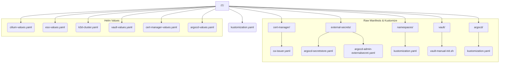

# IT Directory Architecture

This directory contains the **static / bootstrap layer** of the platform. Everything
here must exist _before_ ArgoCD can reconcile Git.

## Guiding Principles

The structure follows two simple rules to keep things predictable.

### 1. Helm Chart Configurations

Configuration for a core component deployed via a Helm chart is defined in a single
`*-values.yaml` file.

- **Location**: Root of the `IT/` directory.
- **Naming**: The filename is simple and references the component (e.g.,
  `cilium-values.yaml`, `vault-values.yaml`).

### 2. Raw Kubernetes Manifests

Static Kubernetes resources that are not part of a Helm chart installation (e.g., a
`ClusterIssuer` or a `ClusterSecretStore`) are organized as raw YAML files.

- **Location**: Placed inside a subdirectory named after the parent component (e.g.,
  `cert-manager/`).
- **Naming**: The filename **must** exactly match the `metadata.name` of the resource
  defined within it (e.g., a `ClusterIssuer` with `name: ca-issuer` is saved in
  `ca-issuer.yaml`).

### 3. Bootstrap Resources via Kustomize

Some components require orchestrated deployment of multiple resources. We wrap them in
Kustomize and apply them with `kustomize build <dir>/ | kubectl apply -f -`.

- **Location**: Subdirectories with their own `kustomization.yaml`.
- **Purpose**:
  - `namespaces/`: Bootstrap namespace definitions for core components.
  - `cert-manager/`: Issuers and Certificate definitions.
  - `external-secrets/`: The `ClusterSecretStore` to connect to Vault and
    the `ExternalSecret` for ArgoCD.
  - `argocd/`: Kustomization to support the Helm chart.

## Visual Structure

## Quick Reference

| Path | Purpose | Type |
| --- | --- | --- |
| `k3d-cluster.yaml` | Defines the k3d topology (1 server + 2 agents + registry cache). | k3d Config |
| `kustomization.yaml` | Root orchestrator (currently minimal but future-proof). | Kustomize |
| `*-values.yaml` | Helm chart configuration for each bootstrap dependency. | Helm Values |
| `namespaces/` | Namespaces + labels required before workloads land. | Kustomize Bootstrap |
| `vault/` | Manual init / unseal helpers (e.g., `vault-manual-init.sh`). | Shell Script |
| `cert-manager/` | ClusterIssuers, CA certificates, Gateway-friendly resources. | Raw Manifests |
| `external-secrets/` | `ClusterSecretStore` + initial `ExternalSecret` objects. | Raw Manifests |
| `argocd/` | Kustomize glue (RBAC, AppProjects) that supplements Helm. | Kustomize |

## Deployment Workflow

### Bootstrap Timeline

```mermaid
gantt
    dateFormat  X
    axisFormat  %s
    section Provision
      Create k3d cluster            :0, 1
      Apply namespaces              :1, 2
    section Networking & CRDs
      Cilium                        :2, 3
      Prometheus CRDs               :3, 4
      Cert-Manager (Helm + manifests) :4, 5
    section Secrets & GitOps
      Vault deploy + init           :5, 6
      External Secrets Operator     :6, 7
      ArgoCD                        :7, 8
      Gateway API                   :8, 9
    section Post-Bootstrap
      Policies (Kyverno)            :9, 10
      Application stacks (AppSets)  :10, 11
```

### Expanded Steps

1. **Create the cluster** via `k3d-cluster-cached.yaml` (built-in registry cache keeps re-deployments snappy).
2. **Apply namespaces** so priority classes, quotas, and Kyverno label policies have a home.
3. **Install Cilium** to replace the default CNI and enable the Gateway API dataplane.
4. **Lay down Prometheus CRDs** using `prometheus-operator-crds` so later Helm releases skip CRD churn.
5. **Install cert-manager** and immediately apply issuers/certificates from `cert-manager/`.
6. **Deploy Vault** and run `Scripts/vault-init.sh` to unseal, store tokens, and enable Kubernetes auth.
7. **Deploy External Secrets Operator** and apply `external-secrets/` to wire Vault → Kubernetes → ArgoCD.
8. **Deploy ArgoCD** (Helm) plus AppProjects from `IT/argocd/`.
9. **Apply the Gateway** (Kustomize) to expose HTTPS endpoints backed by cert-manager.
10. **Apply Policies** (Kyverno + Policy Reporter) so governance exists before workloads.
11. **Let ApplicationSets run**—ArgoCD handles stacks in `K8s/` automatically once the controller is online.

**Key insight:** Everything above runs from `task deploy`, proving that a laptop-friendly IDP still benefits from strict boot order and clearly separated ownership.
