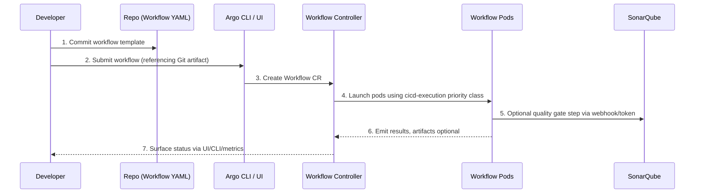
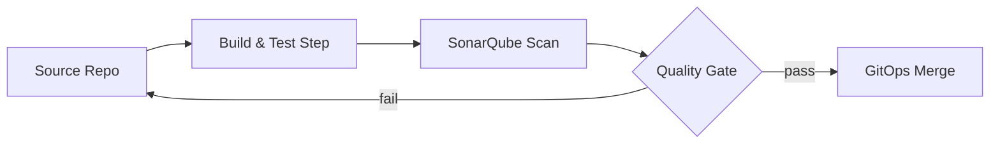

# CI/CD Stack (Argo Workflows + SonarQube)

The `K8s/cicd/` directory hosts everything developers need to run workflows, quality scans, and build-time policies inside the IDP.

## Components

| Component | Path | Highlights |
| --- | --- | --- |
| Argo Workflows | `K8s/cicd/argo-workflows/` | Workflow controller + server with metrics + RBAC locked to `cicd` namespace. |
| Governance manifests | `K8s/cicd/governance/` | ResourceQuota + LimitRange to keep demo workloads lightweight. |
| SonarQube | `K8s/cicd/sonarqube/` | Community edition with Vault-managed admin password + monitoring passcode. |

## Workflow Execution Flow

## Secrets & Credentials

- **Argo Workflows** authenticates to Vault-backed secrets via External Secrets (see `argo-workflows-values.yaml` and `IT/external-secrets/`).
- **SonarQube admin & monitoring tokens** come from Vault and are injected by Helm after ESO syncs the secret.
- Additional CI secrets follow the same pattern: define them in Vault, sync via `ExternalSecret`, mount as env vars in workflow pods.

## Observability Hooks

- Workflow controller metrics are scraped by Prometheus via `ServiceMonitor` and surfaced in Grafana.
- Argo emits Kubernetes events; Fluent-bit ships them to Loki so you can tail workflow logs centrally.
- SonarQube exposes readiness/liveness probes along with JVM metrics—enable dashboards for quality gates and scan times.

## Extending the Stack

1. **Add Workflows** – store reusable templates under `K8s/cicd/argo-workflows/templates/` (or similar), include them via ConfigMaps, and reference them in Workflow manifests.
2. **Add Build Tools** – create subdirectories (e.g., `kaniko/`, `tekton/`) and update `applicationset-cicd.yaml` so ArgoCD auto-syncs them.
3. **Expose CI Services** – enable Ingress/Gateway entries in values files to expose SonarQube or Argo Workflows UI via the platform Gateway.
4. **Integrate pipelines** – Use Argo Events or GitHub webhooks (future work) to trigger workflows automatically.

## Example: Quality Gate Workflow

In Argo Workflows, this translates to a DAG with `build` → `sonarqube-scan` → `quality-gate`. The scan step reaches out to SonarQube using the Vault-provisioned monitoring token.
