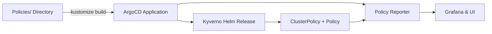
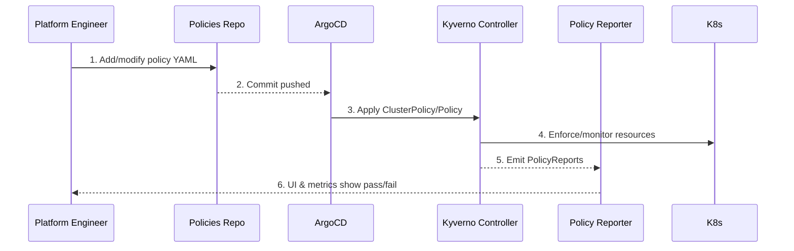

# Policies & Governance (Kyverno + Policy Reporter)

Governance lives under `Policies/` and is deployed before any workload stacks sync. Kyverno enforces the rules, while Policy Reporter surfaces compliance status.

## Policy Layers

| Layer | Location | Purpose |
| --- | --- | --- |
| Baseline (namespaces, labels) | `Policies/rules/baseline/` | Ensures namespaces + workloads receive canonical labels, quotas, and annotations. |
| Security safeguards | `Policies/rules/security/` | Blocks privileged pods, enforces read-only root FS, validates image registries. |
| Platform hygiene | `Policies/rules/platform/` | Checks ServiceAccount usage, requires requests/limits, and validates priority classes. |

## Deployment Path

- `Policies/app-kyverno.yaml` – ArgoCD Application applied during bootstrap.
- `Policies/kustomization.yaml` – Installs both the Kyverno Helm release and all policy manifests.
- `Policies/policy-reporter/` – Deploys Policy Reporter + UI for at-a-glance status.

## Sync Waves & Priority

| Resource | Sync Wave | Notes |
| --- | --- | --- |
| Kyverno Namespace/RBAC | `-2` | Must exist before CRDs/webhooks. |
| Kyverno Helm Release | `-1` | Installs CRDs + controllers. |
| ClusterPolicies | `0` | Apply after controllers are ready. |
| Policy Reporter | `1` | Consumes policy reports after Kyverno starts emitting them. |

## Policy Lifecycle

## Writing Good Policies

1. **Stay declarative** – target labels and annotations (from the label standard) instead of naming individual workloads.
2. **Test locally** – use `kyverno apply` or `kyverno test` against manifests before pushing.
3. **Annotate severity** – add `policies.kyverno.io/severity` so Policy Reporter can filter.
4. **Document remediation** – set `policies.kyverno.io/description` and `documentation` annotations so the UI links back to internal runbooks.

## Policy Reporter Dashboards

Policy Reporter exposes a UI (and Prometheus metrics) with:

- **Policy compliance score** by namespace or application.
- **Top failing policies** to highlight drift or missing labels.
- **Audit history** for previously non-compliant resources.

Hook Grafana into the Policy Reporter metrics endpoint to correlate policy drift with deployments or cost spikes.
