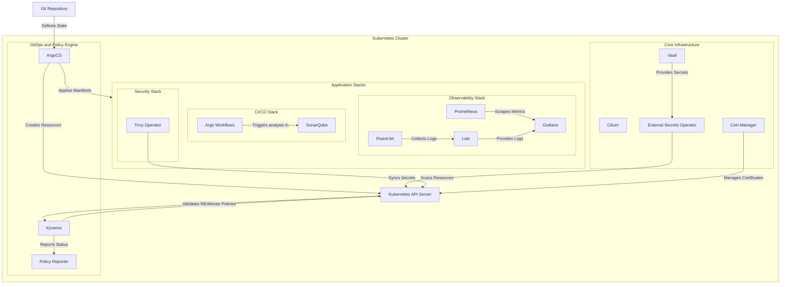
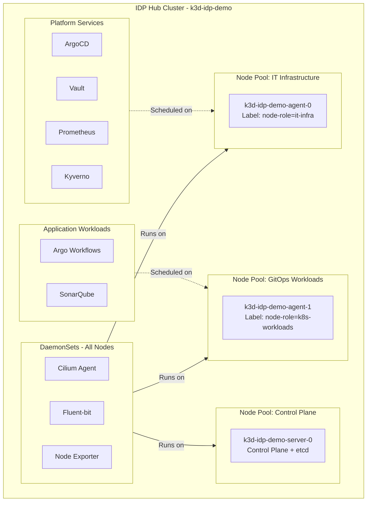
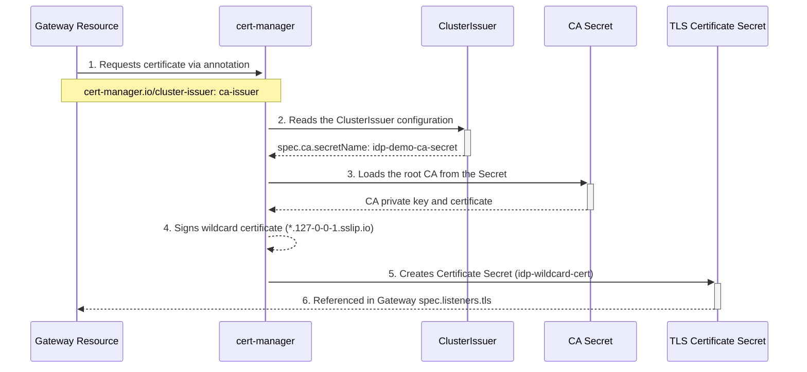
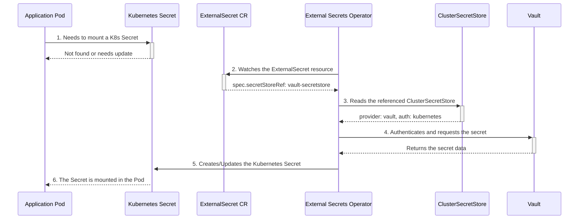
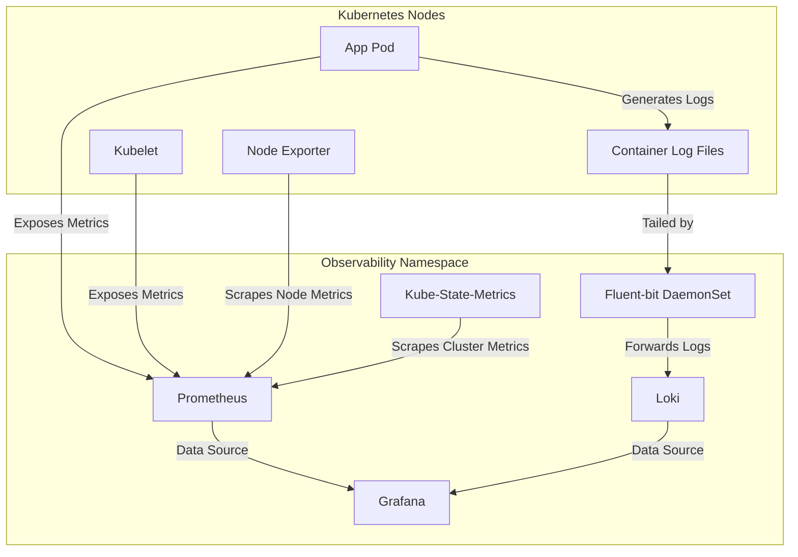
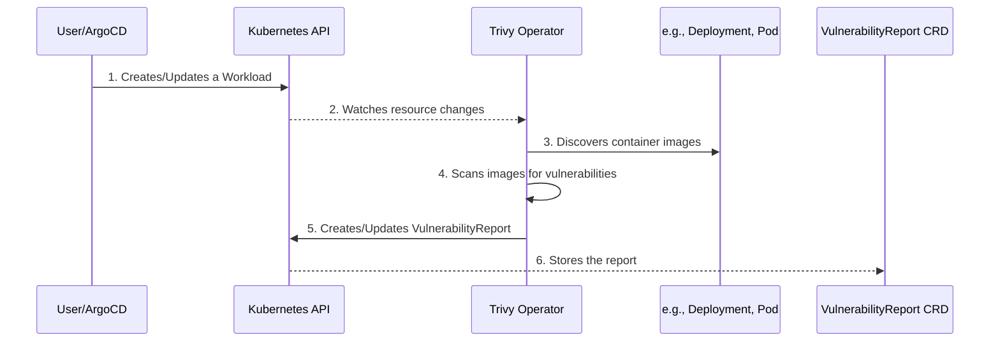
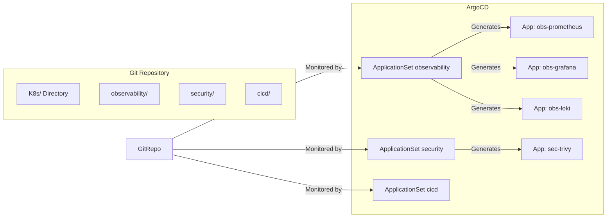
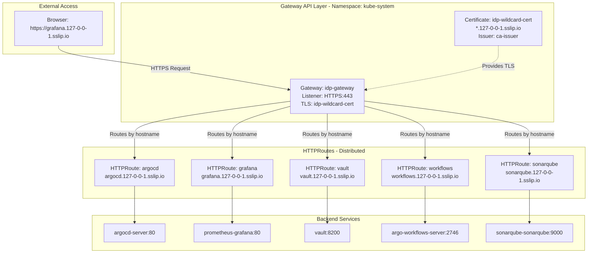
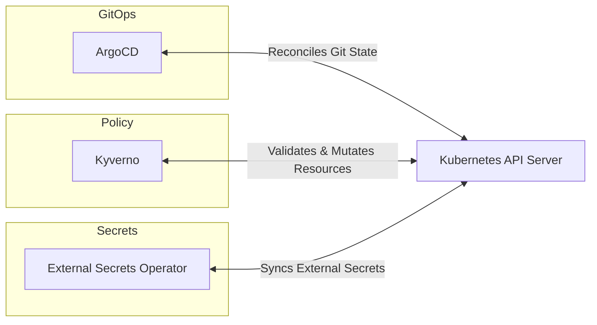

# IDP Visual Architecture

This document describes the platform's architecture, its workflows, and its
execution environment through diagrams.

## 1. General Architecture and GitOps Flow

This diagram shows the high-level view of the workflow, from the definition in a Git
repository to the deployment and operation of the components within the Kubernetes
cluster.

## 2. Helm to Pods Deployment Flow

This diagram shows the complete deployment chain from Helm charts to running pods,
illustrating how different layers (Bootstrap, GitOps) interact.

```mermaid
graph TB
    subgraph Bootstrap [Bootstrap Layer - IT/]
        H1[Helm: cilium v1.18.2]
        H2[Helm: vault v0.31.0]
        H3[Helm: argocd v8.5.8]
        H4[Helm: cert-manager v1.18.2]
        H5[Helm: external-secrets v0.20.2]
    end

    subgraph GitOps [GitOps Layer - K8s/]
        direction TB

        subgraph ArgoCD_Core [ArgoCD Applications]
            APP1[App: observability-fluent-bit]
            APP2[App: observability-loki]
            APP3[App: observability-kube-prometheus-stack]
            APP4[App: cicd-argo-workflows]
            APP5[App: security-trivy]
            APP6[App: platform-policies]
        end

        subgraph Kustomize [Kustomize + Helm Charts]
            K1[Kustomize: fluent-bit<br/>helmCharts: fluent-bit v0.54.0]
            K2[Kustomize: loki<br/>helmCharts: loki v6.42.0]
            K3[Kustomize: kube-prometheus-stack<br/>helmCharts: v77.14.0]
            K4[Kustomize: argo-workflows<br/>helmCharts: argo-workflows v0.45.11]
            K5[Kustomize: trivy<br/>helmCharts: trivy-operator v0.31.0]
            K6[Kustomize: kyverno<br/>helmCharts: kyverno v3.5.2]
        end
    end

    subgraph K8s [Kubernetes Resources]
        direction TB

        subgraph Workloads [Running Workloads]
            DS1[DaemonSet: cilium-agent]
            STS1[StatefulSet: vault-0]
            DEP1[Deployment: argocd-server]

            DS2[DaemonSet: fluent-bit]
            STS2[StatefulSet: loki]
            STS3[StatefulSet: prometheus-prometheus]
            DEP2[Deployment: prometheus-grafana]

            DEP3[Deployment: argo-workflows-server]
            DEP4[Deployment: argo-workflows-controller]
            DEP5[Deployment: trivy-operator]
            DEP6[Deployment: kyverno-admission-controller]
        end
    end

    H1 -->|Deployed via Taskfile| DS1
    H2 -->|Deployed via Taskfile| STS1
    H3 -->|Deployed via Taskfile| DEP1

    DEP1 -->|Manages| APP1
    DEP1 -->|Manages| APP2
    DEP1 -->|Manages| APP3
    DEP1 -->|Manages| APP4
    DEP1 -->|Manages| APP5
    DEP1 -->|Manages| APP6

    APP1 -->|Builds| K1
    APP2 -->|Builds| K2
    APP3 -->|Builds| K3
    APP4 -->|Builds| K4
    APP5 -->|Builds| K5
    APP6 -->|Builds| K6

    K1 -->|Renders Helm + Applies| DS2
    K2 -->|Renders Helm + Applies| STS2
    K3 -->|Renders Helm + Applies| STS3
    K3 -->|Renders Helm + Applies| DEP2
    K4 -->|Renders Helm + Applies| STS4
    K5 -->|Renders Helm + Applies| DEP3
    K6 -->|Renders Helm + Applies| DEP4
```

## 3. Node Pools and Workload Deployment

Within the Hub cluster, nodes are segmented into logical "Node Pools" using
labels to isolate workloads. This classification is the basis for future
scheduling rules with `tolerations` and `affinity`.

## 3. Certificate Management Flow

This flow shows how a Gateway resource automatically obtains a TLS certificate
via cert-manager annotation.

## 4. Secret Management Flow

This flow details how an application securely consumes a secret from Vault
without having direct credentials.

## 5. Observability Data Flow

This diagram details how metrics and logs are collected, processed, and visualized on
the platform.

## 6. Security Scanning Flow with Trivy

This diagram illustrates how the Trivy operator scans cluster workloads for
vulnerabilities.

## 7. GitOps Structure with ApplicationSets

This diagram explains the "App of Apps" pattern. The `ApplicationSet` resources in
ArgoCD monitor directories in Git. When they find subdirectories that match their
generator, they automatically create child `Application` resources, one for each
stack component.

## 8. Gateway API Service Exposure

This diagram shows how services are exposed via Gateway API with wildcard TLS
and sslip.io DNS (zero configuration required).

## 9. Control Loop Overview

This diagram illustrates the continuous, cross-reconciling control loops between
the core GitOps components, forming the heart of the "Platform as a System."
Each component watches the Kubernetes API server for changes and acts to align the
cluster's actual state with the desired state defined in Git, policies, or
external secret stores.

