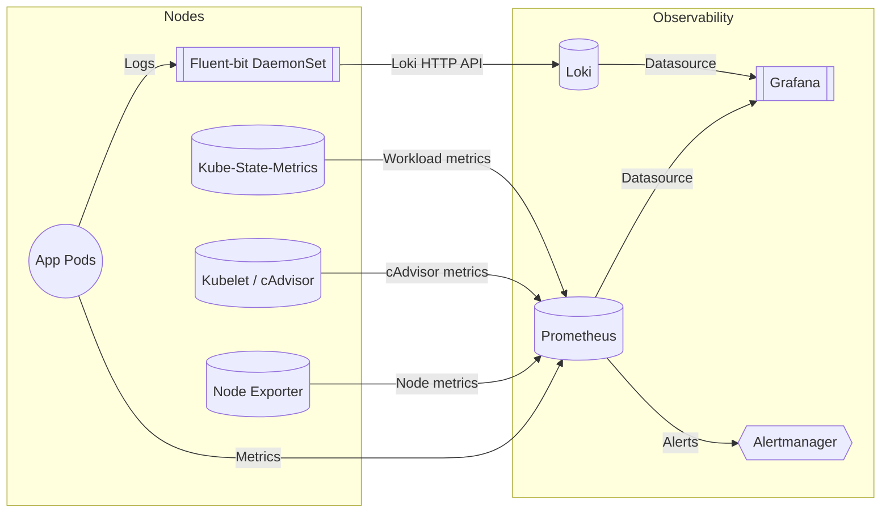
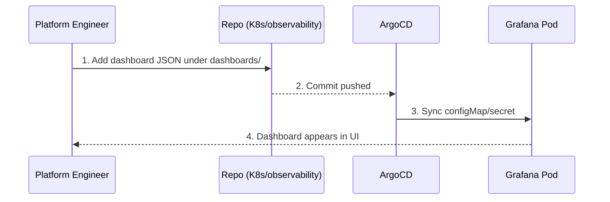

# Observability Stack Deep Dive

The observability stack covers metrics, logs, and dashboards with minimal footprint. It lives under `K8s/observability/` and is powered by Prometheus, Loki, Fluent-bit, and Grafana.

## Components at a Glance

| Component | Deploy Path | Purpose |
| --- | --- | --- |
| Prometheus (`kube-prometheus-stack`) | `K8s/observability/kube-prometheus-stack/` | Scrapes cluster + workload metrics, exposes Alertmanager + Grafana. |
| Fluent-bit | `K8s/observability/fluent-bit/` | Tails container logs on every node and forwards to Loki. |
| Loki | `K8s/observability/loki/` | Stores logs in boltDB shipper mode (single replica for k3d). |
| Grafana | Bundled via Prometheus stack | Serves dashboards, integrates with Prometheus + Loki datasources automatically. |

## Data Flow

## Instrumentation Strategy

1. **ServiceMonitors everywhere** – Each stack component (ArgoCD, Kyverno, Trivy, etc.) exposes metrics and is annotated with the `prometheus: kube-prometheus` label so the Prometheus Operator scrapes it automatically.
2. **Common labels** – `app.kubernetes.io/*` labels ensure dashboards can group data by stack or owner (ties into FinOps tagging).
3. **Lightweight retention** – Prometheus stores ~2 days of data; Loki uses boltdb-shipper with 5Gi PVC to stay laptop-friendly. Adjust in `kube-prometheus-stack-values.yaml` and `loki-values.yaml` if you need longer retention.
4. **Dashboards bundled** – Grafana sidecars import dashboards located in `K8s/observability/kube-prometheus-stack/dashboards/`. Add JSON there to keep everything GitOps-managed.

## Alerting

The Prometheus stack enables Alertmanager but does not send notifications by default. To enable alerts:

1. Create a `Secret` named `alertmanager-kube-prometheus-stack-alertmanager` with your receiver configuration.
2. Update `alertmanager.config` in `kube-prometheus-stack-values.yaml` to reference the secret or inline config.
3. Commit and let ArgoCD roll out the change.

## Custom Dashboards Workflow

## Extending the Stack

- **Add Tempo/OTel**: Create `K8s/observability/tempo/` with a Helm chart entry and reference it from the ApplicationSet.
- **Per-team dashboards**: Use folder provisioning and `grafana.dashboards` values to organize by stack (`observability`, `cicd`, etc.).
- **Metrics federation**: Enable the Prometheus `federation` job in values if sending data to an external monitoring plane.
